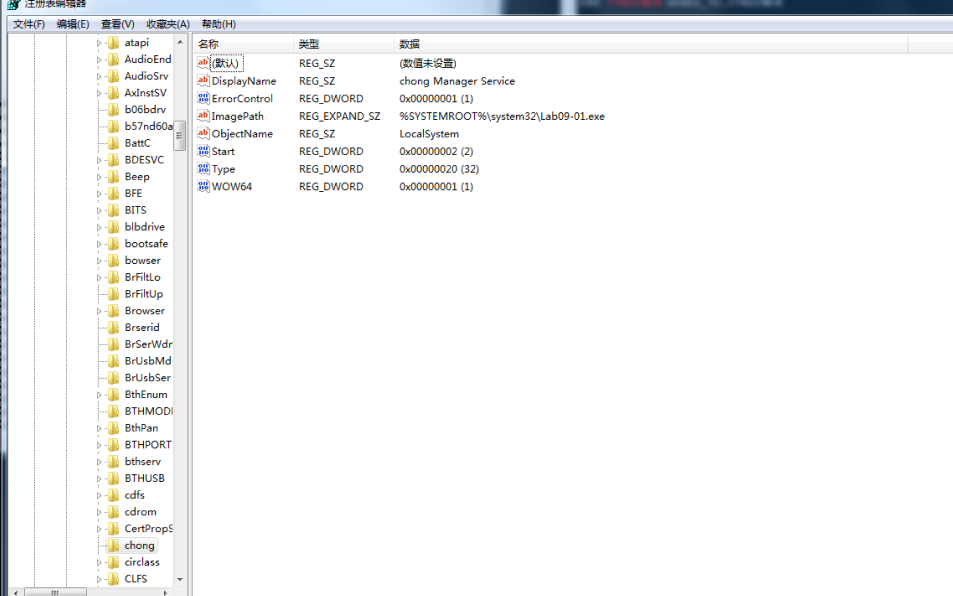
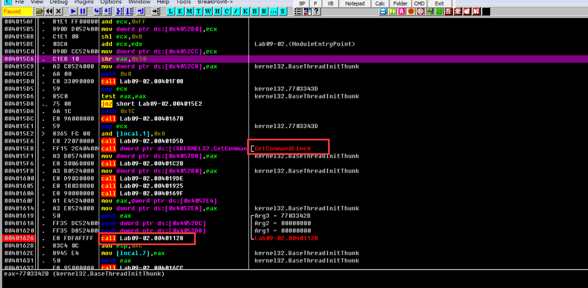
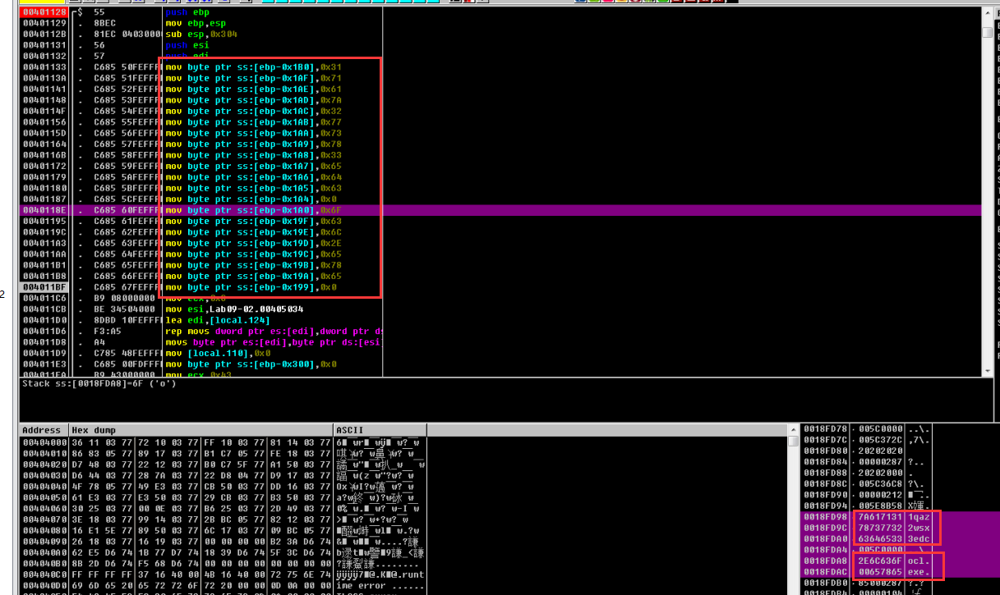
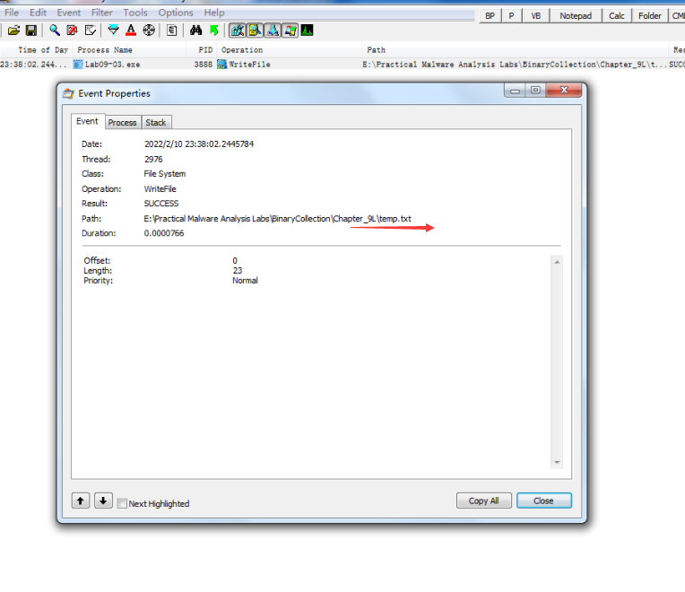

# 第九章 ollydbg 习题分享

## Lab 9-1

### 用OllyDbg和IDA 分析恶意恶意代码文件Lab09-01.exe。

### 问题

### 1、如何让这个恶意代码安装自身？

### 2、这个恶意代码命令行选项？密码是啥？

### 3、OllyDbg修补此程序，使其不用输密码？

### 4、基于系统的特征？

### 5、网络命令执行了啥操作？

### 6、网络特征？

### 分析过程

#### 静态分析

首先看imports，发现导入了文件操作函数，服务相关函数，网络相关函数和shell命令执行函数。

再看strings，发现2个域名和一些报错字符串，还要一一些看着路径和看着像命令的字符串。

然后结合汇编代码和伪代码分析：

首先判断是否有参数，

* 如果没有参数，会查HKLM\SOFTWARE\Microsoft \XPS（注意Microsoft后面有个空格）下是不是有Configuartion健，如果没有则	删除程序本身。

  

  拼出命令cmd.exe /c del  Filename >> NULL

* 如果有键，则查询键值，从键值中取出4个字符串，第一个字符串不知道是啥，第二个字符串是要连接的C2域名，第三个字符串为端口，第四个字符串为sleep的时间，然后执行，然后sleep一段时间。

  连接C2后，发送http request，其为HTTP/1.0 GET，url格式为xxxx/xxxx.xxx，获取response，在response里找\`'\`'\`字符串，这个字符串前面的是命令和命令的参数，以空格分隔，命令分为

  SLEEP 时间

  UPLOAD 端口  文件名

  此处端口为C2指定，可以是新端口

  DOWNLOAD 端口 文件名

  CMD 端口 \`cmd

  NOTHING

如果有参数，检查倒数第一个参数，经分析，此参数为密码，并且为abcd时，程序可以继续执行，否则删除本身。

程序继续执行后，判断程序是否有其他命令行，经分析，有四个命令行选项：

* -in 服务名

  需要加服务名为参数值，服务名没有校验，随便起，假设为chong，否则删除程序本身。

  服务路径%SYSTEM%\system32\Lab09-01.exe，显示名 chong Manager Service

  设置注册表XPS值为ups\x00http://www.praticalmalwareanalysis.com\x0080\x0060\x00

  到此回答了问题1。

* -re 服务名

  如果不加参数，会尝试将当前文件名作为服务名进行删除服务以及清理注册表信息

  如果加参数，会按照参数服务名进行删除服务以及清理注册表信息

  注意，删除服务需要管理员权限，直接运行-re删除不了服务。

* -cc

  没有参数值，如果有，则删除程序本身

  获取configuration的值，主要没看懂0x00403a88这个函数，动态分析再看看其运行结果

  看到两个可疑字符串

  0x0040C14C   "k:%s h:%s p:%s per:%s\n"

  0x0040b170    "command.com"

* -c

  检查命令行个数是否为7（程序本身，-c, 4个参数，密码），其中4个参数用于设置键XPS的值，即修改-in中设置的值ups\x00http://www.praticalmalwareanalysis.com\x0080\x0060\x00

到此回答了问题2

总的逻辑就是先-in进行并根据密码进行安装，然后通过命令执行操作。如果已经安装，可以执行一命令。

### 动态分析

先使用regshot获取当前注册表，然后做vm快照。

* 无命令行运行

  由于还没有安装，注册表没有值，exe文件被删除

* -in chong abcd

  安装，观察注册表变化，及键值如下

  

  

  

  

  

  服务未启动

  问题3，修补程序，不用输入密码：

  将密码验证函数0x00402510处修改为eax为1，然后retn，即可修补

  通过assemble获得汇编的机器码
  mov eax,0x1   B8 01 00 00 00

  retn				  C3

  

  然后编辑binary

  

  

  之后保存文件：

  

  

  然后验证：

  进入函数0x00402510，函数直接返回。

* -cc

  静态分析没有看懂0x00403a88函数，在调用其位置0x00402e98处打断点，按F4运行到当前行，继续执行，屏幕打印configuration的配置

* -c

  不用分析

* -re

  直接在OD中删除不了reg，需要用cmd管理员模式才可以删，不过只能删configuration，父键删除不了。

### 总结：

问题4：基于系统的特征？

* 注册表

  注册表路径与静态分析稍微不一致，多了Wow6432Node

* 服务

* 文件

  文件被复制到系统目录下，但是x64和x86有些区别，可以在动态调试时看到具体获取的的路径，有兴趣可以自己调一下。

拓展知识：

windows x64上的system32和syswow64目录：

问题6：网络特征？

http://www.practicalmalwareanalysis.com/xxxx/xxxx.xxx HTTP/1.0 GET，不提供任何HTTP头部也算一种。response里有特殊字符串。

分析此恶意软件，仍然偏重于静态分析，静态分析基本可以回答除问题3以外的问题，还不太习惯动态分析，需要加强OD使用练习。

## Lab 9-2

## Lab 9-2

### 用OllyDbg分析恶意代码文件Lab09-02.exe，回答下列问题

### 1、二进制文件中，静态字符串是啥？

### 2、运行这个文件，会发生啥？

### 3、怎样让恶意代码的payload获得运行？

### 4、0x00401133处发生了啥？

### 5、传递给函数0x00401089的参数是啥？

### 6、域名？

### 7、混淆域名的编码函数？

### 8、0x0040106e处调用CreateProcessA函数意义是啥？

### 分析过程

使用strings工具查看exe中字符串，发现一些错误信息和导入函数，以及一个cmd字符串（问题1）：

做好快照，然后运行此exe，观察process explorer，没反应，似乎很快就停止了（问题2）。

使用OD分析其main函数，一般main函数在GetCommandLine函数不远处，如下：

0x00401128即为main函数，也可以通过IDA查看main函数地址，打断点，继续分析。

首先看到一个连续压栈操作：

ocl.exe和1qaz2wsx3edc(刚好是键盘的左手第2到4列)，暂时不知道是啥意思，继续分析。此处回答了问题4，作用是来混淆域名。

然后将0x00405034处的32个字节，复制到栈上0x0018FD58处。

接着获得文件名，并存储在栈上，和0x5c一起作为函数0x00401550的参数，此函数返回文件名加\，即“\Lab09-02.exe”的栈上地址。

然后经过处理获得“Lab09-02.exe”的指针0x0018fc87，和上面分析的ocl.exe的指针0x0018fda8作为函数0x004014c0的参数，此函数不讲武德，没有prologue，用一个循环来比较，ocl.exe和Lab09-02.exe是否相等。

如果不相等，则继续跟踪下去，没发现有价值信息，程序直接退出。

将Lab09-02.exe改名为ocl.exe（回答问题3），制造相等条件，然后重新OD分析：

函数0x004014c0后，进程会创建一个套接字s

接着来到0x00401089函数处，其参数2个，第一个是开头看到的字符串1qaz2wsx3edc，第二个为栈上地址0x18fd58。

首先初始化0x3f * 4 + 4 + 1的栈上空间为\x00

然后将1qaz2wsx3edc作为参数传递给0x00401440函数（没有prologue），函数内部是一个循环，和几个比较。

循环用了处理字符串1qaz2wsx3edc，有些xor操作，最后得到字符串1qaz2wsx3edc的长度返回。

这里犯了错误，IDA里清楚的将此函数标注为_strlen，一定要结合静态分析进行恶意代码分析！！！

0x00401089函数的目的是从1qaz2wsx3edc经过某种解码操作获得域名www.practicalmalwareanalysis.com（此处回答了问题6和7），然后获取IP。

接着连接IP，并启动进程cmd，将其输入输出和套接字s绑定（问题8）。

整个程序功能为一个反弹shell，域名做了个加密，需要动态分析比较容易获得。

### 总结

静态动态分析要结合，不要思维固化，题目让用OD，并不是只用OD分析。

## Lab 9-3

### 使用OllyDbg和IDA Pro分析Lab09-03.exe，其自带3个DLL(DLL1.dll, DLL2.dll, DLL3.dll)，它们编译时请求相同的内存加载位置。因此，在OllyDbg中对照IDA Pro浏览这些DLL可以发现，相同代码可能会出现在不同的内存位置。这个实验的目的是让你在使用OllyDbg看代码时可以轻松地在IDA Pro里找到它对应的位置。

### 1、Lab09-03.exe导入哪些DLL?

### 2、DLL1.dll, DLL2.dll, DLL3.dll要求的基址是多少？

### 3、 OllyDbg调试时，3个dll分配的基地址是什么？

### 4、调用DLL1.dll中的一个导入函数时，这个导入函数干了啥？

### 5、WriteFile时，写入的文件名是什么？

### 6、NetScheduleJobAdd创建job时，从哪里获取第二个参数的数据？

### 7、在运行时，会看到exe打印三块神秘数据。3个dll的神秘数据分别是什么？

### 8、如何将DLL2.dll加载到IDA Pro中，使得它与OllyDbg使用的加载地址匹配？

### 分析过程

IDA打开exe，看到imports表：

除了以上导入表外，程序可以通过LoadLibrary动态加载dll，搜索LoadLibraryA，然后X键查询其xref：

type r read, p near call，每个调用都会有一对p和r。

跟进可以看到动态加载了DLL3和user32.dll。总共5个DLL。

由IDA可知DLL1，DLL2，DLL3都要求基址为0x10000000，这样就会发生重定向。

打开OD，查看Memory窗口可以看到DLL1和DLL2的加载基址：

此时DLL3尚未加载，继续分析。

DLL1Print打印了一行字符串：

DLL2Print打印了一行字符串：

OD中可以看到DLL2ReturnJ返回值为DLL2Print值88。

继续分析到writeFile函数，没有找到文件名，使用Process Monitor监控进程PID，运行后得到文件路径为：

文件内容为malwareanalysisbook.com。

动态加载DLL3后：

NetScheduleJobAdd介绍https://docs.microsoft.com/en-us/windows/win32/api/lmat/nf-lmat-netschedulejobadd

其第一个参数为NULL，第二个参数为指针，看到值为0x0023B0A0，值为0x0036EE80。

在OD中看到其标记为local.7，在调用DLL3GetStructure时也作为参数使用，回到IDA，查找其xref

其在DllMain中进行了赋值。

打印的神秘数据：

DLL1打印根据DLL1 IDA分析为PID，Process Monitor也可以证明，

DLL2打印为temp.txt文件的句柄，

DLL3打印为字符串ping www.malwareanalysisbook.com转换成宽字节后的地址的十进制表示。

DLL2 基址IDA和OD一致方法：

