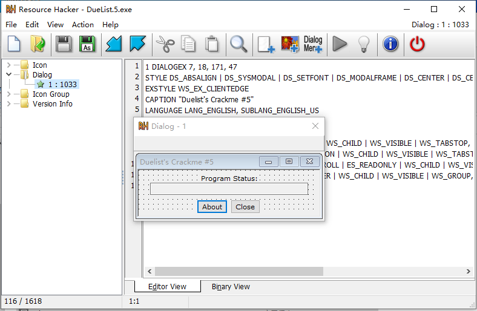

# 第一章 静态分析基础技术

* 使用反病毒软件/沙箱来确定样本的恶意性。
* 使用hash识别恶意软件。
* 从文件字符串列表，函数和文件头中发掘重要信息。

## 反病毒引擎扫描：实用的第一步

在分析一 个可疑的恶意代码样本时，第一 步就最好是拿多个反病毒软件扫描下这个文件，看是否有哪个引擎已经能够识别它。反病毒软件主要依靠一 个已知恶意代码可识别片段的特征数据库（病毒文件特征库），以及基于行为与模式匹配的分析（启发式检测），来识别可疑文件。恶意代码编写者可以很容易地修改自己的代码，从而改变这些程序的特征，来躲避反病毒引擎的检测。不同的反病毒软件使用了不同的特征库和启发式检测方法，所以对同一 个可疑恶意代码样本，运行多个不同反病毒软件进行扫描检测是相当有必要的。


流行的恶意软件检测平台通常会对上传的同一份样本调用多个检测引擎进行检测

```
VirusTotal
微步云沙箱
```

## 哈希值：恶意代码的指纹

哈希是一种用来唯一 标识恶意代码的常用方法。恶意代码样本通过一 个哈希程序，会产生出一段用于唯一标识这个样本的独特哈希值 （类似于一种指纹）。对恶意文件的简单改动就会影响hash值，仅靠hash识别恶意软件是不可靠的。


# 查找字符串

查找ASCII和Unicode字符串，可以在IDA Pro使用快捷键`Shift + F12`查看字符串窗口，IDA Pro默认只显示ASCII字符串，可以设置显示其他编码字符串。

## 加壳和混淆恶意代码

混淆程序是恶意代码编写者尝试去隐藏其执行过程的代码，加壳程序是混淆程序中的一类。加壳和混淆代码通常至少会包含LoadLibrary和GetProcAdress函数，用来加载和使用其他函数的功能。

### 文件加壳


### 使用PEiD检测加壳

使用PEiD检测加壳情况，自动或手动脱壳。


## PE文件格式

可移植执行(PE)文件格式是Windows可执行文件、对象代码和DLL所使用的标准格式。PE文件格式其实是--种数据结构，包含为Windows操作系统加载器管理可执行代码所必要的信息。几乎每个在Windows系统中加载的可执行代码都使用PE文件格式，尽管也在一-些罕见的恶意代码中，存在一些过时兼容性的文件格式。

## 链接库与函数

导入函数：是一个程序所使用的但存储在另一个程序中的那些函数

### 静态链接，运行时链接与动态链接

当一个库被静态链接到可执行程序时，所有这个库中的代码都会被复制到可执行程序中，这会让可执行程序增大许多。而在分析代码时，很难区分静态链接的代码与可执行程序自身代码，因为在PE文件头中没有迹象表明这个文件包含有链接代码。


虽然运行时链接在合法程序中并不流行，但是在恶意代码中是常用的，特别是当恶意代码被加壳或是混淆的时候。使用运行时链接的可执行程序，只有当需要使用函数时，才链接到库，而不是像动态链接模式那样在程序启动时就会链接。


一些Windows API允许程序员导入并没有在程序的文件头中列出的链接函数。


在所有链接方法中，动态链接是最常见的，当代码库被动态链接时，宿主操作系统会在程序被装载时搜索所需的代码库，如果程序调用了被链接的库函数，这个函数会在代码库中执行。


PE文件头中存储了每个将被装载的库文件，以及每个会被程序使用的函数信息。程序所使用的库与调用的函数，经常是一 个程序中最重要的部分，识别它们尤为重要，因为这些信息允许我们来猜测这个恶意代码样本到底干了些什么事情。

### 使用DependencyWalker工具探索动态链接函数


Dependency Walker工具，包含在微软VisualStudio的一些版本与其他微软开发包中，支持列出可执行文件的动态链接函数。

也可以直接使用IDA Pro。

下载地址

```
http://dependencywalker.com/
```


**函数命名约定**

当评估- -些不熟悉的Windows函数时，一些命名约定是非常值得注意的，因为如果你不了解它们，它们就会经常出现在你面前并造成混淆。例如，你经常会遇到以Ex为后缀的函数名，如CreateWindowEx。当微软更新- -个函数，而且新函数与原先函数不兼容的时候，微软还会继续支持原先的旧函数。这时新函数会给一个与旧函数相同的名字，并在后面加上Ex后缀。而被显著更新过两次的函数，则会在它们的名字后面有两个Ex后缀。以字符串作为参 数的许多函数，在它们的名字后面会包含一个A或者一个W，如CreateDirectoryW。这个字母A或者W在这个函数的文档中并没有出现。它只是表明这个接受字符串参数的函数有着两个不同的版本:以A结尾的输入参数类型为ASCII字符串，而以W结尾的输入参数为宽字符字符串。当你在微软的文档中搜索这个函数时，你需要记得丢掉后缀的A或者W。

### 导入函数

PE文件头中也包含了可执行文件使用的特定函数相关信息。Windows函数的这些名字，可以告诉你这个可执行文件到底干了些什么事情。

### 导出函数

与导入函数类似，DLL和EXE的导出函数，是用来与其他程序和代码进行交互时所使用的。通常，一个DLL会实现一 个或多个功能函数，然后将它们导出，使得别的程序可以导入并使用这些函数。


PE文件中包含一 个文件中导出了哪些函数的信息。因为D LL文件本身就是实现一 些导出函数然后被EXE可执行文件使用的，因此导出函数在DLL文件中是最常见的。而EXE文件并不是设计成为其他EXE文件提供功能的，因此里面很少会有导出函数。如果你在可执行文件中发现了导出函数，它们经常会提供一 些有用的信息。


## 静态分析技术实践

### PotentialKeylogger.exe:一个未加壳的可执行文件


Kerne/32.dll导入函数告诉我们，这个软件会打开和操作进程（如OpenProcess、 GetCurrentProcess和GetProcessHeap等），以及对文件进行操作（如ReadFile、CreateFile 和WriteFile）。


FindFirstFile和IFindNextFile函数是特别值得关注的，因为它们提供的功能是搜索一 个目录下的所有文件。


从User32.dll导入的函数甚至更加有趣，大量的图形化界面操作函数 （如 Register、ClassEx, SetWindowText和ShowWindow等）显示这个程序很可能使用了一 个图形化界面 （虽然GU I并不一定会显示给用户〉。


而SetWindowsHookEx函数是间谍软件经常使用的函数，也是键盘记录器用来接收键盘输入最流行的方法。这个函数也会有着一 些合法使用的场景，但如果你分析的是个可疑的恶意代码，而当你看到了这个函数时，你就很可能在查看一 个键盘记录功能。


RegisterHotKey函数也很有趣。它注册了一 个热键 （如Ctrl+ Shift＋P，这样每当用户按下热键组合后，便会通知应用程序。无论当前是哪个应用程序处于活动状态，热键都会将用户带到注册了热键的应用程序。

从GDI32.dll的导入函数是和图形相关的，这只是再次确认了这个程序拥有一 个图形化界面。从Shell32.dll的导入函数告诉我们，这个程序可以启动其他程序一一这个功能对于恶意代码和合法软件都是普遍的功能。


从Advapi32.dll的导入函数则显示，这个程序使用了注册表，这又提示我们，我们应该去搜索一些看起来像是注册表键值的字符串。注册表键值与文件目录非常类似。在这种案例中，我们发现了一个字符串Software＼Microsoft\Windows\CurrentVersion\Run，这是一 个恶意代码非常普遍使用的注册表键值，控制Windows启动时会自动装载哪些程序。


### PackedProgram.exe: 穷途末路

加壳的恶意代码的导入表通常比较少。可以使用PEID进行查壳。


## PE文件头与分节

PE文件格式包括一 个PE文件头，随后跟着一 系列的分节。文件头中包含了有关文件本身的元数据。而头部之后是文件的一 些实际部分，每个分节中都包含了有用的信息。

* .text: . text节包含了CPU执行指令。所有其他节存储数据和支持性的信息。一般来说，这是唯一可以执行的节，也应该是唯一包含代码的节。
* .rdata: . rdata节通常包含导入与导出函数信息，与Dependency Walker和PEview工具所在得的信息是相同的。这个节中还可以存储程序所使用的其他只读数据．。有些文件中还会包含.idata和.edata节，来存储导入导出信息。
* .data, . data节包含了程序的全局数据，可以从程序的任何地方访问到。本地数据并不存储在这个节中，而是PE文件某个其他位置上。
* .rsrc: . rsrc节包含由可执行文件所使用的资源，而这些内容并不是可执行的，比如图标、图片、菜单项和字符串等。字符串可以存储在．rsrc节中，或在主程序里。在.rsrc节中经常存储的字符串是为了提供多语种支持的。


### 用PEview来分析PE文件


下载地址

```
http://wjradburn.com/software/
```

PE文件格式在头部中存储了很多有趣的信息。我们可以使用PEview工具来浏览这些信息


PE头中的前两个部分IMAGE_DOS_HEADER和MS-DOS存根程序，是历史遗留问题，对我们而言没有提供任何值得关注的信息。

PE文件头中的下一 部分，IMAGE_NT_HEADERS，显示了N T文件头。特征签名始终是相同的，可以被直接忽略。


Machine字段告诉我们程序运行在什么平台上。时间戳告诉我们这个可执行文件是什么时候编译的，这在恶意代码分析与事件处理中会非常有用。例如，一个很老的编译时间意味着古老的攻击，反病毒软件就可能包含这个恶意代码的检测特征，而一 个很新的编译时间意味的情况则正好相反。


所有的Delphi程 序都使用统一 的编译时间，都是1992年6月四日。如果你看到这个编译时间，就可以确定很可能是在查看一个Delphi程序，但是不会知道它被编译的确切时间。

`Subsystem`字段可以告诉我们这个程序是一个命令行程序还是一个GUI程序。


`Virtual Size`虚拟大小告诉我们在加载的过程中需要分配多少空间给一个分节。`Size of Raw Data`原始大小显示在磁盘上这个分节的大小规模。这两个值一般是相等的，但是由于磁盘和内存上的对齐规则存在差异，大小有一定差别也是正常的。


分节大小，在检测加壳可执行文件时非常有用。例如，若虚拟大小比原始数据大得多，你便知道这个节在内存中占用了比磁盘上存储更多的空间。这往往意味着加壳代码的存在,特别是当. text分节在内存中较磁盘上更大- - 些时。道这个节在内存中占用了比磁盘上存储更多的空间。这往往意味着加壳代码的存在,特别是当. text分节在内存中较磁盘上更大一些时。


`1-6`是一个加壳的程序，`.text`段的原始数据大小是0，但是虚拟大小不是0，说明它有可能是一个加壳的程序，脱壳存根会将代码脱壳到内存的`.text`段中。


### 使用ResourceHacker工具来查看资源节

你可以使用免费的ResourceHacker工具来浏览.rsrc节。当你单击ResourceHacker工具中分析获得的条目时，你就会看到字符串、图标和菜单，而显示的菜单项和程序所使用的是一致的。

下载地址

```
 http//:www.angusj.com
```

恶意代码，偶尔一些合法软件 ，经常会把一个嵌入的程序或者驱动放在资源节中，在程序运行之前，它们会将嵌入可执行文件或驱动提取出来，Resource Hacker可以帮助你提取这些文件来进行基础分析。


Dialog文件会显示可执行文件的界面。



### 使用其他的PE文件工具

除了上面介绍的一 些工具之外，还存在着很多可以用来浏览PE文件头的其他工具。其中两个最有用的是PEBrowse Professional和PE Explorer.

* PEBrowse Professional 与PE view类似。它允许你查看每个分节中的字节，并显示出解析后的数据。PEBrowse Professional在呈现从资源节（.rsrc）获取的信息上做得更好
* PE Explorer  有着一个功能丰富的图形用户界面，让你可以方便地浏览PE文件的各个部分。你还可以编辑PE文件的特定部分，它所包含的资源编辑器对于浏览和编辑文件资源来说是非常棒的。然而这个工具的主要缺点是一一 它不是免费的。

**52pojie**：https://down.52pojie.cn/Tools/PEtools/

### PE文件头概述

PE文件头包含了对恶意代码分析师有用的信息，下面是可以从PE文件头中获取的关键信息。

