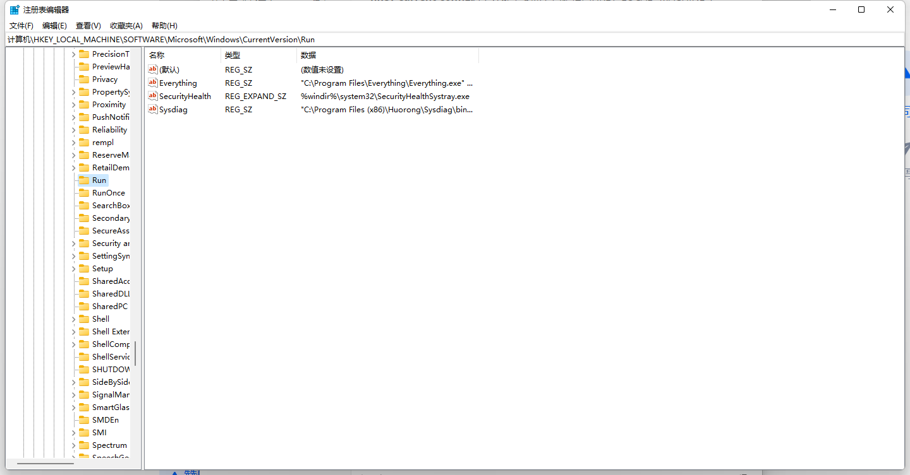
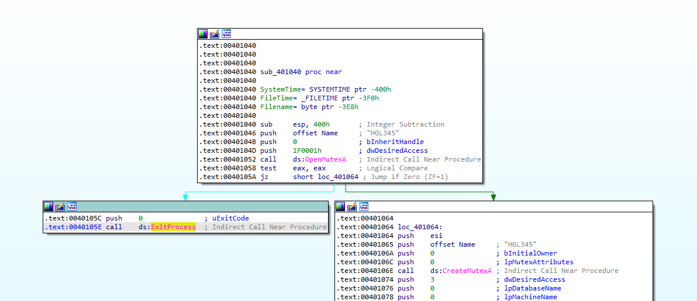
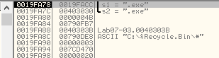

# 第七章 分析恶意Windows程序

## Windows API
Windows总体上使用匈牙利表达法作为API函数标识符，表达式使用前缀命名模式，一个32位无符号整数的变量或者DWORD，会以dw开头。
Windows API常见类型见下图

## 句柄
句柄是在操作系统中被打开或被创建的项(一个窗口，进程，模块，菜单，文件等)
句柄不能用来做数学操作
我们所能做的只有保存它，并在后续函数调用中使用它来引用同一个对象
## 文件系统函数
恶意代码与系统交互的一个最常用的方式就是创建或修改文件
独特文件名或修改为既有文件名是明显的基于主机的感染迹象
文件活动可以提示这个恶意文件在做什么，如果恶意代码创建的文件保存web浏览习惯，那么这个软件可能是间谍软件；如果这个文件创建的文件执行挖矿操作，那么这个软件就可能是挖矿软件。
* CreateFile
用来创建和打开文件，可打开已存在的文件，管道，流，及I/O设备，能创建新文件
* ReadFile和WriteFile
读写文件
* CreatFileMapping和MapViewOfFile
从磁盘加载一个文件到内存和返回一个指向映射的基地址指针(可用来访问内存中的文件)
Tips：文件映射被普遍用来复制windows加载器的功能。在获得一个文件的映射以后，恶意代码可以解析PE头，并对内存中的文件进行所有需要的修改，因此使PE文件就像被操作系统加载器加载一样执行起来。

## 特殊文件
### 共享文件
```
以\serverName\share或\?\serverName\share开头命名的特殊文件，用来访问在共享目录中的目录或文件
```

### 通过名字空间访问的文件
```
名字空间可以被认为是固定数目的文件夹，每一个文件夹中保存不同类型的对象。底层的名字空间是NT名字空间，以前缀＼开始。NT名字空间可以访问所有设备，以及所有在NT名字空间中存在的其他名字空间。


以前缀\.\开始的Win32设备名字空间，经常被恶意代码用来直接访问物理设备，并且像一个文件一样进行读写操作

使用\Device\PhysicalMemory 来直接访问物理内存，这允许用户空间程序写到内核空间中。这个技术已经被恶意代码用来修改内核，并隐藏用户空间的程序。
```

### 备用数据流
```
备用数据流(ADS）特性允许附加数据被添加到一个已存在的NTFS文件中，相当于添加一 个文件到另外一 文件中。额外数据在列一 个目录时不会被显示出来，并且当显示文件内容时也不显示；而只有在你访问流时，它才是可见的。
ADS数据流根据约定normalFile.txt:Stream:$DATA来命名，这允许一个程序去读写一个流。恶意代码作者喜欢ADS，因为它能被用来隐藏数据。
```
**CTF杂项--隐写中有相关内容**

## Windows注册表
Windows注册表被用来保存操作系统与程序的配置信息，它能够很好的揭示出关于恶意代码功能的有关信息。
**注册表相关术语**
* 根键

注册表被划分为称为根键的五个顶层节，有时术语HKEY和储巢也被使用。
* 子键

一个子键就像一个文件夹中的子文件夹
* 键

一个键是一个注册表中的文件夹，它可以包含额外的文件夹或键值。根键个子键都是键。
* 值项

一个值项是一个配对的名字和值。
* 值或数据

值或数据是存储在注册表项中的数据。

### 注册表根键


打开注册表编辑器(regedit)就可以看到注册表根键。

**hkey-classes-root**该主关键字包含了有关的OLE信息，以便在系统工作过程中实现对各种文件和文档信息的访问。具体的内容有已经注册的文件扩展名、文件类型、文件图标等。

**hkey-current-user（HKCU）**是一个指向HKEY_USERS结构中某个分支的指针，它包含当前用户的登录信息。实际上它就是HKEY_USERS＼Default下面的一部分内容，如果在HKEY_USERS＼Default下面没有用户登录的其它内容，那么这两个主关键字包含的内容是完全相同的。

**hkey-local-machine（HKLM）**该关键字包含了本地计算机（相对网络环境而言）的硬件和软件的全部信息。当系统的配置和设置发生变化时，本关键字下面的登录项也将随之改变。

**hkey-users** 所有登录用户的信息。

**hkey-current-config**这个关键字实际上也是指向HKEY_LOCAL _MACHINE＼Config结构中的某个分支的指针。HKEY_CURRENT_CONFIG下面的子关键字及内容与HKEY_LOCAL _MACHINE＼Config＼0001分支下面的子关键字及内容是完全相同的。本关键字包含的主要内容是计算机的当前配置情况，如显示器、打印机等可选外部设备及其设置信息等，而且这个配置信息均将根据当前连接的网络类型、硬件配置以及应用软件的安装不同而有所变化。

### 注册表类型

| **显示类型（在编辑器中）** | **数据类型** | 说明                                                         |
| -------------------------- | ------------ | ------------------------------------------------------------ |
| REG_BINARY                 | 二进制数     | 二进制值，以十六进制显示                                     |
| REG_DWORD                  | 双字         | 一个32位的二进制值，显示为8位的十六进制值，也可显示为10位十进制值 |
| REG_SZ                     | 字符串       | 文本字符串                                                   |
| REG_EXPAND_SZ              | 可扩充字符串 |                                                              |
| REG_MULTI_SZ               | 多字符串     | 含有多个文本值的字符串                                       |


### Regedit

注册表编辑器（Regedit），是Windows内建的用来查看和编辑注册表的工具。


### 自启动程序

注册表以下路径保存了开机自启动的文件，经常被恶意代码用来启动自身

```
计算机\HKEY_LOCAL_MACHINE\SOFTWARE\Microsoft\Windows\CurrentVersion\Run
```



向Run子键中写入项，可设置程序自启动
Autoruns工具列举在操作系统启动时会自动启动运行的代码

### 常用注册表函数

恶意代码常使用一些注册表函数来操作注册表，以便可以实现开机自启动，下面是常见的注册表。

* RegOpenKeyEx打开一个注册表进行编辑和查询。有些函数允许你查询和编辑-一个注册表键，而不用先打开它，但是大多数程序还是会先使用RegOpenKeyEx。

* RegSetValueEx添加- -个新值到注册表，并设置它的数值。

* RegGetValue返回注册 表中- -个值项的数值。

### 练习分析注册表操作代码


前四行是参数，第五行显示调用了`RegOpenKeyExW`修改注册表。

### 使用.reg文件的注册表脚本

`.reg`格式的文件是一种自动修改注册表的脚本


可以使用`.reg`脚本添加自启动文件到注册表目录下

```
Windows Registry Editor Version 5.00

[HKEY_LOCAL_MACHINE\SOFTWARE\Microsoft\Windows\CurrentVersion\Run]
"v2y"="C:\\Program Files\\v2rayN-Core\\v2rayN.exe"
```

**规则**

字符串值S表示："字符串"=""
二进制值B表示："二进制"=hex:
DWORD（32-位）值D表示："DWORD（32-位）"=dword:00000000
DWORD（64-位）值Q表示："DWORD（64-位）"=hex(b):00,00,00,00,00,00,00,00
多字符串值M表示："多字符串"=hex(7):00,00
可扩充字符串值E表示："可扩充字符串"=hex(2):00,00

**参考**

[微软文档]([如何使用 .reg 文件添加、修改或删除注册表子项和值 (microsoft.com)](https://support.microsoft.com/zh-cn/topic/如何使用-reg-文件添加-修改或删除注册表子项和值-9c7f37cf-a5e9-e1cd-c4fa-2a26218a1a23))

## 网络API

识别和理解常见的网络函数，了解恶意代码都做了什么。

### 伯克利兼容套接字

网络功能在Windows系统中由Winsock库实现，主要在ws2_32.dll中


WSAStartup函数必须在其他网络函数之前被调用
调试代码查找网络接口时，可在WSAStartup函数中设置断点

### 网络的服务器和客户端

一个网络程序通常有两个端点:服务器端，它维护一个打开套接字并等待入站连接：客户端，它连接到一个正在等待的套接字。而恶意代码可以是这两端中的任意一个。

### WinINet API

WinINet比Winsocket更加高级，实现了应用层的协议。

* **InternetOpen** 被用来初始化- -个到互联网的连接。

* **InternetOpenUrl** 被用来访问一个URL (它可以是一个HTTP页面或-一个FTP资源)。

* **InternetReadFile** 和ReadFile函数工作原理相似，允许程序从-一个来自互联网的下载文件中读取数据。

## 跟踪恶意代码的运行

搞清恶意代码如何调用其他代码执行很重要。

### DLL

动态链接库（英语：Dynamic-link library，缩写为DLL）是微软公司在windows系统中实现共享函数库概念的一种实现方式。这些库函数的扩展名是.DLL、.OCX（包含ActiveX控制的库）或者.DRV（旧式的系统驱动程序）。

所谓动态链接，就是把一些经常会共享的代码（静态链接的OBJ程序库）制作成DLL档，当可执行文件调用到DLL档内的函数时，Windows操作系统才会把DLL档加载存储器内，DLL档本身的结构就是可执行档，当程序有需求时函数才进行链接。通过动态链接方式，存储器浪费的情形将可大幅降低。静态链接库则是直接链接到可执行文件。

DLL的文件格式与视窗EXE文件一样——也就是说，等同于32位视窗的可移植执行文件（PE）和16位视窗的New Executable（NE）。作为EXE格式，DLL可以包括源代码、数据和资源的多种组合。

DLL的最初目的是节约应用程序所需的磁盘和内存空间。在一个传统的非共享库中，一部分代码简单地附加到调用的程序上。如果两个程序调用同一个子程序，就会出现两份那段代码。相反，许多应用共享的代码能够切分到一个DLL中，在硬盘上存为一个文件，在内存中使用一个实例（instance）。DLL的广泛应用使得早期的视窗能够在紧张的内存条件下运行。

#### 恶意代码作者如何使用DLL

通常利用以下三种方式使用DLL

* 保存恶意代码
* 通过使用Windows DLL
* 通过使用第三方DLL

#### 基本DLL结构

```
DLL使用PE文件格式，并且只有一个单一标志，指示这个文件是一个DLL,而不是一个.exe
DLL经常有更多导出函数，并且通常导入函数较少。
DLL的主函数是DllMain。它没有标记，而且并不是一个DLL中的导出函数，但是它在PE头中被指定为文件的入口点。任何时候一个进程加载或卸载库，会创建一个新线程，或一个已程结束时，这个函数都会被调用来通知DLL。这个通知允许DLL来管理每个进程或每个线程的资源存在的线程的资源。
```

### 进程

传统上，恶意代码有一个独立的进程，但是更新型的恶意代码普遍将自身代码作为其他进程的一部分执行。

#### 创建一个新进程

恶意代码最常使用的创建新进程函数是CreateProcess。恶意代码通常使用CreateProcess,来创建一个简单的远程shell- CreateProcess函数的一个参数，STARTUPINFO结构，包含一个进程的标准输入、标准输出以及标准错误流的句柄。一个恶意程序可以设置这些值为套接字，这样当这个程序写入标准输出时，它实际上会写到套接字上，因而允许一个攻击者执行远程shell,而不需要运行除CreateProcess之外的任何函数。


恶意代码经常在-一个程序的资源节存储另-一个程序，并创建- -个新进程。 在第1章中，我们讨论了PE文件的资源节如何保存任意文件。恶意代码有时会在资源节中保存另外一个可执行文件。当程序运行时，它会从PE头中提取附加的可执行文件，将它写到磁盘上，然后调用CreateProcess来运行这个程序。这也可以通过DLL程序和其他可执行文件完成。

### 线程

进程是执行代码的容器，线程才是Windows操作系统真正要执行的内容。线程是被CPU执行的独立指令序列，而不需要等待其他线程。一个进程包含一个或多个线程，它们执行进程中的一部分代码。一个进程中的所有线程共享同样的内存空间，但是每一个有它自己的处理器、寄存器和栈。

#### 线程上下文

当一个线程运行时，它对CPU或CPU核有着完全的控制，并且其他线程不能影响CPU或核的状态。当一个线程改变CPU中某个寄存器的值时，它不会影响任何其他线程。一个操作系统在线程间切换之前，在CPU中的所有值会被保存到一个称为线程上下文的结构体中。然后操作系统加载这个线程上下文到一个新的线程中，并使这个新线程在CPU中执行（线程上下文是线程切换期间操作系统保持的临时值）

* CreateThread函数被用来创建一个新线程。函数的调用者指定一个起始地址，它经常被叫做sta rt函数。执行从这个起始地址开始直到这个函数返回，尽管这个函数不需要返回，这个线程可以在进程结束前一直运行。
* CreateThread的调用者可以指定线程开始的函数位置，并且一个单一参数可以被传递给这个start函数。这个参数可以是任意值，依赖于这个线程要开始执行的函数。

* 恶意代码可以使用CreateThread,来加载一个新的恶意库文件到进程中，通过在调用CreateThread时将起始地址设置为Load Library的地址。 （传递给CreateThread的参数是要被加载库的名字。新的DLL被加载到这个进程的内存中，然后DllMain被调用。）

* 恶意代码可以为输入和输出创建两个线程：一个用来在套接字或管道上监听，并输出到一个进程的标准输入里，另一个用来从标准输出读取数据，并发送到套接字或管道上，恶意代码的目标是发送所有信息到单一的套接字或管道，来和运行的应用程序进行无缝通信。

### 使用互斥量的进程间协作

* 互斥量（mutex), 在内核中也称为互斥门（mutant)是全局对象，用于协调多个进程和线程。互斥量主要用于控制共享资源的访问，并且经常被恶意代码所使用。
  同一时刻，只有一个线程拥有一个互斥量。

* 线程通过一个对WaitForSingleObject的调用，获取对互斥量的访问，井且任何后续线程试图获取对它的访问时，都必须等待。当一个线程完成对互斥量的使用后，需要使用ReleaseMutex函数。

* 一个互斥量可以通过CreateMutex函数进行创建。而进程可以通过OpenMutex调用来获取另一个进程中互斥量的句柄。恶意代码通常创建一个互斥量，并试图使用同一个名字来打开一个已存在的互斥量，通过这种方式，可以确定恶意代码一次只有一个唯一实例在运行。


###  服务

恶意代码执行附加代码的另一种方式是将它作为服务安装。Windows允许通过使用服务，来使任务作为后台应用程序运行，而不需要它们自己的进程或线程；代码被Windows服务管理器调度和运行，但没有用户输入。在Windows操作系统上的任何指定时间，都会有多个服务在运行。

服务也提供另一种在系统上维护持久化驻留的方式，因为它们可以被设置成当操作系统启动时 自动运行，并且可能甚至不在任务管理器中作为一个进程显示出来。一个用户查找所有运行的应用程序，也不会找到任何可疑的东西，因为恶意代码不是运行在一个独立进程中。

使用`net start`可以列出正在运行的服务，但是只有服务名称，使用`Autoruns`可以列出正在运行服务的更多信息。


服务可以通过一些Windows API函数来进行安装和操作

* OpenSCManager： 返回一个服务控制管理器的句柄，它被用来进行所有后续与服务相关的函数调用。所有要和服务交互的代码会调用这个函数。
* CreateService： 添加一个新服务到服务控制管理器，并且允许调用者指定服务是否在引导时自动启动，或者必须手动启动。
* StartService： 启动一个服务，并且仅在服务被设置成手动启动时使用。

Windows操作系统支持多种服务类型，它们以独特的方式执行。恶意代码最常使用的是WIN32_SHARE_PR0CESS类型，这种类型将这个服务的代码保存在一个DLL中，并且在一个共享的进程中组合多个同的服务。在任务管理器中，你可以找到一个名为svchost.exe进程的多个实例，它们在运行WIN32_SHARE_PR0CESS类型的服务。

```
WIN32_OWN_PROCESS类型有时也被使用，因为它在一个.exe文件中保存代码，而且作为一个独立进程运行。
```

```
最后一个常见的服务类型是KERNEL_DRIVER,它被用来加载代码到内核中执行。
```

```
关于本地系统上服务的信息被保存在注册表中。每个服务在HKLM\SYSTEM\CurrentControlSet\Services下面有一个子键。
```

`VMware NAT Service`的注册表项如下，保存在`计算机\HKEY_LOCAL_MACHINE\SYSTEM\CurrentControlSet\Services\VMware NAT Service`位置，`VMware NAT Service`的代码保存在`C:\WINDOWS\SysWOW64\vmnat.exe`位置。


### 组件对象模型

微软组件对象模型（COM)是一个接口标准，它使得不同软件组件在不知道其他组件代码的接口规范时，相互之间可以进行调用。

COM可以支持任何编程语言，并且被设计成一种可复用的软件组件，并可以被所有程序所利用。COM使用了一个对象结构，在与面向对象的编程语言中可以很好配合使用，COM也并不排斥非面向对象的编程语言。

COM被实现成一个客户-服务器框架。客户端是那些使用COM对象的程序，服务器是那些可复用的软件组件——也就是COM对象本身。微软提供了很多COM对象给程序使用。

每一个使用COM的线程，必须在调用任何其他COM库函数之前，至少调用一次Olelnitialize或CoInitializeEx函数。所以，一个恶意代码分析师可以搜索这些调用，来判断一个程序是否使用了COM功能，然而，知道恶意代码片段作为客户端程序使用COM对象并没有提供很多信息，因为COM对象是繁杂且广泛的。一旦你判断程序在使用COM,你就需要找到一些正在被使用对象的标识符来继续分析。

**与COM相关的重要库和函数**

```
ole32.dll

Olelnitialize
CoInitializeEx
OleUninitialize
CoCreateInstance
```


#### CLSID、IID ,以及COM对象的使用

COM对象通过它们的全局唯一标识符(GUID),分为类型标识符(CLSID)以及接口标识符(IID)来进行访问。

CoCreatelnstance函数被用来获取对COM功能的访问。恶意代码使用的一个常用函数是Navigate , 它允许一个 程 序 启 动 Internet Explorer, 并访问一 个 Web地 址。Navigate函数是IWebBrowser2组件接口的一部分，这个接口指定了一个必须被实现的函数列表，但是它没有指定哪个程序会提供这个功能。提供这个功能的程序就是实现了IWebBrowser2接口的COM类。在多数例子中，IWebBrowser2接口被Internet Explorer实现。接口通过一个叫做IID的GUID来标识，而COM类通过一个叫做CLS1D的GUID来标识。


当一个程序调用`CoCreateInstance`函数时，操作系统使用注册表中的信息，来判断哪个文件包含被请求的COM代码，`HKEY_LOCAL_MACHINE\SOFTWARE\Classes\CLSID`存储了关于哪些代码执行这个COM服务器的信息。

CLSID是`0002DF01-0000-0000-C000-000000000046` (表示Internet Explorer)

IID是`D30C1661-CDAF-11D0-8A3E-00C04FC9E26E` (表示IWebBrowser2)


#### COM服务器恶意代码

有些恶意代码实现了一个恶意COM服务器，继而被其他应用使用。对恶意代码来说，常用的COM服务器功能是通过浏览器帮助对象（B H O ), 这是Internet Explorer的第三方插件。BHO没有限制，所以恶意代码作者使用它们在Internet Explorer®程中运行代码，这允许他们监控互联网流量、跟踪浏览器的使用，以及与互联网通信，而且并不使用它们自己的进程。

实现一个COM服务器的恶意代码通常很容易检测，因为它导出了几个函数，包括DllCanUnloadNow、DllGetClassObject、Dlllnstall、DI 1 RegisterServer, 以及DllUnregisterServer，它们都必须由COM服务器软件导出。

### 异常：当事情出错时

异常机制允许一个程序在普通执行流程之外处理事件。多数时间里，异常是由错误引起的，诸如除零错误。当一个异常发生时，执行转移到处理这个异常的特殊例程。有些异常，比如除零异常，是由硬件抛出的；其他的，比如无效内存访问，是由操作系统抛出的。你也可以在代码中使用RaiseException调用，显式地抛出一个异常。

结构化异常处理(SEH)是Windows的异常处理机制。在一个32位系统中，SEH信息被保存在桟上。

异常处理器是可嵌套的，并且不是所有的处理器都会对应着所有异常。如果当前帧的异常处理器不处理这个异常，这个异常会被传递给调用者帧的异常处理器。最终，如果这些异常处理器中没有一个响应这个异常，那么顶层的异常处理器将使应用程序崩溃。

异常处理器可以让恶意代码获得执行机会。一个指向异常处理信息的指针被保存在栈上，在栈溢出时，一个攻击者可以覆盖这个指针。通过指定一个新的异常处理器，攻击者可以在一个异常发生时获得执行机会。

## 内核与用户模式

Windows使用两种处理器特权级别：内核模式与用户模式。

几乎所有代码都运行在用户模式，除了操作系统和硬件驱动，它们运行在内核模式。在用户模式，每一个进程有它自己的内存、安全权限，以及资源。如果一个用户模式程序执行一个无效指令并崩溃，Windows可以回收所有资源，并终止这个程序

通常，用户模式不能直接访问硬件，并且它被限制只能访问CPU上所有寄存器和可用指令的一个子集。为了在用户模式中操作硬件或改变内核中的状态，你必须依赖于Windows API。

当你调用一个Windows API函数操作内核结构体时，它会通过一个调用进入内核。在反汇编中SYSENTER、SYSCALL或者INT 0x2E的存在，指明一个调用被使用进入到内核。直接通过跳转从用户模式到内核模式是不可能的，这些指令使用查找表来定位一个预定义函数，从而在内核中执行代码。

所有运行在内核的进程共享资源和内存地址。内核模式代码有更少的安全检查。如果在内核运行的代码执行并且包含无效指令，操作系统就不能继续运行，产生的结果就是著名的Windows蓝屏。

运行在内核中的代码可以操纵运行在用户空间的代码，但是运行在用户空间的代码只能通过定义好的接口来影响内核。即使所有运行在内核的代码共享内存和资源，处于活跃状态的进程上下文也总是只有一个。

## 原生API

原生API是用来和Windows进行交互的底层API。
调用原生API函数可以绕过普通的Windows API。

当调用Windows API中的一个函数时，这个函数通常不会直接执行请求的动作，因为大多数重要数据结构都被保存在内核中，在内核外面的代码 （用户模式代码）是无法访问它们的。微软为了使用户应用程序能够达到必需的功能，创建了一个多步骤的调用过程。


用户应用程序被给予对用户API (比如kernel32.dll和其他DLL)的访问，这些DLL会调用ntdlLdll,这是一个特殊的DLL程序，它管理用户空间与内核的交互。然后处理器切换到内核模式,并执行一个内核中的函数，通常它位于ntoskrnl.exe中。这个过程是令人费解的，但是内核和用户API之间的分离，允许微软修改内核而不会影响应用程序。

ntdll函数像内核中的函数一样，使用API和结构体。这些函数组成了原生API。

尽管微软不提供关于原生API的完整文档，还是有网站和书来文档化这些函数。最好的参考书是由GaryNebbett (Sams, 2000)撰写的Windows NT/2000 Native API Reference，尽管它已经很旧了。在线资源如 [http://undocumented.ntinternals.net](http://undocumented.ntinternals.net/) 以提供最近的信息。

有一系列的原生API调用可以被用来获取关于系统的信息、进程、线程、句柄，以及其他项目。这 些 包 括 NtQuerySystemlnformation , NtQuerylnformationProcess > NtQuerylnformationThread > NtQuerylnformationFile, 以及NtQuerylnformationKey。这些调用提供比任何可用Win32调用更详细的信息，并且其中一些函数允许你给文件、进程、线程等设置细粒度的属性。

另一个恶意代码普遍使用的原生API函数是NtContinue。这个函数被用来从一个异常处理返回，并且它的意图是在一个异常被处理后转移执行回到一个程序的主线程。然而，要返回的位置在异常上下文中被指定，并且它可以被修改。恶意代码经常使用这个函数来以复杂的方式转移执行，从而使一个分析师感到困惑，并且使一个程序更加难调试。

原生应用程序是那些不使用Win32子系统而只调用原生API的应用程序。这样的应用程序对恶意代码来说是罕见的，对非恶意代码来说几乎是不存在的，所以一个原生应用程序很可能就是恶意的。在PE头中的子系统指明了一个程序是不是原生应用程序。

## 课后实验

## 1、分析在文件Lab07-01.exe中发现的恶意代码。

**1.当计算机重启后，这个程序如何确保它继续运行(达到持久化驻留) ?**

**2.为什么这个程序会使用一个互斥量?**

**3.可以用来检测这个程序的基于主机特征是什么?**

**4.检测这个恶意代码的基于网络特征是什么?**

**5.这个程序的目的是什么?**



检查硬编码`HGL345`的互斥量是否存在，如果存在则退出，否则`CreateMutexA`创建互斥量，保证同时只有一个线程执行。


创建名为`Malservice`的新服务到服务控制管理器，通过服务实现持久化。互斥体硬编码和创建的`HGL_345`是基于主机的特征。


可以看到使用浏览器代理`Internet Explorer 8.0`访问url`http://www.malwareanalysisbook.com`

这是基于网络的特征。


查看结构体，有一个`SYSTEMTIME`的结构体。


1异或自身edx为0，2，3，4，5赋值给结构体中的元素，步骤6将834h赋值给year，十进制的2100。


创建一个计时器，直到2100年1月1日，开启20个线程循环下载`http://www.malwareanalysisbook.com`

## 2、分析Lab07-02的恶意代码

**1、这个程序如何完成持久化驻留？**

**2、这个程序的目的是什么？**

**3、这个程序什么时候完成执行？**

查看导入表


从ole32库中导入了`OleInitialize`函数，这个程序可能使用了COM功能。

继续查看strings，存在可疑URL`http://www.malwareanalysisbook.com/ad.html`

Tips:这里需要设置让strings页面可以读取unicode编码的字符串。


跟进`main`函数


CLSID是`0002DF01-0000-0000-C000-000000000046` (表示Internet Explorer)

IID是`D30C1661-CDAF-11D0-8A3E-00C04FC9E26E` (表示IWebBrowser2)


`CoCreateInstance`执行结果保存在`ppv`，一旦结构体从调用返回，一旦结构体从`CoCreateInstance`处返回，COM客户端调用位于这个结构体某处偏移的一个函数，见下图。


1处拿到返回的结构体指针，2处将eax解引用并赋给edx，3处通过偏移调用`IWebBrowser2Vtbl`中的第12个函数`Navigate`，可以在struct页面尝试添加一个结构体（快捷键`Insert`）。每个函数4字节，第一个函数在0位置。


该函数被调用后，`Internet Explorer`将导航至`http://www.malwareanalysisbook.com/ad.html`。该函数执行一些清理函数，但是没有持久化驻留，仅简单显示一个广告页面。

## 分析Lab07-03的EXE和DLL文件

对于这个实验，我们在执行前获取到恶意的可执行程序，Lab07-03.exe，已经DLL，Lab07-03.dll。声明这一点很重要，这是因为恶意代码一旦运行可能发生改变。俩个文件在受害者机器上的同一个目录下被发现。如果你运行这个程序，你应该确保俩个文件在分析机器上的同一个目录中。一个以127开始的IP字符串(回环地址)连接到了本地机器。(在这个恶意代码的实际版本中，这个地址会链接到一台远程机器，但是我们已经将它设置成连接本地主机来保护你。)
(warning:这个实验可能对你的计算机引起某些损坏，并且可能一旦安装就很难清除。不要在一个没有事先做快照的虚拟机中运行这个文件。)
这个实验可能比前面的那些有更大的挑战。你将需要使用静态和动态方法的组合，并聚焦在全局视图中，避免陷入细节。

**1.这个程序如何完成持久化驻留，来确保在计算机被重启后它能继续运行?**

**2.这个恶意代码的两个明显的基于主机特征是什么?**

**3.这个程序的目的是什么?**

**4.一旦这个恶意代码被安装，你如何移除它?**

首先分析Lab07-03.exe文件，查看导入表，有很多文件操作。


查看strings视图


1是仿冒的dll，说明该文件存在仿冒系统关键dll的可能，2说明可能调用了Lab07-03.dll，用IDA Pro打开查看代码。


首先用eax保存命令行参数的格式，如果参数的个数不是2，会直接退出，并且比较了argv[1]是不是`WARNING_THIS_WILL_DESTROY_YOUR_MACHINE`这样保证了恶意代码不会在虚拟机中被自动执行，属于反动态检测的一种手段。


在使用OD进行调试时可以看到具体流程，注意`EAX`和`ESI`寄存器。


打开两个文件`C:\Windows\System32\Kernel32.dll` 和`Lab07-03.dll`映射到内存中。


接下来就是将`C:\Windows\System32\Kernel32.dll` 的导出表部分复制到`Lab07-03.dll`的导出表，这部分的操作需要对PE结构比较熟悉。


然后将`Lab07-03.dll` 复制到`C:\\windows\\system32\\kerne132.dll`将文件命名为和关键系统库相似的名称，进一步进行恶意行为。并跳转到`loc_401806`位置。先将参数`C:\\*`压栈，调用函数`sub_4011E0`。


该函数如下，主要是遍历C盘文件，第29行找到`.exe`结尾的文件，调用函数`sub_4010A0`。


判断文件是不是以`.exe`结尾的逻辑主要在`0x004013F6`处。在`0x004011E0`和`0x004013F6`处设置断点，`F9`执行，查看栈上数据变化。可以看到这部分的执行逻辑和静态分析的结论一致。





当结尾是`.exe`时候，不跳转，继续单步跟踪，运行到`sub_4010A0`函数。下面是伪代码。


35行查找字符串`kernel32.dll`,37行调用`qmemcpy`进行复制，我们组要知道`dword_403010`位置是什么数据。继续跟进，光标放在dword_403010，使用快捷键`A`将此数据转换为string。


至此，程序功能清晰，就是将对`kernel32.dll`的调用，转换为`kerne132.dll`的调用，这样很多程序都会受到影响，很难清除。

动态调试发现比较字符串。之后使用`repne scasb + rep movsd + rep movsb` 内联实现 `strcat`

参考链接：

[repne scasb + rep movsd + rep movsb 内联实现 strcat_hambaga的博客-CSDN博客](https://blog.csdn.net/Kwansy/article/details/114242070)


分析Lab07-03.dll，查看导入表，有创建互斥体以及网络相关函数。


查看strings，发现疑似恶意IP`127.26.152.13`还有几个其他可疑的字符串。


跟进`SADFHUHF`字符串，可以看到这是一个互斥量名称硬编码，保证同一时刻只有一个恶意代码进程在执行。


跟进`127.26.152.13`结构体`sockaddr.data`保存了host信息和端口信息。IP是127.26.152.13，端口是0x50(十进制80)


buf中保存的是hello，发送这个字符串给C2，受害者已经上线，然后接收C2发送的命令，继续保存在buf中，检查buf的前五个字节是不是`sleep`如果是，跳出循环sleep60s，检查前四个字节是不是exec，如果是，使用`CreateProcessA`创建新的进程。关于此函数文档如下，`lpCommandLine`参数可以执行命令。说明此DLL文件带有后门功能。

```
https://docs.microsoft.com/zh-cn/windows/win32/api/processthreadsapi/nf-processthreadsapi-createprocessa
```


Answer：

1、这个程序将自己复制到C:\\windows\System32，并伪装成重要dll库，实际名称为`kerna132.dll`来执行持久化。

2、基于主机的特征是互斥量硬编码`SADFHUHF`，文件名`kerna132.dll`。

3、目的是执行持久化操作，并留下后门，可以执行sleep和exec命令。

4、程序很难被移除，可以从快照恢复。