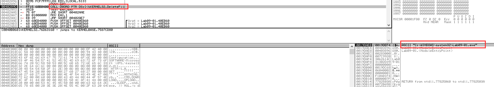
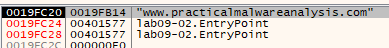
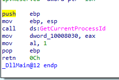
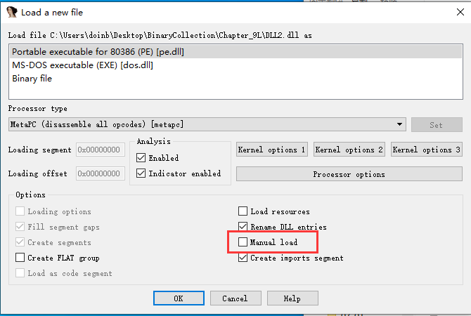

# 第九章 OllyDbg


OllyDbg被普遍用来分析恶意代码之前,最初的用途是破解软件。 Immunity Security公司买下 OllyDbg1.1的基础代码,并将其更名为Immunity Debugger(ImmDbg)。在此之前, OllyDbg直都是恶意代码分析师和漏洞开发者们的首选调试器。Immunity的目的是使这个工具适合漏洞开发者们使用,并且修复了OllDbg中的一些Bug。
在完成 OllyDbg的外观GUI修改,提供带有完整功能的 Python解释器API后,一些用户开始用ImmDbg替代OllyDbg

官网链接：http://www.ollydbg.de/

52pojie汉化版：https://www.52pojie.cn/thread-14986-1-1.html

## 加载恶意代码

* 直接加载可执行程序
* 加载DLL程序
* 通过附加到进程的方式调试已经运行的程序
* 使用命令行运行代码
* 支持执行DLL中的某个函数

### 打开一个可执行文件

* 选择OllyDbg界面中的File->Open, 然后浏览到要加载的可执行文件。
* 如果要调试的程序需要参数,则在Open对话框的 Arguments输入框给出(只能在加载期间给OllyDgb传入命令行参数)
* 默认情况下,如果能够确定软件的入口点位置,即 WinMain, OllyDbg会在这个位置暂停程序的执行。否则OllyDbg会在软件PE头部提供的入口点处中断。另外,你也可以选择 OllyDbg的DebuggingOptions菜单(Options→Debugging Options)来修改这些启动选项。


### 附加调试器到一个运行程序

为将OllyDbg附加到一个进程上,选择OllyDbg界面的File→ Attach。然后会弹出一个菜单,你可以在这个菜单中选择要附加的进程(如果有多个同名的进程,你需要知道调试进程的ID)。接下来选择要调试的进程,并从菜单中选择Attach。此刻OllyDbg会立即暂停这个程序以及它所有的线程。

OllyDbg附加上进程后,进程当前执行线程的代码会被暂停,并显示在OllyDbg的窗口中。然而，有可能在进程正在执行一个系统DLL中的指令时把它暂停了,当这种情况发生时,回到主代码最简单的办法就是在整个代码段中设置一个访问断点。这样就会让这个程序在下次访问代码段时中断执行。


## OllyDbg的接口

OllyDbg主要有以下四个基本窗口


**反汇编面板窗口**
这个窗口显示了被调试程序的代码一当前指令指针的前后一些指令。通常，下一条将要被执行的指令在这个窗口中高亮显示。如果想要修改指令或数据(或添加一些汇编指令),请在这个窗口中按空格键。


**寄存器面板窗口**
这个窗口用来显示被调试程序寄存器的当前状态，代码被调试时，如果一条指令运行过程中修改了寄存器的值，则寄存器窗口中的这个寄存器就会从黑色变为红色。


**栈面板窗口**
这个窗口用来显示被调试线程堆栈在内存中的当前状态。这个窗口总是显示给定线程的栈项。可以通过右击一个栈单元，选择Modify，来操作这个窗口中的栈。OllyDbg会在一些栈单元上显示一些有用的注释，这些注释描述了调用一个API之前栈中存放的参数。‘


**内存转储面板窗口**
这个窗口用来显示被调试进程的实时内存转储。在这个窗口中按CtrI+G组合键，并输入一个内存位置，可以跳转到任何内存地址（也可以单击一个内存地址，然后选择Follow in Dump，来转储那个内存地址）。如果想要编辑这个窗口中的内存，右击它并选择Binary->Edit。使用这种方式也可以修改恶意代码存储在RAM中的全局变量以及其他一些数据。


## 快捷键大全

| 快捷键      | 功能                                                         |
| ----------- | ------------------------------------------------------------ |
| Ctrl+F2     | 重启程序，即重新启动被调试程序。如果当前没有调试的程序，OllyDbg会运行历史列表［historylist］中的第一个程序。程序重启后，将会删除所有内存断点和硬件断点。译者注：从实际使用效果看，硬件断点在程序重启后并没有移除。 |
| Alt+F2      | 关闭，即关闭被调试程序。如果程序仍在运行，会弹出一个提示信息，询问您是否要关闭程序。 |
| F2          | 软件断点                                                     |
| F3          | 加载一个可执行文件进行调试分析，并可以输入运行参数。         |
| F4          | 程序运行到光标处                                             |
| F5          | 缩小还原当前窗口                                             |
| Alt+F5      | 让OllyDbg总在最前面。如果被调试程序在某个断点处发生中断，而这时调试程序弹出一个总在最前面的窗口（一般为模式消息或模式对话框［modal message or dialog］），它可能会遮住OllyDbg的一部分，但是我们又不能移动最小化这个窗口。 |
| F7          | 单步步入到下一条命令，如果当前命令是一个函数［Call］，则会停在这个函数体的第一条命令上。如果当前命令是是含有REP前缀，则只执行一次重复操作。 |
| Shift+F7    | 与F7相同，但是如果被调试程序发生异常而中止，调试器会首先尝试步入被调试程序指定的异常处理（请参考忽略Kernel32中的内存非法访问）。 |
| Ctrl+F7     | 自动步入，在所有的函数调用中一条一条地执行命令（就像您按住F7键不放一样，只是更快一些）。当您执行其他一些单步命令，或者程序到达断点，或者发生异常时，自动步入过程都会停止。每次单步步入，OllyDbg都会更新所有的窗口。所以为了提高自动步入的速度，请您关闭不必要成窗口，对于保留的窗口最好尽量的小。按Esc键，可以停止自动步入。 |
| F8          | 单步步过到下一条命令。如果当前命令是一个函数，则一次执行完这个函数（除非这个函数内部包含断点，或发生了异常）。如果当前命令是含有REP前缀，则会执行完重复操作，并停在下一条命令上。 |
| Shift+F8    | 与F8相同，但是如果被调试程序发生异常而中止，调试器会首先尝试步过被调试程序指定的异常处理（请参考忽略Kernel32中的内存非法访问）。 |
| Shift+F8    | 自动步过，一条一条的执行命令，但并不进入函数调用内部（就像您按住F8键不放一样，只是更快一些）。当您执行其他一些单步命令，或者程序到达断点，或者发生异常时，自动步过过程都会停止。每次单步步过，OllyDbg都会更新所有的窗口。所以为了提高自动步过的速度，请您关闭不必要成窗口，对于保留的窗口最好尽量的小。按Esc键，可以停止自动步过。 |
| **F9**      | 继续运行程序，直到遇到断点                                   |
| Shift+F9    | 与F9相同，但是如果被调试程序发生异常而中止，调试器会首先尝试执行被调试程序指定的异常处理（请参考忽略Kernel32中的内存非法访问）。 |
| **Ctrl+F9** | **执行直到返回，跟踪程序直到遇到返回，用于跳出函数实现。**在此期间不进入子函数也不更新CPU数据。因为程序是一条一条命令执行的，所以速度可能会慢一些。按Esc键，可以停止跟踪。 |
| **Alt+F9**  | **执行直到返回到用户代码段，用于快速跳出系统函数。**跟踪程序直到指令所属于的模块不在系统目录中，在此期间不进入子函数也不更新CPU数据。因为程序是一条一条执行的，所以速度可能会慢一些。按Esc键，可以停止跟踪。 |
| Ctrl+F11    | Run跟踪步入，一条一条执行命令，进入每个子函数调用，并把寄存器的信息加入到Run跟踪的存储数据中。Run跟踪不会同步更新CPU窗口。 |
| F12         | 停止程序执行，同时暂停被调试程序的所有线程。请不要手动恢复线程运行，最好使用继续执行快捷键或菜单选项（像 F9）。 |
| Ctrl+F12    | Run跟踪。步过，一条一条执行命令，但是不进入子函数调用，并把寄存器的信息加入到Run跟踪的存储数据中。Run跟踪不会同步更新CPU窗口。 |
| Esc         | 如果当前处于自动运行或跟踪状态，则停止自动运行或跟踪。如果CPU显示的是跟踪数据，则显示真实数据。 |
| Alt+B       | 显示断点窗口。在这个窗口中，您可以编辑、删除、或跟进到断点处。 |
| Alt+C       | 显示CPU窗口。                                                |
| Alt+E       | 显示模块列表［list of modules］。                            |
| Alt+K       | 显示调用栈［Call stack］窗口。                               |
| Alt+L       | 显示日志窗口。                                               |
| Alt+M       | 显示内存窗口。                                               |

**反汇编窗口中的快捷键［Disassembler shortcuts］**

当CPU窗口中的反汇编面板［Disassembler pane］处于激活状态时，您可以使用以下快捷键：

| 快捷键       | 功能                                                         |
| ------------ | ------------------------------------------------------------ |
| 回车键       | 将选中的命令添加到命令历史［command history］中，如果当前命令是一个跳转、函数或者是转换表的一个部分，则进入到目的地址。 |
| 退格键       | 移除选中部分的自动分析信息。如果分析器将代码误识别为数据，这个快捷键就非常有用。 |
| Alt+退格键   | 撤消所选部分的修改，以备份数据的相应内容替换所选部分。仅当备份数据存在且与所选部分不同时可用。 |
| Ctrl+F1      | 如果API帮助文件已经选择，将打开与首个选择行内的符号名相关联的帮助主题。 |
| F2           | 在首个选择的命令上开关INT3 断点［Breakpoint］，也可以双击该行第二列。 |
| Shift+F2     | 在首个选择命令设置条件断点，参见忽略Kernel32中内存访问异常［Ignore memory access violationsin Kernel32］。 |
| F4           | 执行到所选行，在首个选择的命令上设置一次性断点，然后继续执行调试程序，直到OllyDbg捕获到异常或者停止在该断点上。在程序执行到该命令之前，该一次性断点一直有效。如有必要，可在断点窗口［Breakpoints window］中删除它。 |
| Shift+F4     | 设置记录断点（一种条件断点，当条件满足时一些表达式的值会记录下来）， 详情参见断点［Breakpoint］。 |
| Ctrl+F5      | 打开与首个选择的命令相对应的源文件。                         |
| Alt+F7       | 转到上一个找到的参考。                                       |
| Alt+F8       | 转到下一个找到参考。                                         |
| Ctrl+A       | 分析当前模块的代码段。                                       |
| Ctrl+B       | 开始二进制搜索。                                             |
| Ctrl+C       | 复制所选内容到剪贴板。复制时会简单地按列宽截断不可见内容，如果希望排除不需要的列，可把这些列的宽度调整到最小。 |
| Ctrl+E       | 以二进制（十六进制）格式编辑所选内容。                       |
| Ctrl+F       | 开始命令搜索。                                               |
| **Ctrl+G**   | **转到某地址。该命令将弹出输入地址或表达式的窗口。该命令不会修改 EIP。** |
| Ctrl+J       | 列出所有的涉及到该位置的调用和跳转，在您用这个功能之前，您必须使用分析代码功能。 |
| Ctrl+K       | 查看与当前函数相关的调用树［Call tree］。在您用这个功能之前，您必须使用分析代码功能。 |
| Ctrl+L       | 搜索下一个，重复上一次的搜索内容。                           |
| Ctrl+N       | 打开当前模块的名称（标签）列表。                             |
| Ctrl+O       | 扫描object文件。扫描Object文件。该命令会显示扫描Object文件对话框，您可以在该对话框中选择Object文件或者lib文件，并扫描这个文件，试图找到在实际代码段中用到的目标模块。 |
| Ctrl+R       | 搜索所选命令的参考。该命令扫描激活模块的全部可执行代码，以找到涉及到首个选中的命令的全部相关参考（包括：常量、跳转及调用），您可以在参考中使用快捷键Alt+F7 和 Alt+F8来浏览这些参考。为便于您使用，被参考的命令也包含在该列表中。 |
| Ctrl+S       | 命令搜索。该命令显示命令查找［Find command］对话框供您输入汇编命令，并从当前命令开始搜索。 |
| 星号(*)      | 转到原始位置（激活线程的EIP处）。                            |
| Ctrl+星号(*) | 指定新的起始位置，设置当前所选线程的EIP为首个选择字节的地址。您可以在选择EIP并撤消该操作。 |
| 加号(+)      | 如果run跟踪［run trace］ 没有激活，则根据命令历史［command history］跳到下一条运行过命令的地方；否则跳到Run跟踪的下一个记录。 |
| Ctrl+加号    | 跳到前一个函数开始处。（注意只是跳到，并不执行）             |
| 减号(-)      | 如果run跟踪［run trace］ 没有激活，则根据命令历史［command history］跳到前一条运行过命令的地方；否则跳到Run跟踪的前一个记录。 |
| Ctrl+减号    | 跳到下一个函数开始处。（注意只是跳到，并不执行）             |
| 空格         | 修改命令。您可在显示对话框中以汇编语言修改实际指令或输入新指令，这些指令将替换实际代码，您也可以在想要修改的指令处双击鼠标。 |
| 冒号(:)      | 添加标签。显示添加标签窗口［Add label］或修改标签窗口［Changelabel］，您可在此输入与首个选择的命令中的第一个字节相关联的标签（符号名）。注意，在多种编程语言中，冒号可以是标签的一部分。 |
| 分号(;)      | 添加注释［comment］。显示添加注释窗口［Add label］或修改注释窗口［Changelabel］，您可在此输入与首条所选命令的第一个字节相关联的注释（注释串会显示在最后一列中）。注意，多种汇编语言使用分号作为注释开始。您也可以在注释列双击需要注释的命令行。 |


## 内存映射

内存映射窗口( View->Memory)显示了被调试程序分配的所有内存块。


内存映射是查看程序在内存中布局的一个好方式。你可以双击内存映射中的任意一行，显示那个段的内存转储。你也可以通过右击一段内存转储，然后选择Disassemble的方式，查看dump出的机器码对应的汇编代码。


### 基地址重定位

内存映射能够帮助你理解一个PE文件在运行时如何被重定位。基地址重定位是指Windows中的一个模块没有被加载到其预定基地址时发生的情况。

**基地址**
Windows中的所有PE文件都有一个预定的基地址，它在PE文件头中被称为映像基地址。

Windows允许映像基地址与要被加载到内存的实际地址不一致，虽然大部分情况下是一致的。大部分执行程序都被预定加载到**0x00400000**处，这个地址是Windows平台下大多数编译器使用的默认地址。不过，开发者可以选择将执行程序的基地址设置为一个与此不同的地址。支持地址空间布局随机化( ASLR)安全增强特性的可执行程序会经常被重定位。这就是说.DLL的重定位变得更加普遍。
因为一个应用程序可能导入许多DLL，而每个DLL都有一个希望被加载到内存中的预定基地址，所以重定位十分必要。假设有两个DLL被加载，并且它们拥有相同的预加载地址**0x10000000**，则它们不可能都加载到这个位置,Windows会将其中一个DLL加载到这个地址，另一个DLL重定位到另外某个地址。
Windows操作系统自带的大多数DLL有不同的预定基地址，而且它们之间不会产生冲突。然而第三方应用程序会经常出现使用同一个预定基地址的情况。

可以使用`PEView`工具查看EXE文件和DLL文件的基址。


也可以直接将DLL拖进IDA Pro中查看映像基址。


**绝对地址与相对地址**
重定位过程比简单将代码加载到另一个位置要复杂得多。虽然多数指令会引用内存中的相对地址，但是有些却引用内存的绝对地址。

## 查看线程和堆栈

恶意代码经常使用多线程。你可以通过选择View->Threads，调出线程面板窗口，查看一个程序的当前线程。这个窗口显示了线程的内存位置，以及它们当前的活动状态（活动、暂停，或者挂起）。
由OllyDbg是单线程的，可能需要你先暂停所有的线程，设置一个断点后，继续运行程序，这样可以确保在一个特定线程内调试。单击主工具栏中的暂停按钮，可以暂停所有活动的线程。使用`Kill`结束线程。


## 执行代码

以下是OllyDbg中执行代码的方式：


Run/Pause：开始或者暂停一个程序，多数情况下Pause不如断点常用。调试常用的方法都可以在Dubug目录下找到。


## 断点

Ollydbg默认使用软件断点，也可以设置其他的断点

* 软件断点 Toggle
* 硬件断点 Hardware
* 条件断点 Conditation
* 内存断点 Memory


### 软件断点

调试字符串解码函数时，软件断点特别有用。


### 条件断点

条件断点是软件断点的一种，只有某些条件得到满足时这个断点才能中断执行程序。OllyDbg调试器允许使用表达式，来设置断点，每当断点命中时，都会先计算表达式的值，如果其值不等于零，断点生效，程序运行中断。

对于调用频繁的API函数，仅当特定参数传给它时才中断程序执行，这种情况下，条件软件断点特别有用。

**设置条件断点的步骤**

* 右击反汇编面板窗口中函数的第一条指令，选择Breakpoint->Conditional。然后会弹出一个对话框，要求你输入条件表达式.
* 在步骤l弹出的对话框中输入表达式，然后单击OK按钮。
* 单击Play按钮，并等待条件断点命中。

### 硬件断点

硬件断点非常强大，它可以在不改变你的代码、堆栈以及任何目标资源的前提下进行调试。

**OllyDbg中，在某一指令上设置硬件断点的方法是：右击该指令选择Breakpoint->Hardware，on Execution。**

通过使用Debugging Options菜单，你可以告诉OllyDbg默认使用硬件断点来代替软件断点。同时，使用硬件断点可以帮助你防御反调试技术，如软件断点扫描。硬件断点也可以用来在脱壳时寻找OEP。

### 内存断点

在一个内存块上设置内存断点，可以让被调试程序在访问这段内存时中断执行。OllyDbg支持软件内存断点和硬件内存断点，此外还支持对内存进行读、写、执行或其他权限访问是否产生中断的设置。

为了设置一个基本的内存断点，在内存转储面板窗口中选择一部分内存，或者在内存映射面板窗口中选择一个内存段，然后右击它，选择Breakpoint->Memory,on Access。OllyDbg只允许你一次设置一个内存断点。如果你设置了一个新的内存断点，那么之前设置的内存断点会被移除。


在分析恶意代码时，如果想知道恶意代码何时使用了某个加载的DLL，这时内存断点将变得特别有用。可以设置这样一个内存断点，当DLL中的代码运行时程序被中断。下面是实现这种功能的步骤：

* 打开内存映射面板窗门，并右i键单击需要跟踪DLL的.text段（.text段包含DLL的可执行代码）。

* 选择Set Memory Breakpoint on Access.

* 按F9键或者单击Play按钮恢复程序运行。

  当应用程序运行到DLL的．text段代码时．会中断执行。

## 加载DLL


除了可以调试加载的或者附加的可执行程序，OllyDbg还可以调试DLL。然而由于DLL不能直接运行．OllyDbg使用了一个名为loaddll. exe的虚拟程序来加载它。由于恶意代码经常打包成DLL．且其大部分代码都包含在DLL的DlIMain函数（DLL的初始化函数，当DLL被加载到进程时被调用）中，因此OllyDbg的这种技术非常有用。默认情况下，一旦DLL被加载，OllyDbg会在DLL的入口点(DllMain)处中断。

如果要用参数调用被调试DLL中的导出函数，首先用OllyDbg加载DLL．然后在其入口点处暂停DLL的执行，最后单击Play按钮，运行DllMain函数，以及其他一些DLL要求的初始化操作。


## 跟踪

跟踪是一种强大的调试技术，它可以记录程序详细的运行信息，供你查阅。OllyDbg支持多种跟踪功能，包括：

* 标准回溯跟踪
* 堆栈调用跟踪
* 运行跟踪

### 标准回溯跟踪

每次你在反汇编面板窗口上执行Step Into和Step Over操作时，OllyDbg都会记录下这种动作。你可以使用键盘上的减号键（一）。退回到上一步运行的指令：使用加号键(+)．执行下一条指令。
如果使用Step Into，你可以跟踪每一步的执行。如果使用Step Over，只能单步跟踪step over之前区域，回溯之后再决定是否进入另一个区域。

### 堆栈调用跟踪

在OllyDbg中，通过堆栈跟踪可以查看一个给定函数的执行路径。为了查看堆栈调用，在主菜单中选择View->Call Stack．会弹出一个窗口，窗口中显示了当前位置之前的调用序列。
为了跟踪堆栈调用，单击地址或者堆栈调用窗口中的某段。当你在那个堆栈位置时，寄存器和堆栈并不会显示什么，除非你执行运行跟踪操作。

### 运行跟踪

运行跟踪是指在运行代码时，OllyDbg会保存所有运行过的指令，以及它们运行过程中对寄存器和标志所做的改变。

**几种激活运行跟踪的方法**
· 在反汇编面板窗口中高亮你要跟踪的代码。右键单击代码，选择Run Trace–Add Selection。代码运行后，选择View->Run Trace，查看运行过的指令。使用键盘上的一（减号键）和+（加号键），来上下浏览代码（与标准回溯跟踪小节讨论的一样）。使用这种方法，可以查看每条指令执行时所有寄存器发生的变化。
· 使用Trace Into与Trace Ovcr选项。这些选项比Add Selection更容易使用，因为它们不需要你选择需要跟踪的代码。Trace Into可以单步执行并且记录命中断点前所有的运行指令，但Trace Over仅记录当前正在运行函数的指令。
· 选择Select Debug->Set Condition。可以在命中条件使程序暂停之前，跟踪程序的运行。如果你想在条件断点命中时停止跟踪，并且从发生中断的位置，回溯跟踪查看如何或者为什么发生中断，这种跟踪方法将对你非常有帮助。

## 异常处理

默认情况下．OllyDbg被附加后会产生异常，附加程序也会停止运行，此时调试器开始接管控制权。调试器可以处理该异常，也可以将异常转到被调试的应用程序处理。当异常发生时．OllyDbg会暂停运行，然后你可以使用下列任一种方法，来决定是否将异常转到应用程序处理：

*  Shift+F7将进入异常。
*  Shift+F8将跳过异常。
*  Shift+F9将运行异常处理。


## 修补

OllyDbg可以很容易修改实时数据，如寄存器和标志。它也可以将汇编形式的修补代码直接插入到一个程序。你可以通过高亮选择某块区域来修改指令或内存，右击这块区域，选择Binary->Edit，会弹出让你添加操作码和数据的窗口（OllyDbg具有一些特殊功能，可以使用00项或NOP指令填充程序）。


## 分析shellcode

OllyDbg有一种分析shellcodc的简单方法。下面是使用这种方法的步骤:

* 1．将shellcode从一个十六进制编辑器复制到剪切板。
* 2．在内存映射面板窗口中，选择类型为Priv的内存区域（这是分配给进程的私有内存，与只读的可执行镜像不同，这些内存被多个进程共享）。
* 3．双击内存映射面板窗口的某行，会弹出一个十六进制转储窗口，你可以检查它的内容。该区域应该包含几百个连续为0的字节。
* 4．在内存映射面板窗口中，右击被选择的区域，选择Set Access—Full Access，赋予该区域读、写、运行的权限。
* 5．返回内存转储窗口。0字节填充的高亮区域足以容纳整个sheUcode，右键单击选择的内存区域，然后选择Binary一Binary Paste。这个操作将步骤l中复制的shellcode粘贴到选择的区域。
* 6．设置EIP寄存器，指向你修改的内存区域（右击反汇编面板窗口的一条指令，选择New Origin Here，你可以很容易设置EIP寄存器的值）

上述步骤结束后，你就可以像对待正常应用程序一样运行、调试和单步整个shellcode了

## 协助功能

OllyDbg提供了多种机制来帮助分析，包括下面几种：

**日志( Logging)**
OllyDbg维护一个持续可用的事件日志。要访问这个日志，选择View->Log。此日志显示了加载的可执行模块、触发的断点，以及其他一些信息。另外，在分析过程中，日志还可以帮助你找出为到达某一特定状态而执行的那些操作。
**监视(Watches)窗口**
OllyDbg支持使用监视窗口，用它可以查看你生成表达式的值。程序运行时，这个表达式会不断更新。你可以通过View—Watches，来访问监视窗口，你也可以在监视窗口中按下空格键，来设置表达式。
**帮助（Help）** OllyDbg的Help->Contents选项为运算表达式的书写提供了详细说明。当你想监视一些特定数据或者复杂函数时，这个帮助非常有用。例如，如果想监控EAX+ESP+4处的内存，你只需要输入表达式[EAX+ESP+4]。
**标注（Labeling）** 如IDA Pro一样，你可以为OllyDbg中的子例程和循环添加标注。OllyDbg中的标注是为调试程序中某个地址设置的一个简单符号名称。为了在反汇编面板窗口设置标注，右击一个地址选择Label，此时会弹出提示输入标注的窗口。设置完标注以后，对这个地址的所有引用都会被该标注代替。

## 插件

OllyDbg拥有一些标准插件，其中一些可以免费下载到。在网站 http://www.openrce.org/downloads/browse/OllyDbg_Plugins 中，你可以找到一些对分析恶意代码有用的OllyDbg插件。
OllyDbg的插件以DLL形式存在，如果要安装某个插件，你将这个插件的DLL放到OllyDbg的安装根目录下即可。一旦将DLL放入OllyDbg的安装根目录，OllyDbg会自动识别这个插件，并将其添加到插件菜单。

### 1. OllyDump

OllyDump是OllyDbg最常使用的插件，它能够将一个被调试的进程转储成一个PE文件。当加载器加载一个可执行文件时，OllyDump会尝试逆向这个进程。然而，OllyDump利用的是进程内存中各段（代码段、数据段等）的状态。OllyDbg最典型的应用就是脱壳。

### 2. 调试器隐藏插件

调试器隐藏插件用多种方法对探测者隐藏调试器的存在。为了防止恶意代码使用反调试技术，恶意代码分析人员通常在分析恶意代码期间，一直运行调试器隐藏插件。这个插件主要针对IsDebuggerPresent检测、FindWindow检测、未处理异常欺骗以及用OutputDebugString反OllyDbg调试等反调试技术。

### 3. 命令行

要打开命令行窗口，选择Plugins->Command Line->Command Line。

### 4. 书签

OllyDbg默认情况下自带书签插件，书签插件可以将一个内存位置加到书签中，利用书签，下次不需要记住就可以轻松获取那个内存地址。右击反汇编面板窗口中的地址，选择Bookmark->Insert Bookmark．可以添加书签。选择Plugins->Bookmarks->Bookmarks，可以浏览书签，然后单击书签可以跳转到该书签代表的地址。

## 脚本调试

因为OllyDbg的插件被编译成DLL，创建或者修改一个插件往往是一个复杂的过程。因此，当需要扩展调试功能时，我们采用ImmDbg。它使用Python脚本来扩展功能，并且提供了易于使用的API接口。
ImmDbg的Python API包含很多实用工具和函数。例如，可以将你的脚本像本地代码一样集成到调试器中，创建自定义的表格、图形和各种接u。利用脚本分析恶意代码的原因有多种，典型的包括反调试器补丁、内联函数钩子( hook)以及函数参数日志等，其中许多代码可以在网上找到。
ImmDbg最常见的Python脚本类型是PyCommand．这个Python脚本位于ImmDbg安装目录下的PyCommands\目录中。编写好Python脚本后，必须将其放到这个目录下才能运行。这些脚本从命令栏运行，并且需要加上前缀“!”，如在命令行中输入!list命令，可以列出可用的PyCommand列表。
PyCommand类型脚本拥有如下结构：

* 一系列Import导入语句，用来导入Python的模块（同所有的Python脚本一样）。通过immlib或immutils模块访问ImmDbg的功能。
*  一个主函数，用来读取命令行参数（以Python列表传递）。
* PyCommand的代码实现部分。
* 返回包含字符串的值。一旦脚本运行结束，主调试器会用这个返回字符串更新状态栏。

## 实验部分

### Q

Lab9-1：使用IDA Pro和OllyDbg分析恶意文件Lab9-1.exe，回答以下问题。

1. 如何让这个恶意代码安装自身?
2. 这个恶意代码的命令行选项是什么?它要求的密码是什么?
3. 如何利用OllyDbg永久修补这个恶意代码，使其不需要指定的命令行密码?
4. 这个恶意代码基于系统的特征是什么？
5. 这个恶意代码通过网络命令执行了哪些不同操作?
6. 这个恶意代码是否有网络特征?


Lab09-02：使用OllyDbg分析恶意代码Lab09-02.exe，回答以下问题。

1.在二进制文件中，你看到的静态字符串是什么?
2.当你运行这个二进制文件时，会发生什么?
3.怎样让恶意代码的攻击负载(payload)获得运行?
4.在地址0x00401133处发生了什么?
5.传递给子例程(函数) 0x00401089的参数是什么?
6.恶意代码使用的域名是什么?
7.恶意代码使用什么编码函数来混淆域名?
8.恶意代码在0x0040106E处调用CreateProcessA函数的意义是什么?


Lab09-03：使用OllyDbg和IDAPro分析恶意代码文件Lab09-03.exe.这个恶意代码加载3个自带的DLL(DLL.dl、DLL2.dll、 DLL3.dll) ，它们在编译时请求相同的内存加载位置。因此，在OllyDbg中对照IDA Pro浏览这些DLL可以发现，相同代码可能会出现在不同的内存位置。这个实验的目的是让你在使用OllyDbg看代码时可以轻松地在IDA Pro里找到它对应的位置。

1. Lab09-03.exe导入了哪些DLL?
2. DLLI.dll、 DLL2.dll、 DLL3.dll 要求的基地址是多少?
3. 当使用OllyDbg调试Lab09-03.exe时，为DLLI.dll、DLL2.dll、 DLL3.dll 分配的基地址是什么?
4. 当Lab09-03.exe调用DLLI.dll中的一个导入函数时，这个导入函数都做了些什么?
5. 当Lab09-03.exe调用WriteFile函数时，它写入的文件名是什么? 
6. 当Lab09-03.exe使用NetScheduleJobAdd创建-一个job时，从哪里获取第二个参数的数据?
7. 在运行或调试Lab09-03.exe时，你会看到Lab09-03.exe打印出三块神秘数据。DLL 1的神秘数据, DLL 2的神秘数据，DLL 3的神秘数据分别是什么?
8. 如何将DLL2.dll加载到IDA Pro中，使得它与OllyDbg使用的加载地址匹配?


### A

**Lab09-01**

使用IDA Pro打开Lab09-01.exe文件，查看main函数的地址，发现main函数位于`0x00402AF0`.


首先会检查参数的个数是不是1。


如果只有一个参数，就会检查注册表是否有`SOFTWARE\Microsoft \XPS`，执行删除自身的操作。


其他逻辑先不细看，先使用OllyDbg动态调试。(这里需要注意一下，以管理员权限打开OD，不然之后调试逻辑可能有问题，我是从后面穿越过来的。)


F8到 `CALL 00402AF0`处，这里是对主函数的调用，F7步入，继续单步执行。`0x00402AFD`处查看参数个数是否为1。


继续执行到`0x00401000`处，该函数检查注册表。


步入`0x402410`处的函数，会在`0x004024EE`处调用`ShellExecuteA`参数是`/c del C:\Users\***\Desktop\BINARY~1\CHC9F5~1\Lab09-01.exe >> NUL`执行删除自身的操作，这和静态分析的结果一致。


此时由于参数不正确，恶意代码只是删除自身，难以继续分析，可以继续使用IDA Pro 找到合适的执行流程。


可以看到参数主要有以下几个可选项

* -in
* -re
* -c
* -cc

程序还会检查最后一个参数是不是合法，跟进`sub_402510`函数，此函数会检查最后一个参数是不是abcd，相当于密码，检查失败程序也不会正常执行。


第一种方式我们可以直接逆向处`sub_402510`的逻辑，输入正确的密码，第二种思路，我们可以改变`0x00402B38`处的逻辑，无论`sub_402510`的执行结果为什么，直接跳到`loc_402B3F`函数处。


将此处的`JNZ`指令修改为`JMP`指令。


修改成功后，可以直接跳到`00402B3F`位置。


可以修改指令绕过检查密码的函数，输入`-in abcde`后继续执行，执行到`00402600`位置。


```
BOOL __cdecl sub_402600(LPCSTR lpServiceName)
{
  SC_HANDLE hService; // [esp+Ch] [ebp-1408h]
  char v3[1024]; // [esp+10h] [ebp-1404h] BYREF
  CHAR Filename[1024]; // [esp+410h] [ebp-1004h] BYREF
  CHAR DisplayName[1024]; // [esp+810h] [ebp-C04h] BYREF
  CHAR BinaryPathName[1024]; // [esp+C10h] [ebp-804h] BYREF
  SC_HANDLE hSCManager; // [esp+1010h] [ebp-404h]
  CHAR Src[1024]; // [esp+1014h] [ebp-400h] BYREF

  if ( sub_4025B0(v3) )
    return 1;
  strcpy(Src, aSystemrootSyst);                 // %SYSTEMROOT%\system32\
  strcat(Src, v3);
  strcat(Src, aExe);                            // .exe
  hSCManager = OpenSCManagerA(0, 0, 0xF003Fu);
  if ( !hSCManager )
    return 1;
  hService = OpenServiceA(hSCManager, lpServiceName, 0xF01FFu);
  if ( hService )
  {
    if ( !ChangeServiceConfigA(hService, 0xFFFFFFFF, 2u, 0xFFFFFFFF, BinaryPathName, 0, 0, 0, 0, 0, 0) )
    {
      CloseServiceHandle(hService);
      CloseServiceHandle(hSCManager);
      return 1;
    }
  }
  else
  {
    strcpy(DisplayName, lpServiceName);
    strcat(DisplayName, aManagerService);       // Manager Service
    hService = CreateServiceA(hSCManager, lpServiceName, DisplayName, 0xF01FFu, 0x20u, 2u, 1u, Src, 0, 0, 0, 0, 0);
    if ( !hService )
    {
      CloseServiceHandle(hSCManager);
      return 1;
    }
  }
  CloseServiceHandle(hService);
  CloseServiceHandle(hSCManager);
  if ( !ExpandEnvironmentStringsA(Src, BinaryPathName, 0x400u) )
    return 1;
  if ( !GetModuleFileNameA(0, Filename, 0x400u) )
    return 1;
  if ( !CopyFileA(Filename, BinaryPathName, 0) )
    return 1;
  if ( sub_4015B0(BinaryPathName) )
    return 1;                                   // ups
  return sub_401070(aUps, aHttpWwwPractic, a80, a60) != 0;// http://www.practicalmalwareanalysis.com
}
```

运行到函数`OpenServiceA()`函数处，`lpServiceName`参数为`Lab09-01`.


继续执行至`0x004028A1`处，参数为`C:\Users\doinb\Desktop\BinaryCollection\Chapter_9L\Lab09-01.exe `和`C:\WINDOWS\system32\Lab09-01.exe`，作用为复制自身到系统目录下。


继续执行至`0x004028B9`处，关注函数`sub_4015B0`和`sub_4014E0`


函数参数为`C:\WINDOWS\system32\Lab09-01.exe`和`C:\WINDOWS\system32\Kernel32.dll`，目的是将修改`Lab09-01.exe`的时间戳，此种技术被称为timestomping，ATT&CK中解释如下。

https://attack.mitre.org/techniques/T1070/006/

```
Adversaries may modify file time attributes to hide new or changes to existing files. Timestomping is a technique that modifies the timestamps of a file (the modify, access, create, and change times), often to mimic files that are in the same folder. This is done, for example, on files that have been modified or created by the adversary so that they do not appear conspicuous to forensic investigators or file analysis tools.

Timestomping may be used along with file name Masquerading to hide malware and tools.[1]
```


继续执行代码到`0x004028E0`处。


调用函数`sub_401070`，参数为`ups,http://www.practicalmalwareanalysis.com,80,60`（注意压栈顺序）

继续执行到`0x004011D5`处，调用函数`RegSetValueExA()`函数处，进入函数，这时`EDX`处保存的就是lpdata位置。这是以`ups`开头的字符串，就是把这个恶意domain和port的配置文件写入到了注册表中 `HKLM\SOFTWARE\\Microsoft \\XPS` 位置，名为`Configuration`值为`ups.http://www.practicalmalwareanalysis.com.80.60`，将配置信息持久化。右键`EDX`，选择`Follow in Dump`转储文件。


之后就会在16进制视图上显示。


命令行参数`-in`的行为分析结束，总结一下：

* 创建服务`Lab09-01`
* 复制文件到`C:\WINDOWS\system32\Lab09-01.exe`
* Timestomping技术修改时间戳
* 创建注册表项`HKLM\SOFTWARE\\Microsoft \\XPS`，名为`Configuration`值为`ups.http://www.practicalmalwareanalysis.com.80.60`。

____


继续分析其他的命令行选项。

输入参数`-re abcd`运行函数到`0x00402C18`处，调用函数`00402900`


该函数主要作用为删除服务。删除系统目录下的文件。`C:\WINDOWS\system32\Lab09-01.exe`，总体上来说`-re`参数执行的行为和`-in`参数相反。




____

以`-cc abcd`参数运行文件。调用`sub_401280`。


参数如下


继续运行至`0x00402D60`位置，`call 00402E7E`，参数如下，格式化字符串，并打印。


___

以参数`-c`运行程序比较特殊，要检查是否有七个参数，所以使用以下命令运行

`-c AA BB CC DD abcd`，这里参数看似是六个，实际上文件名也是参数，这时一共有七个参数`argc=7`，`argv=(Lab09-01, -c, AA, BB, CC, DD, abcd)`。


运行程序跟进至`0x00402CC5`处，关注函数`sub_401070`，参数如下


继续运行至`RegSetValueExA`处，查看参数


这个地址上保存的就是`RegSetValueExA`函数的参数`lpData`，之后右键选择`Follow in Dump`在16进制窗口查看。


所以这个函数就是把参数用`.`拼接，然后重新设置注册表的键。


**后门分析**

继续查看strings页面，发现有网络连接和疑似后门字符串，查看引用。


在函数`sub_402020`发现对后门字符串的引用，对`HTTP/1.0\r\n\r\n`的直接引用在`sub_401AF0`处，继续查看引用，看到函数`sub_401E60`继续查看引用发现到了函数`sub_402020`，接下来就重点分析`sub_402020`函数。


支持的命令如下

| 命令     | 实现地址 | 行为                                                     |
| -------- | -------- | -------------------------------------------------------- |
| SLEEP    | 0x402076 | 睡眠                                                     |
| UPLOAD   | 0x4019E0 | 通过端口port连接远程主机并且读取内容，在本地文件创建file |
| Download | 0x401870 | 读取文件file并通过端口port发送到远程主机                 |
| CMD      | 0x402268 | 运行command命令                                          |
| NOTHING  | 0x402356 | 无操作                                                   |

实现地址除了`UPLOAD`和`Download`可以直接在伪代码里面看到，其他可以在图形模式里清晰看到。（_strncmp以后jnz的跳转）

回答：

1、可以使用命令行`-in abcd`也patch程序，跳过密码验证流程。

2、有四个可选的命令行和密码`abcd`

3、将`0x00402B38`处的`jnz`指令改为`jmp`指令

4、创建了注册表项`HKLM\SOFTWARE\Microsoft \XPS\Configuration`会在此写配置`ups.http://www.practicalmalwareanalysis.com.80.60`，相关配置信息之间使用`.`连接，在使用`-c`参数重新修改配置信息的时候，也会修改注册表此处的信息。

5、执行了上述分析的五个操作，不再赘述

6、恶意代码向`http://www.practicalmalwareanalysis.com`发出GET请求。


**Lab09-02**

1、在IDA Pro中查看strings，看到的是一些报错字符串和导入函数名称，参考答案以后发现还有`cmd`字符串。这是因为`IDA Pro`的strings窗口显示的字符串默认最小长度是5，需要在setup里面设置。（Unicode选项也比较常见，记得选上），也可以使用`strings.exe`程序


2、运行程序很快就退出，使用`Process Monitor`捕获到了一些文件操作和注册表操作，没有太多有价值的信息。

3、运行之前将文件命名为`ocl.exe`，看IDA伪代码很清晰。


也可以动态运行，在`00401240`执行之前改`ZF`寄存器为1。改变程序执行逻辑，相当于把文件名给改成了`ocl.exe`


4、在地址`0x00401133`处是在栈上创建了字符串，这个字符串在后面被用来混淆域名。

5、在此处传入的参数是`1qaz2wsx3edc`和一个缓冲区。

在`0x4012BD`处打断点，查看栈上数据


6、攻击者使用的域名是`www.practicalmalwareanalysis.com`，添加断点到`0x4012CC`处，观察栈上数据。



7、解密域名的主要逻辑在`sub_401089`，通过字符串`1qaz2wsx3edc`异或加密过的域名信息来完成解密工作。


8、这部分代码显然是一个反向shell，将cmd的输入，输出，错误绑定到socket，并且`wShowWindow`被赋值为0，不显示窗口。


**Lab09-03**

1、有六个导入的DLL，导入表中有四个，LoadLibrary函数调用了两个。


查看交叉引用


2、三个文件基址都是要求`0x10000000`，使用`PEView`查看即可。

3、基址如下图所示

DLL1和DLL2在导入表中，都是被立即加载的，DLL3是被动态调用的。在`0x004010417`下断点。在OD的内存映射界面查看基址重定位的结果，只有DLL1在预定的`0x10000000`位置。


4、

运行程序结果如下。


IDA Pro中查看DLL1，查找`dword_10008030`的交叉引用 ，看是说明时候被赋值的。发现是调用了`GetCurrentProcessId`以后的结果。




OD中动态运行，拿到的进程ID是`0xBC8`（十进制3016）


接下来用Process Monitor验证一下，重新调试程序


而且新建了文件`temp.txt`，文件内容是`malwareanalysisbook.com`


同理分析DLL2的两个函数`DLL2Print`函数打印的是`CreateFileA`的执行结果，也就是文件句柄。

5、写入的文件名是`temp.txt`，`WriteFile`的`hFile`参数是`DLL2ReturnJ`返回的文件句柄。

6、第二个参数是从`DLL3GetStructure`函数返回的一个指向全局变量`stru_5EB0A0`的指针，通过查询[MSDN](https://docs.microsoft.com/en-us/windows/win32/api/lmat/nf-lmat-netschedulejobadd)中`NetScheduleJobAdd`的参数发现第二个参数是一个名为`AF_INFO`的`struct`。可以在`Structures`窗口添加一个结构体(使用快捷键`Insert`)

进入`stru_5EB0A0`的内存位置，选择`Edit -> Struct Var`。


7、可以看到DLL3打印出的是宽字符串的地址转换为十进制的结果。在调用`00401041    FF15 20504000   call dword ptr ds:[<&KERNEL32.LoadLibrar>;`之后 DLL3的_DllMain就执行完毕了，这时候就能根据内存映射界面DLL3的基址加上`0xB0c0`的偏移找到内存中的宽字节字符串了。


7、神秘数字上面已经分析完毕。

8、在加载到IDA Pro时候，选择手动加载(Manual Load)，如下。



可以看到此时IDA Pro中显示的地址就和OD中的地址一致了。


