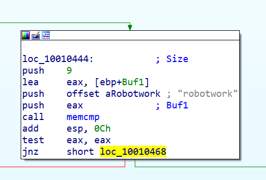

# 第五章 IDA Pro

本章简单介绍了IDA Pro的用法，详细信息推荐阅读《IDA Pro权威指南（第二版）》这本书是《The IDA Pro Book: The Unofficial Guide to the World's Most Popular Disassembler》的中文版，也是不可不读的经典之作。


## 加载一个可执行文件


最上面的方框是选择文件格式的，1是PE文件格式，想让IDA将文件作为一个原始二进制文件进行反汇编时，选择3，这个选项是非常有用的，因为恶意代码有时会带有shellcode、其他数据、加密参数，甚至在合法的PE文件中带有可执行文件，并且当包含这些附加数据的恶意代码在Windows.上运行或被加载到IDA Pro时，它并不会被加载到内存中。此外，当你正在加载- -个包含shellcode的原始二进制文件时，你应该将这个文件作为二进制文件加载并反汇编它。

PE文件被编译加载到内存中一个首选的基地址，如果Windows加载器无法将它加载到它的首选地址(因为这个地址已经被使用)，加载器会执行一个叫做基地址重定向的操作。这在DLL中经常发生，因为它们经常被加载到与它们首选地址不同的位置。如果你遇到进程中加载的---个DLL的位置与你在IDAPro中看到的不一样，这可能是这个文件被基地址重定向的结果。发生这种情况时，选中图中4处的Manual Load复选框，这时你会看到-一个输入框，你可以指定这个文件要加载的新的虚拟基地址。

## IDA Pro接口

### 反汇编窗口模式

使用**空格键**切换图形模式和文本模式。

#### 图形模式

**打开行号显示**


**自动添加反汇编注释**

对于萌新来说有很多没见过的指令，添加反汇编注释以后看起来会轻松很多，不需要每一个不认识的指令都去查阅资料。


**IDA目录结构**


在IDA的安装根目录下有许多文件夹，各个文件夹存储不同的内容

cfg：包含各种配置文件，基本IDA配置文件ida.cfg,GUI配置文件idagui.cfg，文本模式用户界面配置文件idatui.cfg,

dbgsrv：包含远程调试器，可以将此文件夹中对应的调试器复制到对应系统进行远程调试。

idc:idc目录包含IDA的内置脚本语言IDC所需的核心文件。

ids:ids目录包含一些符号文件（IDA语法中的IDS文件），这些文件用于描述可被加载到IDA的二进制文件引用的共享库的内容。这些IDS文件包含摘要信息，其中列出了由某一个指定库导出的所有项目。这些项目包含描述某个函数所需的参数类型和数量的信息，函数的放回类型以及与该函数的调用约定有关的信息。

Loaders：loaders目录包含在文件加载过程中用于识别和解析PE或ELF等已知文件格式的IDA扩展。

platform:系统运行需要的库文件

plugins：plugins目录包含专门为IDA提供附加功能的IDA模块。

procs：procs目录包含已安装的IDA版本所支持的处理器模块。处理器模块为IDA提供机器语言-汇编语言转换功能，并负责生成在IDA用于界面中显示的汇编语言。

Sig：sig目录包含IDA在各种模式匹配操作中利用的现有代码的签名。通过模式匹配，IDA能够将代码序列确定为已知的库代码，从而节省大量的分析时间。这些签名有IDA的“快速的库识别和鉴定技术”（FLIRT）生成。

til：til目录包含一些类型库信息，IDA通过这些信息记录特定与各种编译器库的数据结构的布局

themes：该文件夹存储IDA样式文件，可以定制样式。

python/python38：IDA Python模块

**箭头颜色：**

1. 红色：一个条件跳转没有被采用
2. 绿色：这个条件跳转被采用
3. 蓝色：一个无条件跳转被采用

**常用快捷键**

记录几个常用的快捷键

a：将数据转换为字符串

f5：一键反汇编

esc：回退键，能够倒回上一部操作的视图（只有在反汇编窗口才是这个作用，如果是在其他窗口按下esc，会关闭该窗口）

shift+f12：可以打开string窗口，一键找出所有的字符串，右击setup，还能对窗口的属性进行设置

ctrl+w：保存ida数据库

ctrl+s：选择某个数据段，直接进行跳转

ctrl+鼠标滚轮：能够调节流程视图的大小

x：对着某个函数、变量按该快捷键，可以查看它的交叉引用

g：直接跳转到某个地址

n：更改变量的名称

y：更改变量的类型

/ ：在反编译后伪代码的界面中写下注释

\：在反编译后伪代码的界面中隐藏/显示变量和函数的类型描述，有时候变量特别多的时候隐藏掉类型描述看起来会轻松很多

；：在反汇编后的界面中写下注释

ctrl+shift+w：拍摄IDA快照

u：undefine，取消定义函数、代码、数据的定义

**折叠流程图中的分支**

在流程视图中，分支过多的时候，可以在窗口标题处右击选择group nodes，就能把当前块折叠起来，分支可以自己命名，帮助理解代码块作用。


**函数调用图**

菜单栏中：view-->graphs-->Function calls(快捷键Ctrl+F12)

**函数流程图**


**创建结构体**

创建结构体是在IDA的structures窗口中进行的


可以看到已经存在了三个结构体，可以右键选择hide和unhide来决定是否详细展示结构体


创建结构体的快捷键是：insert


在弹出的窗口中，可以编辑结构体的名字

这底下有三个复选框，第一个表示显示在当前结构体之前（就会排列在第一位，否则排列在你鼠标选定的位置），第二个表示是否在窗口中显示新的结构体，第三个表示是否创建联合体。

需要注意的是，结构体的大小是它所包含的字段大小的总和，而联合体的大小则等于其中最大字段的大小


可以使用快捷键`D`或者右键选择Data进行添加数据操作。成员的命名默认是以field_x表示的，x代表了该成员在结构体中的偏移。（使用快捷键`D`进行添加时，光标需要放在end行）


同时，可以把鼠标放在结构体成员所在的行，按D，就可以切换不同的字节大小

默认情况下可供选择的就只有db，dw，dd（1，2，4字节大小）

**IDA-Python**

图形化窗口的最下面output window其实是一个输出终端，可以执行IDC脚本或者Python脚本。

IDA-Python官方文档地址：https://www.hex-rays.com/products/ida/support/idapython_docs/


#### 文本模式

文本模式显示的左侧部分被称为箭头窗口，显示了程序的非线性流程。实线标记了无条件跳转,虚线标记了条件跳转。注释以一个分号开始，这个注释是由IDA Pro自动添加的。


可以添加自动注释，帮助理解程序，打开自动注释： Options->General，选择Auto comments


### 对分析有用的接口

下面是对我们分析最有帮助的几个窗口。


可以按下图进行设置


* 函数窗口 

列举可执行文件中的所有函数，并显示每个函数的长度。你可以根据函数长度来排序，并过滤出那些规模庞大复杂的可能很有意思的函数，并排除进程中规模很小的函数。这个窗口也对每一个函数关联了一些标志(F、 L、S等)，这其中最有用的L，指明库函数。L标志可以在分析时节省你很多时间，因为你可以识别并跳过这些编译器生成的函数。

* 名字窗口

名字窗口列举每个地址的名字， 包括函数、命名代码、命名数据和字符串。

* 字符串窗口

字符串窗口显示所有的字符串。 默认情况下，这个列表只显示长度超过5个字符的ASCI字符

* 导入表窗口

导入表窗口列举- 一个文件的所有导入函数。

* 导出表窗口

导出表窗口列举- 一个文件的所有导出函数。在分析DLL时这个窗口很有用。

* 结构窗口

结构窗口列举所有活跃数据结构的布局。这个窗口也提供用自己创建的数据结构作为内存布

这些窗口还提供了交叉引用的特性，这个特性在定位有意义代码时十分有用。例如，要找到调用一个导入函数的所有代码位置，你可以使用导入表窗口，双击感兴趣的导入函数，然后使用交叉引用特性，来定位代码清单中的导入调用。

### 返回到默认视图

可以通过Reset desktop来恢复到默认的视图，此操作不会撤销你完成的任何标记或反汇编工作，仅仅是改变了展示窗口的布局。

Windows->Reset Desktop
Windows->Save desktop 保存新视图


### 导航IDA Pro


#### 使用链接和交叉引用

介绍几种最常见的链接类型

* 子链接是一个函数的开始链接，比如printf和sub_4010A0
* 本地链接是跳转指令的目的的链接，比如loc_40107E
* 偏移链接时内存偏移的链接

#### 浏览历史

当进入一个新的视图分析完毕以后，可以轻松返回上一个视图。


#### 导航栏


```
1. 浅蓝色： 被FLIRT识别的库代码
2. 红色： 编译器生成的代码
3. 深蓝色： 用户编写的代码
4. 粉红色： 导入的数据
5. 灰色： 已定义的数据
6. 棕色： 未定义的数据
```

#### 跳转到位置

跳转到任意虚拟内存地址：快捷键g


跳转到一个原始文件的偏移


### 搜索

```
Search->Next Code 移动光标到包含你所指定的指令的下一个位置
Search->Text 在整个反汇编窗口中搜索一个指定的字符串
Search->Sequence of Bytes 在十六进制视图窗口中对一个特定字节序列执行二进制搜索
```

### 使用交叉引用

交叉引用在IDA Pro中被称为xref，可以告诉一个函数在何处被调用，或者一个字符串在何处被使用。

#### 代码交叉引用


1处告诉我们sub_401000在main+3的地方被引用，2处告诉我们loc_401003在sub_401000偏移19位的时候被引用而且是j（jump）类型。

查看一个函数的所有交叉引用：单机函数名并按X键


#### 数据交叉引用

1处告诉我们dword_40C000处的数据在函数sub_401020处被引用

2处告诉我们aHostnamePort的host信息在sub_401000处被引用，在查看string后定位关键函数很有帮助。


### 分析函数

局部变量用前缀var_标记，参数变量用arg标记，将局部变量和参数用相对EBP的偏移量来命名，局部变量会在负偏移的位置，参数是在正偏移的位置。

创建函数： P
无法识别出基于EBP的一个栈帧的修复： 按Alt+P，选择BP Based Frame，然后指定4 bytes for Saved Registers

### 使用图形选项


功能描述


### 增强反汇编

IDA Pro可以允许你修改反汇编，请注意IDA Pro没有撤销，修改时要小心且谨慎。

1. 重命名
2. 注释：将光标放在反汇编的某行上，并按冒号（:）
3. 格式化操作数
4. 使用命名的常量—-手动加载有关类型库：选择View->Open Subviews->Type Libraries
5. 重新定义代码和数据
   1. 按U取消函数，代码或数据的定义
   2. 按C定义原始字节为代码
   3. 按D定义原始字节为数据
   4. 按A定义原始字节为ASCII字符串


### 用插件扩展IDA

可以通过使用插件来扩展IDA的功能，自动化的执行任务。

最常见的就是IDC和Python的脚本，通过以下的操作来使用脚本。


#### 使用商业插件

可以考虑购买或安装一些第三方的优秀插件来辅助分析。

Github上整理的IDA的插件汇总： https://github.com/onethawt/idaplugins-list

**Hex-Rays**生成伪代码


**zynamics BinDiff**比较两个IDA Pro数据库

**Findcrypt**是IDA Pro一个插件，其功能是可查找加密常量是IDA Pro一个插件，其功能是可查找加密常量

官方链接：https://github.com/polymorf/findcrypt-yara

## 恶意代码分析实战 第五章 实验

### Q

**1.DllMain的地址是什么?**

**2.使用Imports窗口并浏览到gethostbyname,导入函数定位到什么地址?**

**3.有多少函数调用了gethostbyname?**

**4.将精力集中在位于0x1000757处的对gethostbyname的调用,你能找出哪个DNS请求将被触发吗?**

**5.IDA Pro识别了在0x16001656处的子过程中的多少个局部变量?**

**6.IDA Pro识别了在0x16001656处的子过程中的多少个参数?**

**7.使用Strings窗口,来在反汇编中定位字符串\cmd.exe/c。它位于哪?**

**8.在引用\cmd.exe/c的代码所在的区域发生了什么?**

**9.在同样的区域,在0x100101C8处,看起来好像dword_1008E5C4是一个全局变量,它帮助决定走哪条路径。那恶意代码是如何设置dword_1008E5C4的呢?(提示:使用dword_1008E5C4的交叉引用。)**

**10.在位于0x1000FF58处的子过程中的几百行指令中,一系列使用memcmp来比较字符串的比较如果对rootwork的字符串比较是成功的(当memcmp返回0),会发生什么?**

**11.PSLIST导出函数做了什么?**

**12.使用图模式来绘制出对sub_10004E79的交叉引用图。当进入这个函数时,哪个API函数可能被调用?仅仅基于这些API函数,你会如何重命名这个函数?**

**13.DllMain直接调用了多少个 Windows api?多少个在深度为2时被调用?**

**14.在0x10001358处,有一个对Sleep(一个使用一个包含要睡眠的毫秒数的参数的API函数)的调用。顺着代码向后看,如果这段代码执行,这个程序会睡眠多久?**

**15.在0x10001701处是一个对 socket的调用。它的3个参数是什么?**

**16.使用MSDN页面的 socket和 IDA Pro中的命名符号常量,你能使参数更加有意义吗?在你应用了修改以后,参数是什么?**

**17.搜索in指令( opcode 0xED)的使用。这个指令和一个魔术字符串VMXh用来进行 Vmware检测。这在这个恶意代码中被使用了吗?使用对执行in指令函数的交叉引用,能发现进一步检测Vmware的证据吗?**

**18.将你的光标跳转到0x1001D988处,你发现了什么?**

**19.如果你安装了 IDA Python插件(包括 IDA Pro的商业版本的插件),运行Lab0501py,一个本书中随恶意代码提供的 IDA Pro Python脚本,(确定光标是在0x1001D988处。)在你运行这个脚本后发生了什么?**

**20.将光标放在同一位置,你如何将这个数据转成一个单一的ASCI字符串?**

**21.使用一个文本编辑器打开这个脚本。它是如何工作的?**

### A

1、入口点地址`1000D02E`

2、`100163CC`

3、`ctrl + X`查看交叉引用，或者如下方式查看，共18个，但是实际上`gethostbyname`被调用了9次，`p`是被调用，`r`是被读取，（因为对于一个导入项，CPU会先读取再导入，实际上只需要看type是`p`的即可，点击`type`进行排序。）

 


4、直接g跳到指定位置，看函数前面的参数，参数eax是`[This is RDO]pics.praticalmalwareanalysis.com`，这是一个指针，后面add eax,0Dh 加上了13位的偏移，所以`0x10001757`位置处函数的参数是`pics.praticalmalwareanalysis.com`，请求的是这个域名。


5、局部参数通常以`var_`开头，偏移值为负值，看红色部分；参数的偏移为正，看蓝色部分。


7、位于`0x10095B34`

8、查看`\cmd.exe/c`的交叉引用，定位到`sub_1000FF58`函数，这个函数的参数是SOCKET，是一个网络连接，还有很多字符串可以给出提示信息`Encrypt Magic Number For This Remote Shell Session [0x%02x]\r\n`。根据不同系统打开了命令行，接下来就是很多比较，这部分代码在图形模式下更容易看懂，quit，exit，cd，enmagic。所以这部分代码是一个远程shell，可以执行cmd。


9、`X`查看交叉引用，只有第一个地址是W类型的写入操作，跳转过去.


`dword_1008E5C4`是eax的值，所以应该是`sub_10003695`函数的执行改变eax的，继续跟进。


可以看到这个函数最终影响了al的值（eax的最低8位），实际上是确认系统是否是某个特定版本。


10、跳转到该位置，比较成功跟进红色箭头。跳转到`sub_100052A2`。继续跟进该函数。该函数查询注册表项`SOFTWARE\Microsoft\Windows\CurrentVersion`




获取`WorkTime`和`WorkTimes`的键值。然后将格式化的字符串调用`sub_100038EE`发送。


11、

在导出表中查看PSLIST函数，result是关于系统版本的信息，根据不同的系统版本进行跳转。首先跟进函数`sub_1000664C`。


该函数获取系统内所有进程的快照。获取失败就获取相关错误信息，socket传回，重点关注红框内代码逻辑即可。


这部分收集了一些进程信息，并通过Socket发送。


12、直接查看交叉引用。


编辑函数修改函数名


13、使用以下方式查看引用 ，设置引用的深度为1即可。


14、关注以下部分代码，`[This is CTI]30`此字符串偏移13位，在转为int，乘1000，将单位从毫秒转为秒。将30作为sleep的参数。所以代码在此部分休眠30s。


15、`G`跳转到位置，三个参数是2，1，6。这里需要注意参数的压栈顺序是从右到左的。


16、可以设置符号常量，感觉其实原始参数旁边的注释已经可以帮助我们理解参数含义了。


17、可以看到564D5868h，这就是小端存储的VMXh，也是检测恶意代码有反虚拟机行为的特征码。

搜索指令可以使用search text，也可以使用Search -> Sequence of Bytes ，搜索in指令的opcode(ED)。

参考链接

```
https://www.cnblogs.com/FallenHWer/p/3409620.html
```


可以看到这个函数调用之后的比较中也出现了虚拟机相关的字符串，按时了这个函数有反虚拟机的功能。


18、发现了一个字符串但是好像乱码不可读。


19、根据提示运行脚本。File -> Script File


关于IDAPython可以参考：

```
https://wizardforcel.gitbooks.io/grey-hat-python/content/43.html
```

编写idc脚本，新建文件，后缀为`.idc`，内容如下

```
#include <idc.idc>
static main()
{
	auto ea=ScreenEA(),b,i,decode_byte;
	for(i =0x00;i<=0x50;i++)
	{
		b=Byte(ea+i);
		decode_byte=b^0x55;
		PatchByte(ea+i,decode_byte);
	}
}
```

20、光标定位在`1001D988`位置，`A`可以转换位string

21、将从`1001D988`位置的数据到0x50偏移的数据都与0x55进行XOR操作。
