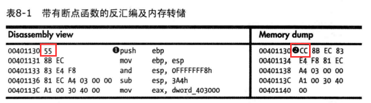

# 第八章 动态调试

目标：熟练使用常见的动态分析工具

* OD
* WinDbg
* X64Dbg

## 源代码级与汇编级的调试器

源代码及调试器：IDE中的调试器。

汇编及调试器：可以逐条运行汇编指令，并下断点调试。

## 内核模式与用户模式调试

* 在用户模式中，调试器与被调试的代码运行在同一个系统中
* 内核模式调试一般需要两个不同的系统
* WinDbg是当前唯一支持内核调试的流行调试器
* 可以使用x64dbg调试64位程序

## 使用调试器

###  单步调试

单步执行一个程序，每运行一条指令，控制权就返回调试器。

### 单步跳过(Stepping-Over)和单步跳入(Stepping-Into)

单步跳过：了解函数实现什么功能即可，大大减少需要分析的指令。

单步跳入：具体分析函数实现。

**如果程序调用了一个没有返回值的函数，而你单步步过，那么调试器将不能再次获得控制权。发生这种情况是，请重新运行函数到同一位置，这时请使用单步跳入**

### 用断点暂停执行

#### 软件执行断点

调试器通过使用0XCC,即指令INT 3的机器码，重写指令的首个字节来实现软件断点，0XCC被设计来供调试器使用。当0XCC指令执行后，操作系统会产生一个异常，然后控制权转到调试器。

push指令对应的机器码是`0x55`，但是内存转储中以`CC`开头，代表此处是一个断点。

#### 硬件执行断点

**硬件执行断点有个明显缺点：只有四个硬件寄存器存储断点的地址。**

利用专门的硬件寄存器，x86结构可以支持硬件执行断点。处理器每次执行一个指令时，硬件都会检测指令的指针是否与断点地址相等。硬断点并不关心断点地址存储哪些字节。当调试修改自身的代码时，硬断点会非常有益。硬断点相比于软断点的另一个优点是，它们可以设置访问中断的断点而不是执行中断的断点。

硬断点的深层缺陷之一是它们容易被运行的程序修改。虽然CPU芯片有八个调试寄存器，但只有六个在使用。前四个寄存器DR0〜DR3用来存储断点地址，调试控制寄存器（DR7)存储DR0〜DR3寄存器中的值是否有效，以及它们是否表示读、写或者执行断点等信息。恶意代码可以修改这些寄存器来干扰调试器。x86芯片组具有防御该干扰的功能。通过设置DR7寄存器中的通用探测（General Detect)标志位，任何执行mov指令访问调试寄存器的操作都会触发中断。而这让你能够探测调试寄存器的改变。

#### 条件断点

条件断点是软件断点的一种，它在某些条件满足时才会被触发。条件断点通过调试器总是接收的软断点来实现的。调试器计算条件，如果条件不满足，它自动继续执行而不通知用户。另外，不同的调试器支持不同的条件。

## 异常

异常是调试器取得运行程序控制权的基本方式。本质上，除了断点产生异常外，与调试无关的事件，如非法内存访问、除0操作也会产生异常

### 首次和二次异常处理

调试器通常有两次机会来处理同一个异常：首次处理异常和二次处理异常。调试器第一次附加到进程时，会发生一个异常，然后被调试的程序停止执行，此时调试器开始获得控制权。调试器可以自己处理异常，也可以将异常转给被调试的应用程序处理。

如果程序注册了一个异常处理函数，它会在调试器处理异常后，获得处理异常的权限。
如果应用程序没有处理异常，调试器将获得另一个处理它的机会—— 二次异常处理。调试器接收到一个二次处理的异常后，意味着如果程序没有附加到调试器就会崩溃。为了让应用程序正常运行，调试器必须处理异常。

**简而言之就是程序中没有处理异常，调试器就必须处理这个异常，此时就是二次异常，比如除0操作。**

### 常见异常

最常见的是执行INT 3指令时产生的异常。调试器有专门的代码处理INT 3异常，而操作系统则把它和其他异常一样对待。应用程序可能包含处理INT 3异常的指令，但附加调试器到程序后，调试器将获得首先处理异常权限。如果调试器将异常传给程序，程序的异常处理函数会处理它。

单步调试也作为操作系统内的一个异常来实现。标志寄存器中的陷阱标志（trap flag)用于单步 调试。陷阱标志置位后，处理器每执行一条指令就会产生异常。

当程序试图去访问一个它无权访问的内存位置时，将产生内存访问冲突（memory-access violation)异常。这种异常经常因为内存地址无效而发生，也可能是因为访问了受保护而无权访问的内存位置。

另外，一些指令只在处理器处于特权模式时才能执行。如果程序尝试着在非特权模式下执行它们，则处理器会产生异常。

## 使用调试器修改可执行文件

调试器可以用来改变程序的执行方式。可以通过修改控制标志、指令指针或者代码本身等方式来改变程序执行的方式。

