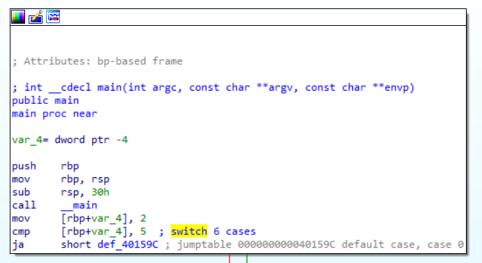
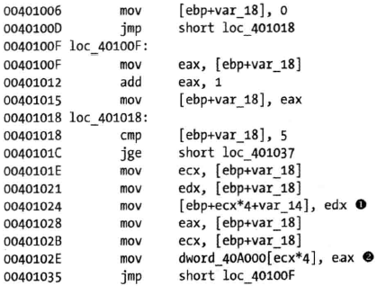
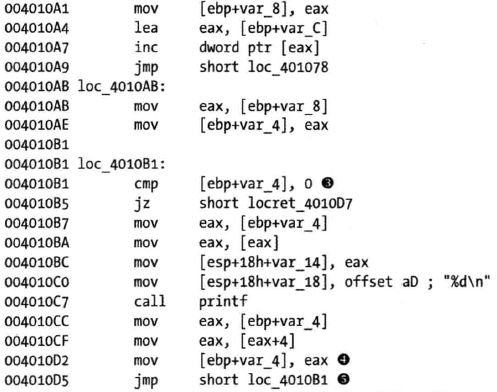

# 第六章 识别汇编中的C代码结构

## 全局和局部变量

```
全局变量可以被一个程序中的任意函数访问和使用
局部变量只能在它被定义的函数中访问
```

```
在反汇编代码中：
全局变量通过内存地址引用
局部变量通过栈地址引用
```

代码清单6-1：两个全局变量

```
#include<stdio.h>

int x = 1;
int y = 2;

void main() {
	x = x + y;
	printf("total=%d", x);
}
```

代码清单6-2：两个局部变量

```
#include<stdio.h>
void main(){
	int x = 1;
	int y = 2;
	x = x+y;
	printf("total=%d", x);
}
```

使用gcc编译为64位程序，使用IDA打开（也可以使用gcc -S）


此部分代码为未经标记的汇编代码。


这部分代码是经过IDA标记的代码。


## 反汇编算数操作

以下的C代码进行了加发，减法，自增自减，去模五种运算

C语言代码


汇编代码


这里需要解释一下cdq的作用，cdq其实多出现在除法运算之前，这里使用除法来进行取模运算。

```
CDQ 是一个让很多人感到困惑的指令。这个指令把 EAX 的第 31 bit 复制到 EDX 的每一个 bit 上。 它大多出现在除法运算之前。它实际的作用只是把EDX的所有位都设成EAX最高位的值。也就是说，当EAX <80000000, EDX 为00000000；当EAX >= 80000000， EDX 则为FFFFFFFF。

例如 :
         假设 EAX 是 FFFFFFFB (-5) ，它的第 31 bit (最左边) 是 1，
         执行 CDQ 后， CDQ 把第 31 bit 复制至 EDX 所有 bit
         EDX 变成 FFFFFFFF
        这时候， EDX:EAX 变成 FFFFFFFF FFFFFFFB ，它是一个 64 bit 的大型数字，数值依旧是 -5。

备注：
 EDX:EAX,这里表示EDX，EAX连用表示64位数
```

在使用`div`或者`idiv`指令时，是在用edx:eax除操作数并将结果保存在eax中，余数保存在edx中，最后把余数赋值给b。

```
void main(){
	int a = 0;
	int b = 1;
	a = a + 11;
	a = a - b;
	a--;
	b++;
	b = a % 3;
}
```


## 识别if语句

```
对于一个if语句必定有一个条件跳转
不是所有的条件跳转都对应一个if语句
```

C语言代码


汇编代码


基于cmp的结果进行判断是否继续执行还是跳转到`40102B`

### 用IDA Pro图像化分析函数


```
no为红色箭头
yes为绿色箭头
蓝色表示下一个执行块
```

### 识别嵌套的if语句

C语言代码


汇编代码


1，2，3处发生了三次跳转。


这类多重if嵌套还是直接看IDA图像比较方便。

## 识别循环

### 找到for循环

for循环的四个组件

* 初始化
* 比较条件‘
* 执行代码
* 递增递减

C语言代码

```
# include<stdio.h>
void main(){
	int i;
	for(i=0;i<100;i++){
		printf("i equals %d.\n", i);
	}
}
```

汇编


IDA Pro图形化


当比较语句为false的时候，执行循环四步，有一个很明显的闭环。红的箭头部分是跳出循环，可以进行下一步操作，本示例程序中，没有进行下一步动作，仅清理栈并返回。

### 找到while循环

C语言代码


汇编代码


停止代码的时候应该关注1处的条件跳转。

## 理解函数的调用约定

函数调用在汇编代码中的表现可能不一样，调用约定决定了函数调用发生的方式。这些约定包含了参数被放在栈上或者寄存器中的顺序，以及是由调用者或者被调函数负责在函数执行完毕后清理栈。

```
一个函数调用的伪代码
```


最常见的三个调用约定：cdecl，stdcall，fastcall，下面讨论他们的关键区别。

**1. cdecl**


```
在cdecl约定中:
参数从右到左按序被压入栈
当函数完成时由调用者清理栈。
将返回值保存在EAX中。
```

**2.stdcall**

**stdcall主要约定了栈的清理是由被调函数来执行的。**stdcall是Windows API的标准调用约定。任何调用这些API的代码都不需要清理栈，清理栈由实现API函数代码的DLL程序所承担

**3.fastcall**

在fastcall中，前面的一些参数被传到寄存器(典型的是前两个)，备用的寄存器是EDX和ECX。如果需要，剩下的参数再以从右到左的次序被加载到栈上。
使用fastcall比其他约定更高效，因为代码不需要涉及过多的栈操作

**4.压栈与移动**

C代码


adder函数汇编代码


```
即使是同一种编译器，在调用约定方面也可能存在差异性，这依赖于各种选项和设置
```


## 分析switch语句

if语句通常以两种方式被编译：

使用if样式和跳转表

### IF样式

C代码


反汇编代码


采用三对比较跳转，最后一句无条件跳转

IDA Pro图形化


整个图线看上去就像是多层嵌套的IF，在if判断为False的情况下执行下一个判断。


### 跳转表

上面三个case的switch会被编译器编译为if，else结构，但是如果case的数量线性增加，或者刚好我们需要的case在最后一个，那么算法的时间复杂度不就变成了O(n)吗，其实并不是这样，当case的数量增加，编译器会使用跳转表优化代码，降低算法的时间复杂度。

C语言代码

```
#include<stdio.h>
void main(){
	int i=2;
	switch(i)
	{
		case 1:
		printf("1");
		break;
		case 2:
		printf("2");
		break;
		case 3:
		printf("3");
		break;
		case 4:
		printf("4");
		break;
		case 5:
		printf("5");
		break;
		default:
		break;
	}
}
```




[rbp+var_4]存储的是case 一共有六种case（从0到5）所以是和case-1做比较


`lea rdx, ds:0[rax*4]`这个指令中是rax*4加上跳转表的基址来确定要跳转到哪一个case块，乘以四是因为跳转表中每一项是一个4字节大小的地址。


IDA Pro上有标记这是跳转表。

## 反汇编数组

数组a是局部定义的，数组b是全局定义的

C代码


汇编代码




eax是索 引，每个元素的大小是4，数据的基址加上偏移来访问正确的数组元素。


## 识别结构体

C代码


main函数反汇编代码


test函数反汇编代码


## 分析链表遍历

C代码


汇编代码




## 小结

* 从细节中抽象
* 不要过度死磕汇编，从全局角度看待问题

## 实验部分

Q：

Lab 6-1：在这个实验中，你将分析在文件Lab06-01.exe中发现的恶意代码
1.1 由main函数调用的唯一子过程中发现的主要代码结构是什么？
1.2 位于0x40105F的子过程是什么？
1.3 这个程序的目的是什么？
Lab 6-2：分析在文件Lab06-02.exe中发现的恶意代码。
2.1 main函数调用的第一个子过程执行了什么操作？
2.2 位于0x40117F的子过程是什么？
2.3 被main函数调用的第二个子过程做了什么？
2.4 在这个子过程中使用了什么类型的代码结构？
2.5 在这个程序中有任何基于网络的指示吗？
2.6 这个恶意代码的目的是什么？
Lab 6-3：在这个实验中，我们会分析在文件Lab06-03.exe中发现的恶意代码。
3.1 比较在main函数与实验6-2的main函数的调用。从main中调用的新的函数是什么？
3.2 这个新的函数使用的参数是什么？
3.3 这个函数包含的主要代码结构是什么？
3.4 这个函数能够做什么？
3.5 在这个恶意代码中有什么本地特征吗？
3.6 这个恶意代码的目的是什么？
Lab 6-4：在这个实验中，我们会分析在文件Lab06-04.exe中发现的恶意代码。
4.1 在实验6-3和6-4的main函数中的调用之间的区别是什么？
4.2 什么新的代码结构已经被添加到main中？
4.3 这个实验的解析HTML的函数和前面实验中的哪些有什么区别？
4.4 这个程序会运行多久？（假设它已经连接到互联网。）
4.5 在这个恶意代码中有什么新的基于网络的迹象吗？
4.6 这个恶意代码的目的是什么？

A：

1.1、if结构

1.2、sub_401282 直接看sub_401282函数，但是此函数太复杂看不懂。。


查看sub_40105F函数的交叉引用，发现是获取了联网状态，只有一个参数压栈(Success: Internet Connection\n或者Error 1.1: No Internet\n)就直接调用了sub_40105F函数，虚拟机中运行此文件，发现打印处了网络连接信息。推断位于0x40117F的子过程就是打印字符串。可以重命名此函数方便理解。


1.3、程序流程图如下，整个程序就是通过`WININET`库中的`InternetGetConnectedState`函数获取联网状态，打印处有关联网状态的字符串。


2.1、获取联网状态并打印。

2.2、打印函数

2.3、使用`Internet Explorer 7.5/pma`代理访问url：`http://www.practicalmalwareanalysis.com/cc.htm`。


这里IDA识别有些混乱，按照书上介绍的逻辑，应该是比较buf的前四个字节是不是`<!--`但是IDA好像都识别成了局部变量，我们需要修改这个函数的栈。


其实这里将这几个局部变量换成buf的偏移看起来就比较明确了，实际上就是比较前四个字符，全部匹配之后将第五个字符放在al，并返回；执行失败返回0.


下面是修改过的版本，看起来更舒服


修改方式是定义一个512大小的Array，每个元素1字节宽。


上一步调用完成后，检查返回的result是不是0，非零状态下格式化字符串打印`Success: Parsed command is %c\n`%c的位置上就是返回的result，然后调用休眠函数sleep6000毫秒。

2.4，2.5，2.6的具体分析过程上面已经体现

2.4 使用了if结构 多重比较

2.5 该恶意代码使用`Internet Explorer 7.5/pma`作为代理（作为HTTP的User-Agent字段）、对http://www.practicalmalwareanalysis.com/cc.htm进行了数据访问（下载了该页面）。

2.6、访问指定url的页面，访问注释中的内容(<!--)从注释中获取命令，属于一种C2的隐藏手段。然后调用休眠指令休眠60s。

3.1`0x401130`

3.2、有两个参数，一个是html注释中的第五个字符，第二个是参数是argv，argv 是 argument vector的缩写，表示传入main函数的参数序列或指针，并且第一个参数argv[0]一定是程序的名称，并且包含了程序所在的完整路径。（从右到左压栈的，所以第一个参数是`var_8`，第二个参数是argv）


3.3、这里是一个switch语句，以跳转表的方式实现。可以在图模式很容易看出。


有创建文件夹，复制文件，删除文件，修改环境变量，配置`C:\Temp\cc.exe`为自启动，或者休眠100s。

还需要注意的是`C:\Temp\cc.exe`这个文件是从哪里来的。会先创建`C:\\Temp`这个文件夹，然后将`Lab06-03.exe`复制到`C:\Temp\cc.exe`。


3.5、 注册表键`Software\Microsoft\Windows\CurrentVersion\Run`和文件路径可以作为特征值`C:\Temp\cc.exe`。

3.6、该恶意代码先检查是否有网络连接，如果有则请求指定网址，下载一个htm文件，并获取文件开头`<!–`后的一个字符，再根据该字符值来决定接下来是创建目录、复制自身到目标路径、删除文件、设置注册表键值还是休眠100秒。


____

4.

第四章没有太多新东西，简单分析一下


新加了一个循环结构，循环1440次，每个循环里休眠1分钟，共运行1*1440min，`sub_401040`函数新加了一个参数，这个参数影响了web代理。

