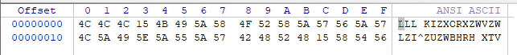

# 第十三章 数据加密

数据加密是指以隐藏真实意图为目的的内容修改。

## 分析加密算法的目的

恶意代码用加密来达到各种各样的目的。最常见的是加密网络通信，同时，恶意代码也会用加密来隐藏它的内部工作。例如，恶意代码编写者可能因为如下目的而使用加密：

* 隐藏配置信息。例如，命令和控制服务器域名。
* 窃取信息之前将它保存到一个临时文件。
* 存储需要使用的字符串，并在使用前对其解密。
* 将恶意代码伪装成一个合法的工具，隐藏恶意代码活动中使用的字符串。


分析加密算法时的目标：

* 识别加密算法

* 根据识别的加密算法解密攻击者的秘密


## 简单的加密算法

简单的加密算法对恶意代码带来的好处

* 足够小，可以用在空间受限的环境中，例如`Shellcode`编写。
* 没有复杂加密算法明显特征
* 开销低，对性能无影响


### 凯撒密码

#### **介绍**

在密码学中，**恺撒密码**（英语：Caesar cipher），或称**恺撒加密**、**恺撒变换**、**变换加密**，是一种最简单且最广为人知的加密技术。它是一种替换加密的技术，明文中的所有字母都在字母表上向后（或向前）按照一个固定数目进行偏移后被替换成密文。例如，当偏移量是3的时候，所有的字母A将被替换成D，B变成E，以此类推。


#### **破解**

* 穷举法

  * ```
    由于使用凯撒密码进行加密的语言一般都是字母文字系统，因此密码中可能使用的偏移量也是有限的。例如使用 26 个字母的英语，它的偏移量最多就是 25（偏移量 26 等同于偏移量 0；偏移量超过 26，等同于偏移量 1-25），因此可以通过穷举法，轻易地进行破解。
    ```

* 频率分析法

  * ```
    当密文长度足够大的情况下，可以先分析密文中每个字母出现的频率，然后将这一频率与正常情况下的该语言字母表中所有字母出现的频率作比较。例如在英语中，正常明文中字母 e 和 t 出现的频率特别高。通过这一特点，分析密文字母出现的频率，可以估计出正确的偏移量。
    
    但是频率分析也有其局限性，它对于故意省略元音字母或者其他缩写方式写成的明文加密出来的密文并不适用。
    ```

### XOR

#### **介绍**

XOR加密使用一个静态字节值，通过与该值执行**逻辑异或**运算来修改明文中的每个字节。逆向解密与加密使用同一个函数。要解密用XOR加密算法加密的数据，你仅需使用加密密钥再次XOR加密数据即可。

#### **破解**

* 暴力破解XOR加密

由于文件中的每个字符只有256种可能的值，对于一个计算机来说很容易并且能够足够快地使用255个单字节密钥来异或文件头部，然后将输出与期望的可执行文件头部进行比较。可以使用一个脚本来执行用255个密钥的XOR加密。


* 暴力破解多个文件

暴力破解方法也可以主动使用。例如，为了从多个文件中找出使用XOR加密的PE文件，可以为所有XOR组合创建255个特征码，留意你认为文件可能存在的元素。


#### **XOR算法漏洞**

 如果XOR算法遇到大量的NULL（`0x00`）时会暴露密钥。

解决方案：

保留NULL的单字节XOR加密


#### **保留NULL的单字节XOR加密**

特殊策略：

* 如果明文中字符是NULL或者密钥本身，则被跳过。
* 如果明文中字符既不是NULL也不是密码本身，则将被使用XOR密钥加密。


使用保留NULL的单字节加密算法，很难识别它是XOR加密，并且也没有明显的密钥。这种**保留NULL的XOR加密技术**在`shellcode`中特别流行,因为使用少量的代码,就能够执行加密。


#### **使用IDA Pro识别XOR循环**

在反汇编中，通过循环语句中间使用XOR指令的循环语句找到XOR循环。用IDA Pro找到XOR循环的一个最简单方法是搜索指令中XOR指令，如下：
1.确保你正在查看代码（窗口的标题应该包含`IDAView`）。
2.选择Search→Text。
3.在文本搜索对话框中输入`xor`，选中`Find all occurrences`复选框，然后单击OK按钮。


**`Lab12-02.exe`中就有`xor`加密，下面以此文件为例，找到加密函数所在位置，并找到密钥。**


搜索到XOR指令并不意味着它一定用于加密。XOR指令可以用于不同的目的，其用途之一就是清空寄存器的内容。XOR指令以三种形式存在。

* 1、用寄存器自身XOR。
* 2、用一个常量（或一个内存引用）XOR。
* 3、使用一个不同寄存器（或一个内存引用）XOR。

最常见的是第一种形式，因为寄存器与自身异或是清零寄存器的一种有效方式。清零寄存器与数据加密无关，所以可以忽略它。

XOR加密循环可能使用另外两种形式中的一种：用一个常量异或一个寄存器，或者用一个不同的寄存器异或一个寄存器。如果你幸运，XOR加密是一个常量异或寄存器的XOR，因为通过它，可以确认你可能发现了加密，并且也可以知道密钥。

所以`sub_401000`就是第二种情况，最后两个是第三种情况，其他都属于第一种情况，`sub_401000`疑似为加密函数。

查看函数确定`sub_401000`确实为加密函数。


直接查看sub_401000的参数，即可发现密钥为`0x41`。


加密的迹象之一就是含有一个包含XOR函数的嵌套循环。


#### **使用`WinHex`处理XOR**

可以使用`Winhex`处理简单加密的文件。


### 其他一些简单的加密策略


### Base64

#### 介绍

**`Base64`**是一种基于64个可打印字符来表示二进制数据的表示方法。每6个比特为一个单元，对应某个可打印字符。3个字节相当于24个比特，对应于4个`Base64`单元，即3个字节可由4个可打印字符来表示。在`Base64`中的可打印字符包括字母`A-Z`、`a-z`、数字`0-9`，这样共有62个字符，`+`和`/`作为最后两个字符，组成64个字符的字符集。

`Base64`常用于在通常处理文本数据的场合，表示、传输、存储一些二进制数据，包括MIME的电子邮件及XML的一些复杂数据。


**Base64索引表如下**


如果要编码的字节数不能被3整除，最后会多出1个或2个字节，那么可以使用下面的方法进行处理：先使用0字节值在末尾补足，使其能够被3整除，然后再进行`Base64`的编码。在编码后的`Base64`文本后加上一个或两个`=`号，代表补足的字节数。也就是说，当最后剩余两个八位(待补足)字节（2个byte）时，最后一个6位的`Base64`字节块有四位是0值，最后附加上两个等号；如果最后剩余一个八位(待补足)字节（1个byte）时，最后一个6位的base字节块有两位是0值，最后附加一个等号。 参考下表：


#### 标准定义

RFC4648：https://www.rfc-editor.org/rfc/rfc4648.txt


#### 非标Base64加密

恶意代码可能会使用非标准的自定义索引来进行`Base64`加密，此时需要知道原始索引才能成功解密。下面给出自定义索引的`Base64`加解密算法。例如`CTF`题目：https://adworld.xctf.org.cn/media/task/attachments/989ca07c3f90426fa05406e4369901ff.apk 就是关于非标准`Base64`解码。

````
```
# coding:utf-8

#s = "ABCDEFGHIJKLMNOPQRSTUVWXYZabcdefghijklmnopqrstuvwxyz0123456789+/"
s = "vwxrstuopq34567ABCDEFGHIJyz012PQRSTKLMNOZabcdUVWXYefghijklmn89+/"

def My_base64_encode(inputs):
        # 将字符串转化为2进制
        bin_str = []
        for i in inputs:
                x = str(bin(ord(i))).replace('0b', '')
                bin_str.append('{:0>8}'.format(x))
        #print(bin_str)
        # 输出的字符串
        outputs = ""
        # 不够三倍数，需补齐的次数
        nums = 0
        while bin_str:
                #每次取三个字符的二进制
                temp_list = bin_str[:3]
                if(len(temp_list) != 3):
                        nums = 3 - len(temp_list)
                        while len(temp_list) < 3:
                                temp_list += ['0' * 8]
                temp_str = "".join(temp_list)
                #print(temp_str)
                # 将三个8字节的二进制转换为4个十进制
                temp_str_list = []
                for i in range(0,4):
                        temp_str_list.append(int(temp_str[i*6:(i+1)*6],2))
                #print(temp_str_list)
                if nums:
                        temp_str_list = temp_str_list[0:4 - nums]

                for i in temp_str_list:
                        outputs += s[i]
                bin_str = bin_str[3:]
        outputs += nums * '='
        print("Encrypted String:\n%s "%outputs)

def My_base64_decode(inputs):
        # 将字符串转化为2进制
        bin_str = []
        for i in inputs:
                if i != '=':
                        x = str(bin(s.index(i))).replace('0b', '')
                        bin_str.append('{:0>6}'.format(x))
        #print(bin_str)
        # 输出的字符串
        outputs = ""
        nums = inputs.count('=')
        while bin_str:
                temp_list = bin_str[:4]
                temp_str = "".join(temp_list)
                #print(temp_str)
                # 补足8位字节
                if(len(temp_str) % 8 != 0):
                        temp_str = temp_str[0:-1 * nums * 2]
                # 将四个6字节的二进制转换为三个字符
                for i in range(0,int(len(temp_str) / 8)):
                        outputs += chr(int(temp_str[i*8:(i+1)*8],2))
                bin_str = bin_str[4:]
        print("Decrypted String:\n%s "%outputs)

print()
print("     *************************************")
print("     *    (1)encode         (2)decode    *")
print("     *************************************")
print()


num = input("Please select the operation you want to perform:\n")
if(num == "1"):
        input_str = input("Please enter a string that needs to be encrypted: \n")
        My_base64_encode(input_str)
else:
        input_str = input("Please enter a string that needs to be decrypted: \n")
        My_base64_decode(input_str)

```
````

## 对称密码（Symmetric Key Encryption）

对称加密是最快速、最简单的一种加密方式，加密（encryption）与解密（decryption）用的是同样的密钥（secret key）。对称加密有很多种算法，由于它效率很高，所以被广泛使用在很多加密协议的核心当中。

对称加密算法的优点：算法公开、计算量小、加密速度快、加密效率高。

对称加密算法的缺点：交易双方都使用同样钥匙，安全性得不到保证。此外，每对用户每次使用对称加密算法时，都需要使用其他人不知道的惟一钥匙，这会使得发收信双方所拥有的钥匙数量呈几何级数增长，密钥管理成为用户的负担。对称加密算法在分布式网络系统上使用较为困难，主要是因为密钥管理困难，使用成本较高。而与公开密钥加密算法比起来，对称加密算法能够提供加密和认证却缺乏了签名功能，使得使用范围有所缩小。


可以粗略的将对称密码算法可以大致分为以下两种：

* **流密码（Stream Cipher）**

  明文每次被处理一bit，即为输入一bit明文，经过一系列操作后，输出一bit密文

* **分组密码 （Block Cipher）**

​		明文一次被处理多bit，一次被处理的明文位序列被成为一个分组。

### 流密码

#### RC4

在密码学中，**RC4**（来自Rivest Cipher 4的缩写）是一种串流加密法，密钥长度可变。它加解密使用相同的密钥，因此也属于对称加密算法。RC4是WEP中采用的加密算法，也曾经是TLS可采用的算法之一。

由美国密码学家罗纳德·李维斯特（Ronald Rivest）在1987年设计的。由于RC4算法存在弱点，2015年2月所发布的 RFC 7465规定禁止在TLS中使用RC4加密算法。

RC4由伪随机数生成器和异或运算组成。RC4的密钥长度可变，范围是[1,255]。RC4一个字节一个字节地加解密。给定一个密钥，伪随机数生成器接受密钥并产生一个S盒。S盒用来加密数据，而且在加密过程中S盒会变化。

由于异或运算的对合性，RC4加密解密使用同一套算法。

### 分组密码

#### AES

`AES`为分组密码，分组密码也就是把明文分组，每组长度相等，每次加密一组数据，直到加密完整个明文。在`AES`标准规范中，分组长度只能是128位，也就是说，每个分组为16个字节（每个字节8位）。密钥的长度可以使用128位、192位或256位。密钥的长度不同，推荐加密轮数也不同，如下表所示：

| AES     | 密钥长度（32位比特字) | 分组长度(32位比特字) | 加密轮数 |
| ------- | --------------------- | -------------------- | -------- |
| AES-128 | 4                     | 4                    | 10       |
| AES-192 | 6                     | 4                    | 12       |
| AES-256 | 8                     | 4                    | 14       |

加密流程如下：

`AES` C语言实现：https://www.ghostscript.com/doc/base/aes.c


##### 字节替换（Byte Substitution）

状态矩阵中的元素按照下面的方式映射为一个新的字节：把该字节的高4位作为行值，低4位作为列值，取出S盒或者逆S盒中对应的行的元素作为输出。

```
S box:
0x63, 0x7C, 0x77, 0x7B, 0xF2, 0x6B, 0x6F, 0xC5, 0x30, 0x01, 0x67, 0x2B, 0xFE, 0xD7, 0xAB, 0x76
0xCA, 0x82, 0xC9, 0x7D, 0xFA, 0x59, 0x47, 0xF0, 0xAD, 0xD4, 0xA2, 0xAF, 0x9C, 0xA4, 0x72, 0xC0
0xB7, 0xFD, 0x93, 0x26, 0x36, 0x3F, 0xF7, 0xCC, 0x34, 0xA5, 0xE5, 0xF1, 0x71, 0xD8, 0x31, 0x15
0x04, 0xC7, 0x23, 0xC3, 0x18, 0x96, 0x05, 0x9A, 0x07, 0x12, 0x80, 0xE2, 0xEB, 0x27, 0xB2, 0x75
0x09, 0x83, 0x2C, 0x1A, 0x1B, 0x6E, 0x5A, 0xA0, 0x52, 0x3B, 0xD6, 0xB3, 0x29, 0xE3, 0x2F, 0x84
0x53, 0xD1, 0x00, 0xED, 0x20, 0xFC, 0xB1, 0x5B, 0x6A, 0xCB, 0xBE, 0x39, 0x4A, 0x4C, 0x58, 0xCF
0xD0, 0xEF, 0xAA, 0xFB, 0x43, 0x4D, 0x33, 0x85, 0x45, 0xF9, 0x02, 0x7F, 0x50, 0x3C, 0x9F, 0xA8
0x51, 0xA3, 0x40, 0x8F, 0x92, 0x9D, 0x38, 0xF5, 0xBC, 0xB6, 0xDA, 0x21, 0x10, 0xFF, 0xF3, 0xD2
0xCD, 0x0C, 0x13, 0xEC, 0x5F, 0x97, 0x44, 0x17, 0xC4, 0xA7, 0x7E, 0x3D, 0x64, 0x5D, 0x19, 0x73
0x60, 0x81, 0x4F, 0xDC, 0x22, 0x2A, 0x90, 0x88, 0x46, 0xEE, 0xB8, 0x14, 0xDE, 0x5E, 0x0B, 0xDB
0xE0, 0x32, 0x3A, 0x0A, 0x49, 0x06, 0x24, 0x5C, 0xC2, 0xD3, 0xAC, 0x62, 0x91, 0x95, 0xE4, 0x79
0xE7, 0xC8, 0x37, 0x6D, 0x8D, 0xD5, 0x4E, 0xA9, 0x6C, 0x56, 0xF4, 0xEA, 0x65, 0x7A, 0xAE, 0x08
0xBA, 0x78, 0x25, 0x2E, 0x1C, 0xA6, 0xB4, 0xC6, 0xE8, 0xDD, 0x74, 0x1F, 0x4B, 0xBD, 0x8B, 0x8A
0x70, 0x3E, 0xB5, 0x66, 0x48, 0x03, 0xF6, 0x0E, 0x61, 0x35, 0x57, 0xB9, 0x86, 0xC1, 0x1D, 0x9E
0xE1, 0xF8, 0x98, 0x11, 0x69, 0xD9, 0x8E, 0x94, 0x9B, 0x1E, 0x87, 0xE9, 0xCE, 0x55, 0x28, 0xDF
0x8C, 0xA1, 0x89, 0x0D, 0xBF, 0xE6, 0x42, 0x68, 0x41, 0x99, 0x2D, 0x0F, 0xB0, 0x54, 0xBB, 0x16
 
Reverse box:
0x52, 0x09, 0x6A, 0xD5, 0x30, 0x36, 0xA5, 0x38, 0xBF, 0x40, 0xA3, 0x9E, 0x81, 0xF3, 0xD7, 0xFB
0x7C, 0xE3, 0x39, 0x82, 0x9B, 0x2F, 0xFF, 0x87, 0x34, 0x8E, 0x43, 0x44, 0xC4, 0xDE, 0xE9, 0xCB
0x54, 0x7B, 0x94, 0x32, 0xA6, 0xC2, 0x23, 0x3D, 0xEE, 0x4C, 0x95, 0x0B, 0x42, 0xFA, 0xC3, 0x4E
0x08, 0x2E, 0xA1, 0x66, 0x28, 0xD9, 0x24, 0xB2, 0x76, 0x5B, 0xA2, 0x49, 0x6D, 0x8B, 0xD1, 0x25
0x72, 0xF8, 0xF6, 0x64, 0x86, 0x68, 0x98, 0x16, 0xD4, 0xA4, 0x5C, 0xCC, 0x5D, 0x65, 0xB6, 0x92
0x6C, 0x70, 0x48, 0x50, 0xFD, 0xED, 0xB9, 0xDA, 0x5E, 0x15, 0x46, 0x57, 0xA7, 0x8D, 0x9D, 0x84
0x90, 0xD8, 0xAB, 0x00, 0x8C, 0xBC, 0xD3, 0x0A, 0xF7, 0xE4, 0x58, 0x05, 0xB8, 0xB3, 0x45, 0x06
0xD0, 0x2C, 0x1E, 0x8F, 0xCA, 0x3F, 0x0F, 0x02, 0xC1, 0xAF, 0xBD, 0x03, 0x01, 0x13, 0x8A, 0x6B
0x3A, 0x91, 0x11, 0x41, 0x4F, 0x67, 0xDC, 0xEA, 0x97, 0xF2, 0xCF, 0xCE, 0xF0, 0xB4, 0xE6, 0x73
0x96, 0xAC, 0x74, 0x22, 0xE7, 0xAD, 0x35, 0x85, 0xE2, 0xF9, 0x37, 0xE8, 0x1C, 0x75, 0xDF, 0x6E
0x47, 0xF1, 0x1A, 0x71, 0x1D, 0x29, 0xC5, 0x89, 0x6F, 0xB7, 0x62, 0x0E, 0xAA, 0x18, 0xBE, 0x1B
0xFC, 0x56, 0x3E, 0x4B, 0xC6, 0xD2, 0x79, 0x20, 0x9A, 0xDB, 0xC0, 0xFE, 0x78, 0xCD, 0x5A, 0xF4
0x1F, 0xDD, 0xA8, 0x33, 0x88, 0x07, 0xC7, 0x31, 0xB1, 0x12, 0x10, 0x59, 0x27, 0x80, 0xEC, 0x5F
0x60, 0x51, 0x7F, 0xA9, 0x19, 0xB5, 0x4A, 0x0D, 0x2D, 0xE5, 0x7A, 0x9F, 0x93, 0xC9, 0x9C, 0xEF
0xA0, 0xE0, 0x3B, 0x4D, 0xAE, 0x2A, 0xF5, 0xB0, 0xC8, 0xEB, 0xBB, 0x3C, 0x83, 0x53, 0x99, 0x61
0x17, 0x2B, 0x04, 0x7E, 0xBA, 0x77, 0xD6, 0x26, 0xE1, 0x69, 0x14, 0x63, 0x55, 0x21, 0x0C, 0x7D
```

S盒的构成是固定的，详细的分析过程参考，S和或者逆S盒硬编码是使用AES加密的特征，那些检测加密的插件也是基于此原理。

AES中S盒的生成原理与变化：https://bbs.pediy.com/thread-253916.htm

##### 行移位（Shift Row）

行移位是一个简单的左循环移位操作。当密钥长度为128比特时，状态矩阵的第0行左移0字节，第1行左移1字节，第2行左移2字节，第3行左移3字节，如下图所示：


##### 列混合（Mix Column）

列混合变换是通过矩阵相乘来实现的，经行移位后的状态矩阵与固定的矩阵相乘，得到混淆后的状态矩阵。


##### 轮密钥相加（Add Round Key）

将由列混合过程生成的16字节的正方形矩阵看成128位，，并与128位的轮密钥做异或，如果这是最后一轮，那么输出就是密文。否则产生的128位被看成16字节，从一个新的字节替换开始进行下一轮的处理。


#### 分组加密的四种工作模式

##### ECB (Electronic Code Book，电子编码本)

ECB 模式是最简单的加密模式，明文消息被分成固定大小的块（分组），并且每个块被单独加密。每个块的加密和解密都是独立的，且使用相同的方法进行加密，所以可以进行并行计算，但是这种方法一旦有一个块被破解，使用相同的方法可以解密所有的明文数据，安全性比较差。适用于数据较少的情形，加密前需要把明文数据填充到块大小的整倍数。

**ECB算法优点：**
简单、孤立，每个块单独运算。适合并行运算。传输错误一般只影响当前块。
**ECB算法缺点：**
同明文输出同密文，可能导致明文攻击。

**Encryption：**


**Decryption：**


##### CBC (Cipher Block Chaining, 密码分组链接)

CBC 模式中每一个分组要先和前一个分组加密后的数据进行XOR异或操作，然后再进行加密。这样每个密文块依赖该块之前的所有明文块，为了保持每条消息都具有唯一性，第一个数据块进行加密之前需要用初始化向量IV进行异或操作。CBC模式是一种最常用的加密模式，它主要缺点是加密是连续的，不能并行处理，并且与ECB一样消息块必须填充到块大小的整倍数。 

**CBC算法优点：**
串行化运算，相同明文不同密文。
**CBC算法缺点：**
需要初始向量。

**Encryption：**


**Decryption：**


##### CFB (Cipher Feedback, 密码反馈)

CFB 模式和CBC模式比较相似，前一个分组的密文加密后和当前分组的明文XOR异或操作生成当前分组的密文。CFB模式的解密和CBC模式的加密在流程上其实是非常相似的。

**CFB算法优点：**
同明文不同密文，分组密钥转换为流密码。
**CFB算法缺点：**
串行运算不利并行，传输错误可能导致后续传输块错误。

**Encryption：**


**Decryption：**


##### OFB (Output Feedback, 输出反馈)

OFB 模式将分组密码转换为同步流密码，也就是说可以根据明文长度先独立生成相应长度的流密码。通过流程图可以看出，OFB和CFB非常相似，CFB是前一个分组的密文加密后XOR当前分组明文，OFB是前一个分组与前一个明文块异或之前的流密码XOR当前分组明文。由于异或操作的对称性，OFB模式的解密和加密完全一样的流程。 

**OFB算法优点：**
同明文不同密文，分组密钥转换为流密码。
**OFB算法缺点：**
串行运算不利并行，传输错误可能导致后续传输块错误。

**Encryption：**


**Decryption：**


## 非对称加密(Asymmetric Key Encryption)

非对称加密为数据的加密与解密提供了一个非常安全的方法，它使用了一对密钥，公钥（public key）和私钥（private key）。私钥只能由一方安全保管，不能外泄，而公钥则可以发给任何请求它的人。非对称加密使用这对密钥中的一个进行加密，而解密则需要另一个密钥。

**非对称加密算法的优点：**

安全性更高，公钥是公开的，秘钥是自己保存的，不需要将私钥给别人。

**非对称加密算法的缺点：**

加密和解密花费时间长、速度慢，只适合对少量数据进行加密。

对称加密算法相比非对称加密算法来说，加解密的效率要高得多。但是缺陷在于对于秘钥的管理上，以及在非安全信道中通讯时，密钥交换的安全性不能保障。所以在实际的网络环境中，会将两者混合使用。


## 常见的加解密算法

对于恶意代码来说使用标准的加密存在一些潜在的漏洞：

* 1、加密库很大，所以恶意代码需要静态集成或者链接到已有的代码中。
* 2、链接主机上现有的代码可能降低可移植性。
* 3、标准加密库比较容易探测（通过函数导入，函数匹配或者加密常量标识）。
* 4、对称加密算法需要考虑如何隐藏密钥。

**对于恶意代码分析而言，识别密钥与识别加密算法同等重要。**


下面的一些简单方法可以识别标准加密。它们包括查找字符串和引用加密函数的导入，使用一些工具寻找特定的内容。

#### 识别字符串和导入

* 一种识别标准加密算法的方法是识别涉及加密算法使用的字符串。当加密库（如`OpenSSL`）被静态地编译到恶意代码时，这种情况便会发生。


* 另外一种查找标准加密算法的方法是识别引用导入的加密函数。涉及加密的微软函数都以`Crypt`、`CP`（对于加密提供者）或者`Cert`为前缀。


#### 查找加密向量

IDA Pro的插件`FindCrypt2`和`Krypto ANALyzer`插件可以搜索常见的加密向量。

**使用`FindCrypt2`**

`IDA Pro`有一个叫做`FindCrypt2`插件，包含在`IDA Pro`的`SDK`中，它搜索程序中任何与加密算法相关的已知常量。这样做效果很好，因为多数加密算法会使用一些神秘的常量类型。所谓神秘常量则是与基本加密算法结构相关的一些固定位串。

```
注意：一些加密算法并不使用神秘常量，值得注意的是，国际数据加密（IDEA）算法和RC4算法动态地创建它们的结构，因此它们不在可识别的算法之中。恶意代码常使用RC4算法，因为它体积小，在软件中易于实现，并且没有明显的加密常量。
```

**使用`Krypto ANALyzer`**

`KANAL`是`PEiD`的一个插件，它拥有一个范围更广的常量集合（作为结果可能更加容易产生误报）。除此之外，`KANAL`还能够识别`Base64`编码表以及加密相关的导入函数。


#### 查找高熵值内容

识别加密算法的另一方法是查找高熵值的内容。除了识别潜在的明显的加密常量或者加密密钥外，这种技术也可以识别加密内容本身。由于这种技术的影响广泛，可以适用于没有找到加密常量的地方（如`RC4`）。

```
警告：高嫡内容技术相当迟钝，最好作为最后一种使用手段。多种类型的内容，如图片、电影、音频文件以及其他压缩数据等，也会显示高篇值，除了它们的头部特征之外，很难与加密内容进行区分。
```

IDA的熵值插件(http://www.smokedchicken.org/2010/06/idaentropy-plugin.html )是针对PE文件使用这种技术的一个工具。将`ida-entplw`文件放置到`IDA Pro`的插件目录，就可以将这个插件载入到IDA Pro。


## 自定义加密

恶意代码常使用自定义的加密手段，其中一种方案就是将多种简单加密结合起来。

### 识别自定义加密

如果怀疑输出中包含加密数据，那么加密函数应该出现在输出之前。

相反，解密则出现在输入之后。

### 攻击者使用自定义加密的优势

* 自定义加密保留了简单加密策略的特点（体积小和加密不明显），同时使逆向工作变得十分困难。
* 不存在一个免费的函数库供我们实现解密，恶意代码分析人员可能要自行编写解密函数。


## 解密

重现恶意代码中的加密或解密函数的两种基本方法

* 1、重新编写函数
* 2、使用恶意代码中存在的函数


### 自解密

最经济的解密方法是:无论算法是否已知,让程序正常活动期间自己完成解密。我们称这种方法为自解密。

### 手动执行解密函数

* 对于简单的加密和编码方法，通常你可以使用编程语言提供的标准函数。

* 在处理非常复杂而且不标准的加密算法时，由于很难模拟算法，因此会成为更艰巨的挑战。

**`Base64`脚本（`Python3`版本）**

```
import base64

example_string = 'VChpcyBpcyBhIHR1c3Qgc3RyawSn'
string = str(base64.b64encode(example_string.encode("utf-8")), "utf-8")
print(string)

bbs = str(base64.b64decode(bs), "utf-8")
print(bbs) # 解码
```

**保留NULL字节的XOR加密算法的Python脚本**

```
def null_preserving_xor(input_char,key_char):
    if(input_char == key_char or input_char == chr(0x00)): 
        return input_char
    else:
        return chr(ord(input_char)^ord(key_char))
      

"""
example_str = "abcdef"
result_data = []
for i in example_str:
    res = null_preserving_xor(i, "s")
    result_data.append(res)
"""
```

**对于标准的加密算法，最好是使用代码库中提供的现有实现。**一个基于Python的加密库叫做`PyCrypto`，它提供了各种各样的加密函数。类似的库也存在于其他不同的语言中

### 使用通用的解密规范

使用`ImmDbg`调试器，编写脚本处理恶意代码中的加密文件

* 1、在调试器中启动恶意代码。
* 2、准备读取的加密文件和准备写入的输出文件。
* 3、在调试器中分配存储空间，让恶意代码能够引用这块内存。
* 4、加载加密文件到分配的存储区域。
* 5、为恶意代码的加密函数设置合适的变量和参数。
* 6、运行加密函数执行加密。
* 7、将新加密的存储区域写入到输出文件。


## 实验

### Q

#### Lab13-1

1、比较恶意代码中的字符串（字符串命令的输出）与动态分析提供的有用信息，基于这些比较，哪些元素可能被加密？

2、使用`IDAPro`搜索恶意代码中字符串`xor`，以此来查找潜在的加密，你发现了哪些加密类型?

3、恶意代码使用什么密钥加密，加密了什么内容?

4、使用静态工具`FindCrypt2`、`Krypto ANALyzer(KANAL)`以及 IDA熵插件识别一些其他类型的加密机制，你发现了什么？

5、什么类型的加密被恶意代码用来发送部分网络流量?

6、`Base64`编码函数在反汇编的何处?

7、恶意代码发送的 `Base64`加密数据的最大长度是什么?加密了什么内容?

8、恶意代码中，你是否在 `Base64`加密数据中看到了填充字符(=或者==)?

9、这个恶意代码做了什么?

#### Lab13-2

1、使用动态分析，确定恶意代码创建了什么?

2、使用静态分析技术，例如 `xor`指令搜索、`FindCrypt2`、`KANAL`以及IDA熵插件，查找潜在的加密，你发现了什么?

3、基于问题1的回答，哪些导入函数将是寻找加密函数比较好的一个证据?

4、加密函数在反汇编的何处?

5、从加密函数追溯原始的加密内容，原始加密内容是什么?

6、你是否能够找到加密算法?如果没有，你如何解密这些内容?

7、使用解密工具，你是否能够恢复加密文件中的一个文件到原始文件?

#### Lab13-3

1、比较恶意代码的输出字符串和动态分析提供的信息，通过这些比较，你发现哪些元素可能被加密?

2、使用静态分析搜索字符串`xor`来查找潜在的加密。通过这种方法，你发现什么类型的加密?

3、使用静态工具，如`FindCrypt2`、`KANAL` 以及 IDA嫡插件识别一些其他类型的加密机制。发现的结果与搜索字符XOR结果比较如何?

4、恶意代码使用哪两种加密技术?

5、对于每一种加密技术，它们的密钥是什么?

6、对于加密算法，它的密钥足够可靠吗?另外你必须知道什么?

7．恶意代码做了什么?

8、构造代码来解密动态分析过程中生成的一些内容，解密后的内容是什么?


### A

#### Lab13-01

先拖进IDA Pro中观察，导入表中有网络连接有关的函数，怀疑有网络连接行为。还有资源相关的函数，怀疑资源节中有东西。


进行网络连接函数为`sub_4011c9`。


`a1`来自`sub_401300`，就是资源节中的数据用`sub_401190`进行了解码。


解码逻辑就是和`0x3B`进行异或操作。


资源节中数据如下：



解码后如下：


所以恶意代码访问的域名是`www.practicalmalwareanalysis.com`。


继续看`a8`来源，拿到了主机名的前12个字节，然后将第十三字节置为0，截断。使用`sub_4010B1`进行处理。


继续跟进`sub_4010B1`，看着比较麻烦，调用了`sub_401000`。


继续跟进`sub_401000`，调用了`byte_4050E8`。


该处是一个标准的`Base64`索引，所以怀疑`sub_4010B1`应该是一个`Base64`编码函数，实际看代码确实是这样。


使用`PEID`的插件寻找加密，可以看到这里找到了一个`Base64`表，也给出了详细位置。


下面动态分析一下，开启`wireshark`抓包，我的`wireshark`在宿主机，恶意代码运行在`win10`虚拟机中，注意选择正确接口。抓到流量如下：


对`REVTS1RPUC0zMVVN`进行`Base64`解码，解码结果为，正是我的主机名。这也与静态分析结果相符。


如果前面的今天分析没有将逻辑分析的很清楚，其实可以动态调试，看看`sprintf`格式化的`url`，直接提取`IOC`


然后看看浏览器返回的数据，因为后面要判断浏览器返回的数据的第一个字母是`o`，这里我们提取数据如下


就是拿到了一些注释，程序的基本流程就分析结束


#### Lab13-02

直接运行文件，同时打开`Process Monitor`，可以看到在和`Lab13-03.exe`同级的文件夹下创建了很多新文件，而且数量还在不断增加，大小都是`7042950`字节。


将文件拖进IDA Pro中进行分析。

可以看到创建的文件名是`GetTickCount`的返回值，返回值是系统启动以来经过的毫秒数。


使用PEID的插件寻找加密，没有任何发现。


IDA Pro的插件`FindCrypt`也没有找到相关信息。在IDA Pro中搜索XOR的结果如下，`sub_401739`函数大量使用`xor`，查看引用


查看引用，可以判断`sub_401851`可能是加密相关的函数。


`sub_401070`函数如下，主要作用是对桌面截屏。

```C++
void *__cdecl sub_401070(void **a1, _DWORD *a2)
{
  void *result; // eax
  HGLOBAL hMem; // [esp+0h] [ebp-78h]
  UINT dwBytes; // [esp+8h] [ebp-70h]
  char pv[4]; // [esp+Ch] [ebp-6Ch] BYREF
  LONG v6; // [esp+10h] [ebp-68h]
  UINT cLines; // [esp+14h] [ebp-64h]
  HGLOBAL v8; // [esp+24h] [ebp-54h]
  void *v9; // [esp+28h] [ebp-50h]
  HDC hdc; // [esp+2Ch] [ebp-4Ch]
  struct tagBITMAPINFO bmi; // [esp+30h] [ebp-48h] BYREF
  int v12; // [esp+5Ch] [ebp-1Ch]
  HGDIOBJ h; // [esp+60h] [ebp-18h]
  __int16 Src[7]; // [esp+64h] [ebp-14h] BYREF
  int cy; // [esp+74h] [ebp-4h]

  v12 = GetSystemMetrics(0);
  cy = GetSystemMetrics(1);
  hWnd = GetDesktopWindow();
  hDC = GetDC(hWnd);
  hdc = CreateCompatibleDC(hDC);
  h = CreateCompatibleBitmap(hDC, v12, cy);
  SelectObject(hdc, h);
  BitBlt(hdc, 0, 0, v12, cy, hDC, 0, 0, 0xCC0020u);
  GetObjectA(h, 24, pv);
  bmi.bmiHeader.biSize = 40;
  bmi.bmiHeader.biWidth = v6;
  bmi.bmiHeader.biHeight = cLines;
  bmi.bmiHeader.biPlanes = 1;
  bmi.bmiHeader.biBitCount = 32;
  bmi.bmiHeader.biCompression = 0;
  bmi.bmiHeader.biSizeImage = 0;
  bmi.bmiHeader.biXPelsPerMeter = 0;
  bmi.bmiHeader.biYPelsPerMeter = 0;
  bmi.bmiHeader.biClrUsed = 0;
  bmi.bmiHeader.biClrImportant = 0;
  dwBytes = cLines * 4 * ((32 * v6 + 31) / 32);
  hMem = GlobalAlloc(0x42u, dwBytes);
  bmi.bmiColors[0] = (RGBQUAD)GlobalLock(hMem);
  GetDIBits(hDC, (HBITMAP)h, 0, cLines, *(LPVOID *)bmi.bmiColors, &bmi, 0);
  *(_DWORD *)&Src[5] = 54;
  *(_DWORD *)&Src[1] = dwBytes + 54;
  Src[0] = 19778;
  v8 = GlobalAlloc(0x42u, dwBytes + 54);
  v9 = GlobalLock(v8);
  memcpy(v9, Src, 0xEu);
  memcpy((char *)v9 + 14, &bmi, 0x28u);
  memcpy((char *)v9 + 54, *(const void **)bmi.bmiColors, dwBytes);
  GlobalUnlock(hMem);
  GlobalFree(hMem);
  ReleaseDC(hWnd, hDC);
  DeleteDC(hdc);
  DeleteObject(h);
  result = v9;
  *a1 = v9;
  *a2 = dwBytes + 54;
  return result;
}
```

关于此部分代码的分析可以参考MSDN

https://docs.microsoft.com/en-us/windows/win32/gdi/capturing-an-image


开始动态调试，在`0x401880`位置打上断点，这时栈上是缓冲区地址(`0x030F5020`)和大小(`0x006B7786`)。


查阅资料可知此处格式为BMP，详细信息参考wiki：https://zh.wikipedia.org/wiki/BMP

| 偏移量  | 大小  | 用途                                                         |
| ------- | ----- | ------------------------------------------------------------ |
| `0000h` | 2字节 | 用于标识BMP和DIB文件的魔数，一般为`0x42` `0x4D`，即ASCII的BM。以下为可能的取值：**BM** – Windows 3.1x, 95, NT, ... etc.**BA** – OS/2 struct Bitmap Array**CI** – OS/2 struct Color Icon**CP** – OS/2 const Color Pointer**IC** – OS/2 struct Icon**PT** – OS/2 Pointer |
| `0002h` | 4字节 | BMP文件的大小（单位为字节）                                  |
| `0006h` | 2字节 | 保留；实际值因创建程序而异                                   |
| `0008h` | 2字节 | 保留；实际值因创建程序而异                                   |
| `000Ah` | 4字节 | 位图数据（像素数组）的地址偏移，也就是起始地址。             |

再看缓冲区的内容，第一二个字节为`0x42`和`0x4D`，后面四个字节为`0x6B7786`就是十进制的`7,042,950`，和最初发现的temp文件大小是一致的。

接下来到解密环节，可以直接将未加密的文件给dump出来，脚本如下：

```
from idc import *

RunTo(0x401880)
GetDebuggerEvent(WFNE_SUSP, -1)
stack = GetRegValue("esp")
buffer_addr = Dword(stack)
print("buffer_addr:{}".format(hex(buffer_addr)))
buffer_length = Dword(stack + 4)
print("buffer_length:{}".format(hex(buffer_length)))


tmp_list = []
for byte in idc.GetManyBytes(buffer_addr, buffer_length):
    tmp_list.append(byte)

with open("dump.bmp", "wb") as f:
    f.write(bytes(tmp_list))
print("success")
```


dump出的文件如下，可以看到是一个全屏截图。


假设此加密函数是可逆的（可以对加密后的数据再次运行加密函数得到加密前的数据），可以使用手动或者自动化的方式解密。

**使用x32dbg进行解密**

使用`winhex`打开加密后的文件，以16进制形式复制。再使用`x32dbg`打开`Lab13-02.exe`，在`0x401880`和`0x40190A`两处下断点，复制加密后的数据到buffer地址，再`F9`运行，即可得到解密后的文件，将后缀名改为`.bmp`即可打开


**使用脚本对上面操作自动化**

```
//使用PathchByte()对内存数据进行修改（不适合修改大量数据，时间非常久）

eg:对XOR的数据进行解密
addr = 0xaaaa
for i in range(xxxx):
    PatchByte(addr +i, Byte(addr + i)^ 0x123)
    
eg:读取文件数据进行Patch
with open(file_path, "rb") as f:
    buffer = f.read()
    for index, byte in enumerate(buffer):
        PatchByte(buffer_addr +index, byte)
```

回答：

1、在当前目录创建了大小为`7,042,950`byte的文件，文件名为temp加8个十六进制数

2、XOR大量出现在`sub_401739`，其他检测加密的插件没有发现什么有效信息。

3、`WriteFile`调用之前可能会出现加密逻辑。

4、加密函数是`sub_40181F`

5、原内容是屏幕截图

6、可以在文件未加密之前dump出来，也可以对加密的文件再次执行加密函数进行解密

7、还原文件不再赘述


#### Lab13-03

使用IDA Pro打开文件，查看strings窗口，可以看到可能使用了自定义的`Base64`加密。


可以看到函数`sub_4015B7`可能使用了`AES`加密数据。


使用PEID的插件KANAL也发现了AES加密的特征。


`sub_401AC2`和`sub_4015B7`两个函数都和加密相关，中间部分有网络连接行为。


修改`Lab13-03.exe`运行机器的`hosts`文件，将对应`IP`改为我们自己的机器，使用`NC`查看连接


捕获的数据包如下，根据行为可以判断应该是一个反弹shell程序，但是对应输出为乱码，应该是进行了加密。


开始分析代码，查找`xor`指令，去掉清空寄存器和库函数相关的指令，重命名相关函数。（快捷键`N`）

| 重命名函数名 | 函数地址 |
| ------------ | -------- |
| s_xor1       | `401AC2` |
| s_xor2       | `40223A` |
| s_xor3       | `4027ED` |
| s_xor4       | `402DA8` |
| s_xor5       | `403166` |
| s_xor6       | `403990` |

使用`IDA Pro`的插件寻找加密，可以看到运用了`AES`加密，对应有三个常量，分别查看引用。


`0x40C908`地址上的数据在`s_xor1`， `s_xor2`， `s_xor4`中被使用

`0x40CA08`地址上的数据在`s_xor3`， `s_xor5`中被使用

`0x40CB08`地址上的数据在`s_xor2`， `s_xor4`中被使用

查看`0x40CB08`位置上的数据，可以看到这是硬编码的S Box，可以重命名为`s_box`。与此数据关联的函数与`AES`加密相关。


查看`0x40CA08`位置上的数据，可以看到这是硬编码的逆 S Box，可以重命名为`reverse-s_box`。与此数据关联的函数与`AES`解密相关。


查看`s_xor6`的交叉引用，函数`sub_40352D`调用了`s_xor6`。


查看`sub_40352D`调用了那些函数。可以判断`s_xor6`也是和`AES`加密相关，将`sub_40352D`重命名为`s_AES_encrypt`


查看`s_xor5`的交叉引用，该函数在`0x4037EE`和`0x40392D`位置被调用了，但是这两个位置并没有被识别为代码，说明这个解密函数可能没有被调用执行。

查看函数`s_xor1`首先有几个判断条件，条件不正确时给出错误提示，而且包含以下部分，所以判断这应该是AES加密函数的初始部分。

密钥扩展

字循环

字节代换，涉及到S盒

轮常量异或 （`byte_40FB08`）


`_main`函数中调用了`s_xor1`函数，在调用此函数之前，使用了`mov     ecx, offset unk_412EF8`，查看`unk_412EF8`的交叉引用，发现几个调用的地方都是这样使用，可以判断`unk_412EF8`是一个初始化的对象`AES`。（这里的调用方式是`thiscall`，第一个参数this保存在`ecx`中**32位**）

参考：https://zh.wikipedia.org/wiki/X86%E8%B0%83%E7%94%A8%E7%BA%A6%E5%AE%9A#thiscall


查看`AES`加密函数`sub_40352D`的交叉引用，发现是在`ReadFile`和`WriteFile`之间被调用的。该函数是`sub_40132B`。


继续向上查找交叉引用，发现这是一个新的线程，重命名为`aes_thread`。


同理可以重命名`Base64`相关函数，`Base64`解密函数和`AES`加密函数都出现在函数`sub_4015B7`中，这两个新线程与两个管道和一个`cmd`的输入输出相关联：

* 使用自定义的`Base64`解密反向shell传回的命令，并发给`cmd`执行
* 将`cmd`标准输出和标准错误通过`AES`加密以后传给反向shell控制端。


分析到这里基本流程已经清晰，将命令`dir`使用自定义`Base64`加密，加密以后为`BInaEi==`，重新抓取流量。


对上述response流量进行`AES`解密，结果符合预期。


使用`AES`解密脚本进行解密，模式为`CBC`，

```
# pip install pycryptodome
from Crypto.Cipher import AES
import binascii

raw = 'eb 63 85 35 e8 45 cc e9  5c 92 36 9d 31 d5 3c 01' + \
      '8e bf e5 8b 06 e1 48 3f  42 5c 5a 0a 4c 75 b2 fa' + \
      '7a c5 3c 27 f2 04 d2 25  d8 e6 c5 d5 78 03 34 98' + \
      '49 5e 4f fd f7 dd 63 a6  91 0e 81 06 cc a8 62 ac' + \
      '74 f2 4a 26 e7 b2 55 03  d3 71 c8 a9 4c 61 c0 65'
ciphertext = binascii.unhexlify(raw.replace(' ', ''))
obj = AES.new('ijklmnopqrstuvwx', AES.MODE_CBC)
print obj.decrypt(ciphertext)
```


## 练习题目

分析恶意文件 `f622a03f9c746e551b6467930413fff9`，分析该程序是如何加密恶意负载的。提取相应`IOC`

微步在线：https://s.threatbook.cn/report/file/f73c40dd16a7299eb7ae42283e5d37757d43625a2aa95f0a03c982dd5051ebd4/?sign=history&env=win7_sp1_enx86_office2013

**此文件为真实病毒，注意防护**


## 参考

【解决IDA Python报错】https://bbs.pediy.com/thread-269644.htm

【对称密码体制和非对称密码体制】https://www.cnblogs.com/Leo_wl/p/10714011.html

【AES加密算法的详细介绍与实现】https://blog.csdn.net/qq_28205153/article/details/55798628

【AES C语言实现】https://www.ghostscript.com/doc/base/aes.c
