# 第十五章 对抗反汇编

所谓对抗反汇编技术，就是再程序中使用一些特殊构造的代码或者数据，让反汇编分析工具产生不正确的程序代码列表。这种技术一般有以下几种实现方式：

* 恶意代码编写者手工构造
* 恶意代码编译和部署阶段使用单独的混淆工具
* 直接在源码中插入混淆代码

**对抗反汇编技术可以延缓或阻止分析人员分析恶意代码。**

**对抗反汇编技术也可以在一定程度上阻碍特定的自动化分析技术。**

## 反汇编技术

### 线性反汇编

线性反汇编策略是遍历一个代码段，一次一条指令的线性反汇编，从不偏离。线性反汇编用已经反汇编的指令大小来决定下一个要反汇编的字节，而从不考虑代码流的控制指令。

### 面向代码流的反汇编

多数商业反汇编器（IDA pro）采用的是面向代码流的反汇编。

面向代码流的反汇编与线性反汇编的主要不同在于，面向代码流的反汇编器并不盲目地反汇编整个缓冲区，也不假设代码段中仅包含指令而不包含数据。相反，他会检查每一条指令，然后建立一个需要反汇编的地址列表。


如果IDA pro产生了不正确的反汇编代码，可以手动将指令和数据相互转化：

* **C键将光标位置的数据转换成代码**
* **D键将光标位置的代码转换成数据**

## 对抗反汇编技术

### 花指令

简单来说就是通过添加一些垃圾数据导致IDA分析的时候会把这些垃圾数据当成代码阻碍静态分析同时保证该程序能正常运行

#### 可执行花指令

可执行式花指令指的是能够正常运行的但又不改变原始程序逻辑性的一组无用指令。

这类花指令有如下特点：

* 可以正常运行；
* 不改变任何寄存器的值；
* 反汇编器可以正确反汇编该指令。

这种类别的花指令组合形式很多，常常用在病毒代码的变形引擎中，病毒在传播时通过变形引擎随机产生一组该类别花指令并插入到病毒正常代码中，可以改变病毒的特征码，从而起到变形的作用。

* 1、压栈后恢复栈地址

```
{
	_asm {
		push eax;
		add esp, 4;
}
```

* 2、call后改变esp的值，然后再return

```
{
_asm {
	call label1
	add dword ptr [esp] 0x5
	retn
}
}
```


#### 不可执行花指令

不可执行式花指令是指被插入到原始代码中但又不改变原始程序逻辑性的一组无用字节。

这类花指令有如下特点：

* 不可以正常运行；
* 不改变任何寄存器的值；
* 反汇编器可能会错误反汇编这些字节。

根据反汇编的工作原理，只有当花指令同正常指令的开始几个字节被反汇编器识别成一条指令时，才能有效破坏反汇编的结果。因此，插入的花指令应当是一些不完整的指令，被插入的不完整指令可以是随机选择的。正因为不可执行花指令有这些特点，该类花指令才能应用到软件保护中。

* 1、破坏堆栈平衡

```
int main()
{
	_asm {
		xor eax, eax;
		jz s;
		add esp, 0x11;
	s:
	}
	printf("Hello World!\n");
}
```

* 插入一个操作码作为花指令

```
int main()
{
	_asm {
		xor eax, eax;
		jz s;
		_emit 0x11;
		_emit 0x22;
		_emit 0x33;//0x33是xor指令的操作码，会导致后面正常的Push指令被错误解析
	s:
	}
    printf("Hello World!\n");
}
```


#### 相同目标的跳转指令

使用指向同一目的地址的两个连续条件跳转指令

```
_asm{
    jz label1
    jnz label1
    db junkcode
label1:    
}
```

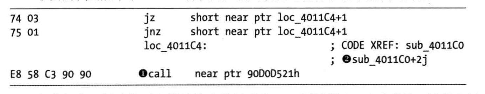

修正后

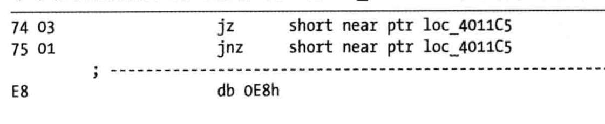

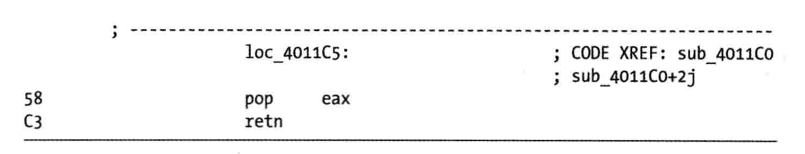

方便理解

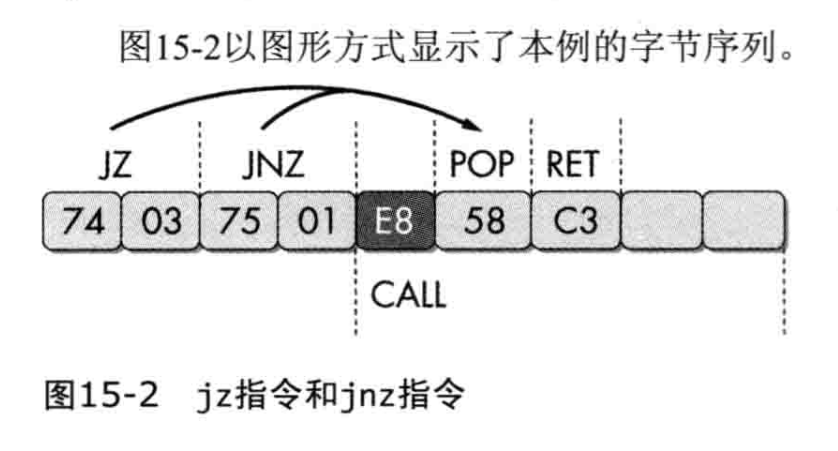

#### 固定条件的跳转指令（恒真或者恒假）

```
__asm{
xor eax, eax
jz address
}

__asm{
    push ebx
    xor ebx,ebx
    test ebx,ebx
    jnz label1
    jz label2
label1:
    _emit junkcode
label2:
   pop ebx//需要恢复ebx寄存器    
}

__asm{
	clc
	jnz label1:
	_emit junkcode
label1:
}

__asm{
    cmp eax, ecx
	jnz label
}
```

根据此原理变形的几种花指令

```
1、
__asm {
		xor eax, eax
		test eax, eax      //产生确定标志位ZF
		je LABEL1
		jne LABEL2         //je和jnz指令形成互补跳转
		LABEL2 :
		    _emit 0x5e     //与pop si机器码相同
		    and eax, ebx
		    _emit 0x50     //与push ax机器码相同
			xor eax, ebx
			_emit 0x74     //与汇编助记符 jz 机器码相同
			add eax, edx
			
			LABEL1 :
	}

2、
__asm {
		push eax;
		xor eax, eax;
		test eax, eax;
		jnz  LABEL1;
		jz LABEL2;
	LABEL1:
		_emit 0xE8;    //与call助记符的机器码相同
	LABEL2:
		mov byte ptr[a], 0;
		call LABEL3;
		_emit 0xFF;     //与adc助记符的字节码相同
	LABEL3:
		add dword ptr ss : [esp], 8;
		ret;
		__emit 0x11;
		mov byte ptr[a], 2;
		pop eax;
	}

3、
__asm {
		push ebx;
		xor ebx, ebx;   
		test ebx, ebx;
		jnz LABEL5;
		jz	LABEL6;
	LABEL5:
		_emit 0x21;     //与and助记符的机器码相同
	LABEL6:
		pop ebx;
	}

4、
void example4()
{
	__asm {
		push ebx;
		xor ebx, ebx;
		test ebx, ebx;
		jnz LABEL7;
		jz	LABEL8;
	LABEL7:
		_emit 0xC7;
	LABEL8:
		pop ebx;
	}
	a = 4;
}

5、
	__asm {
		call LABEL9;
		_emit 0x83;
	LABEL9:
		add dword ptr ss : [esp], 8;
		ret;
		__emit 0xF3;
	}


6、
LoadLibrary("./hhhh");   //函数返回值存储于eax中
_asm {
    cmp eax, 0;
    jc LABEL6_1;          //cf=1触发跳转
    jnc LABEL6_2;         //cf=0触发跳转
    LABEL6_1:
    _emit 0xE8;           //与call汇编指令对应
    LABEL6_2:
}


7、
if (a > 0)
		return 1;
	else
		return 0;
	_asm {
		cmp eax, 0;
		jc LABEL7_1;
		jz LABEL7_2;
	LABEL7_1:
		_emit 0xE8;
	LABEL7_2:
	}

8、
void __declspec(naked)__cdecl cnuF(int* a)//裸函数，开辟和释放堆栈由我们自己写。
{

	//55 8b ec 83
	__asm
	{
	   /*保留栈底*/
		push ebp
		/*开辟栈空间*/
		mov ebp, esp
		sub esp, 0x40//0x40是缓冲区大小
		/*保留现场（寄存器状态）*/
		push ebx
		push esi
		push edi
		/*缓冲区写入数据*/
		mov eax, 0xCCCCCCCC    //0xCCCC在gb2312中是'烫'字
		mov ecx, 0x10          //cx为下面填'烫'操作计数
		lea edi, dword ptr ds : [ebp - 0x40]
		rep stos dword ptr es : [edi]
	}
	/*执行的操作*/
	*a = 1;
	 //花指令
	_asm    
	{
		call LABEL9;
		_emit 0xE8;
		_emit 0x01;
		_emit 0x00;
		_emit 0x00;
		_emit 0x00;

	LABEL9:
		push eax;
		push ebx;
		lea  eax, dword ptr ds : [ebp - 0x0]
			add dword ptr ss : [eax - 0x50], 26;

		pop eax;
		pop ebx;
		pop eax;
		jmp eax;
		__emit 0xE8;
		_emit 0x03;
		_emit 0x00;
		_emit 0x00;
		_emit 0x00;
		mov eax, dword ptr ss : [esp - 8];
	}
	__asm
	{
	    /*恢复现场*/
		pop edi
		pop esi
		pop ebx
		/*释放栈空间*/
		mov esp, ebp
		pop ebp
		ret
	}
}


参考：https://blog.csdn.net/m0_46296905/article/details/117336574
这篇文章写的非常好
```


修正前

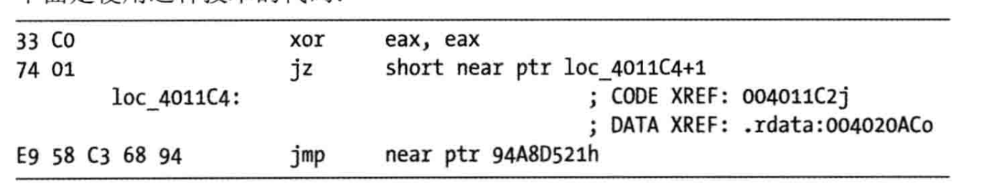

修正后

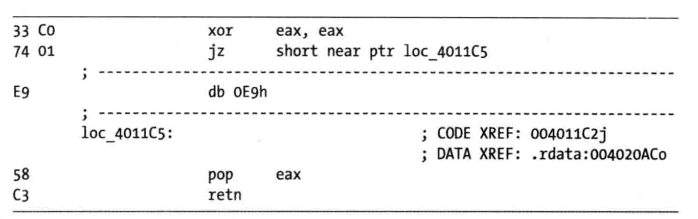

便于理解

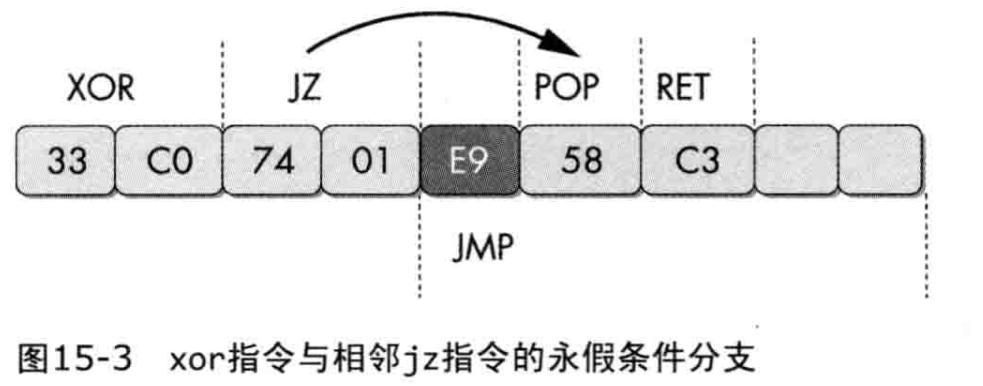

#### 汇编指令共用opcode

```
EB FF C0 48
66 B8 EB 05 31 C0 74 FA E8
```

* 1、内部跳转

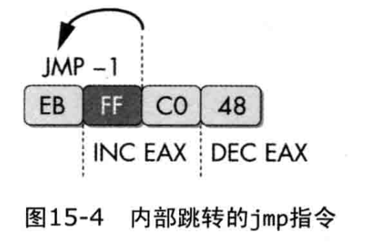

* 2、多层内部调转序列

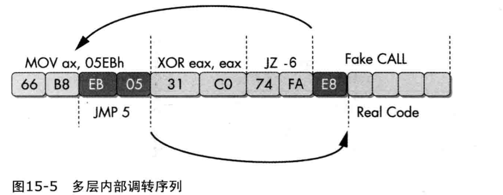

修正前

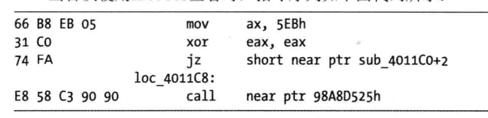

修正后

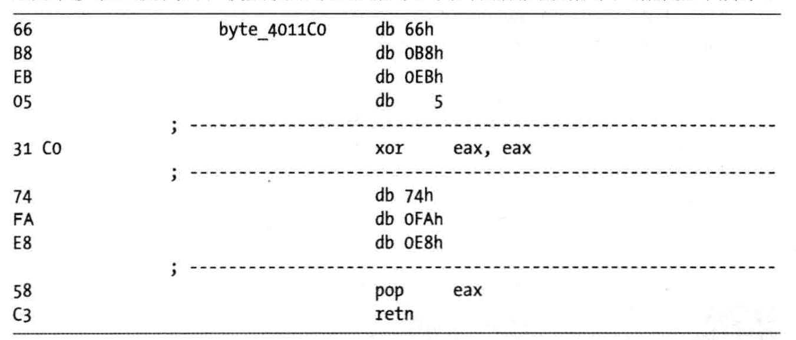

使用`IDAPython` Patch后

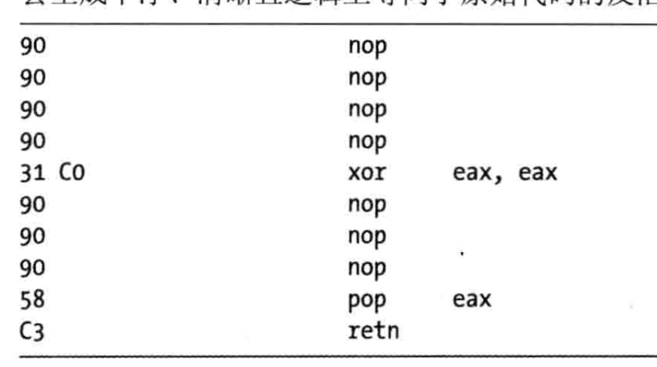

将下面的脚本放置在`IDA Pro -> plugins`目录下，就可以实现`ALT + N` 热键`nop`数据。

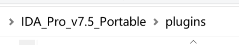

```
from idaapi import *
from idc import *

def nopIt():
	start = get_screen_ea()
	patch_byte(start,0x90)
	refresh_idaview_anyway()

add_hotkey("alt-N",nopIt)
```

#### 滥用结构化异常处理

结构化异常处理(`SEH`）提供一种控制流的方法，该方法不能被反汇编器采用，但可以用来欺
骗反汇编器。`SEH`是`x86`体系结构的一种功能，旨在为程序提供一种智能处理错误条件的万法。编程语言例如C++，Ada等，严重依赖异常处理，并且在`x86`系统上编译时会自动翻译成`SEH`。骗反汇编器。`SEH`是`x86`体系结构的一种功能，旨在为程序提供一种智能处理错误条件的万法。编程语言例如C++，Ada等，严重依赖异常处理，并且在`x86`系统上编译时会自动翻译成`SEH`。


为了查找`SEH`链，操作系统会检查`FS`段寄存器。这个寄存器包含一个段选择子，使用段选择子可以得到线程环境块（`TEB`）。`TEB`中第一个数据结构是线程信息块(`TIB`)。`TIB`中的第一个元素(即`TIB`的第一个字节）就是`SEH`链的指针。`SEH`链是一个简单的8字节数据结构链表，这个8字节数据结构叫作`EXCEPTION_REGISTRATION`记录。

结构体如图所示

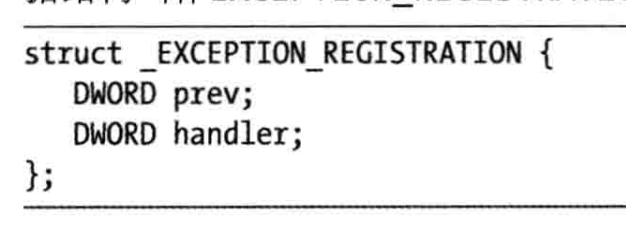

结构化异常处理链

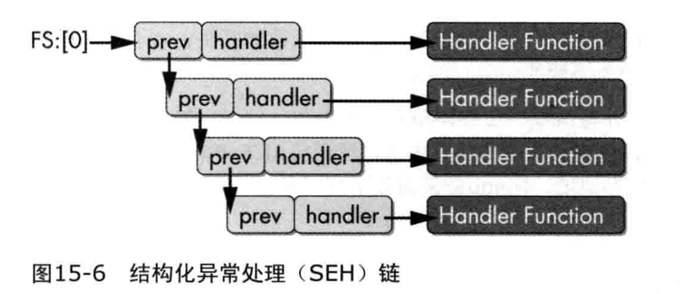

如何装载

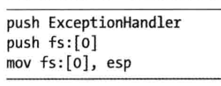

如何卸载

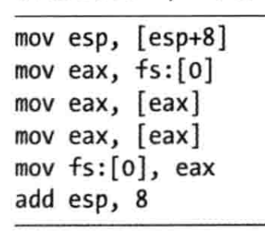

## 实验部分

### Lab 15-1

**分析样本文件`Lab15-01.exe`，它是一个命令行程序，它接收一个参数，如果这个参数与一个秘密代码相匹配，程序会输出“Good Job!”。**

* 1、这个二进制程序中使用了何种对抗反汇编技术?

* 2、这个二进制程序使用了什么流氓机器码来欺骗反汇编过程

* 3、这种对抗反汇编技术被使用了多少次?

* 4、什么命令行参数会让程序输出“Good Job”?

使用了`E8`机器码阻碍反汇编

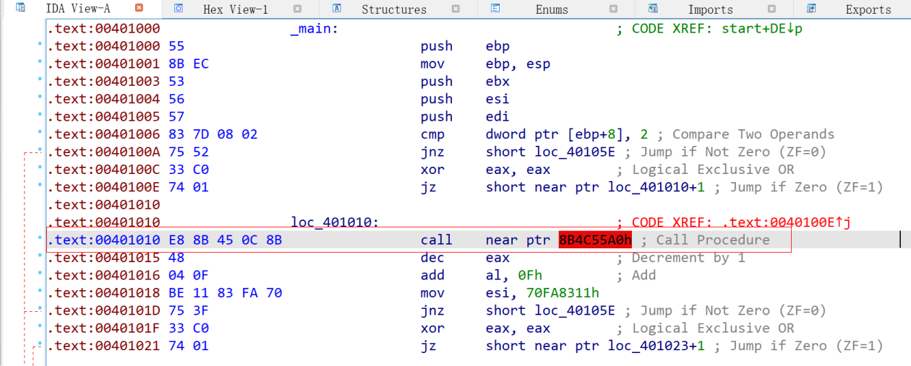

`nop`掉`E8`，然后把其他部分(`loc_401011`)转化成code，如果code和code之前还有单字节db，就继续选中地址按C转换。

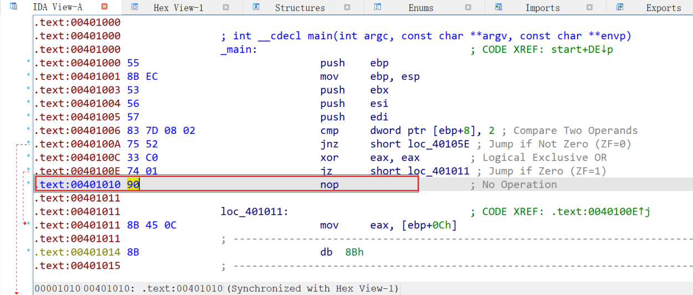

解决全部`E8`以后，选中`0x401077`的return到main函数开始，按P创建函数，看伪代码可以看到需要输入的参数是`pdq`

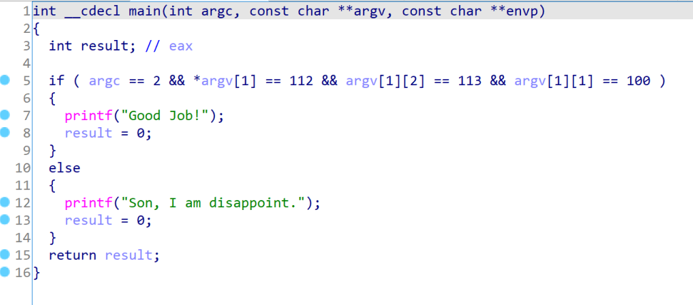

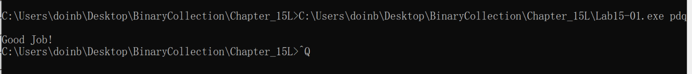

解答第三个问题，这种手法使用了多少次，可以直接搜索`xor`，需要注意的是要看下一条指令是不是跳转，有时候只是单纯的清空寄存器，这种手法共五次

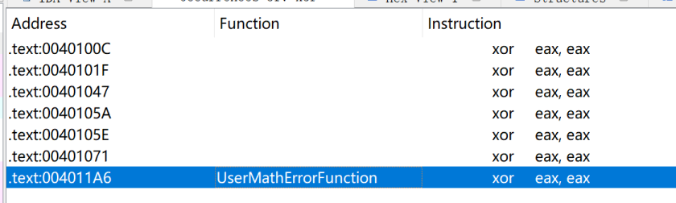

### Lab 15-2

**分析恶意代码文件`Lab15-2.exe`。要回答下列问题，请在分析二进制文件前，修正所有的反汇编技术。**

* 1、程序初始化请求的URL是什么?

* 2、**User-Agent**域是如何产生的?

* 3、初始化请求时，程序在内存页中查找什么?

* 4、程序如何处理它从页中提取的信息?


首先去除掉各种反汇编花指令，创建函数。直接定位到`url`生成部分，关键函数`InternetOpenUrlA`，参数是函数`url`的返回值，`http://www.practicalmalwareanalysis.com/bamboo.html`>

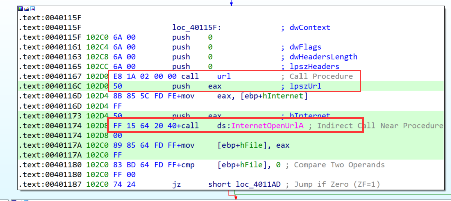

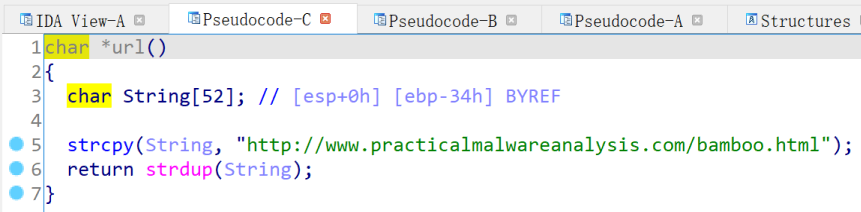

`User-Agent`主要关注函数`InternetOpenA`

```
HINTERNET InternetOpenA(
  [in] LPCSTR lpszAgent,
  [in] DWORD  dwAccessType,
  [in] LPCSTR lpszProxy,
  [in] LPCSTR lpszProxyBypass,
  [in] DWORD  dwFlags
);

[in] lpszAgent

Pointer to a null-terminated string that specifies the name of the application or entity calling the WinINet functions. This name is used as the user agent in the HTTP protocol.

[in] dwAccessType

Type of access required. This parameter can be one of the following values.

[in] lpszProxy

Pointer to a null-terminated string that specifies the name of the proxy server(s) to use when proxy access is specified by setting dwAccessType to INTERNET_OPEN_TYPE_PROXY. Do not use an empty string, because InternetOpen will use it as the proxy name. The WinINet functions recognize only CERN type proxies (HTTP only) and the TIS FTP gateway (FTP only). If Microsoft Internet Explorer is installed, these functions also support SOCKS proxies. FTP requests can be made through a CERN type proxy either by changing them to an HTTP request or by using InternetOpenUrl. If dwAccessType is not set to INTERNET_OPEN_TYPE_PROXY, this parameter is ignored and should be NULL. For more information about listing proxy servers, see the Listing Proxy Servers section of Enabling Internet Functionality.

[in] lpszProxyBypass

Pointer to a null-terminated string that specifies an optional list of host names or IP addresses, or both, that should not be routed through the proxy when dwAccessType is set to INTERNET_OPEN_TYPE_PROXY. The list can contain wildcards. Do not use an empty string, because InternetOpen will use it as the proxy bypass list. If this parameter specifies the "<local>" macro, the function bypasses the proxy for any host name that does not contain a period.

By default, WinINet will bypass the proxy for requests that use the host names "localhost", "loopback", "127.0.0.1", or "[::1]". This behavior exists because a remote proxy server typically will not resolve these addresses properly.Internet Explorer 9:  You can remove the local computer from the proxy bypass list using the "<-loopback>" macro.

If dwAccessType is not set to INTERNET_OPEN_TYPE_PROXY, this parameter is ignored and should be NULL.

[in] dwFlags

Options. This parameter can be a combination of the following values.
```


Link：https://docs.microsoft.com/en-us/windows/win32/api/wininet/nf-wininet-internetopena

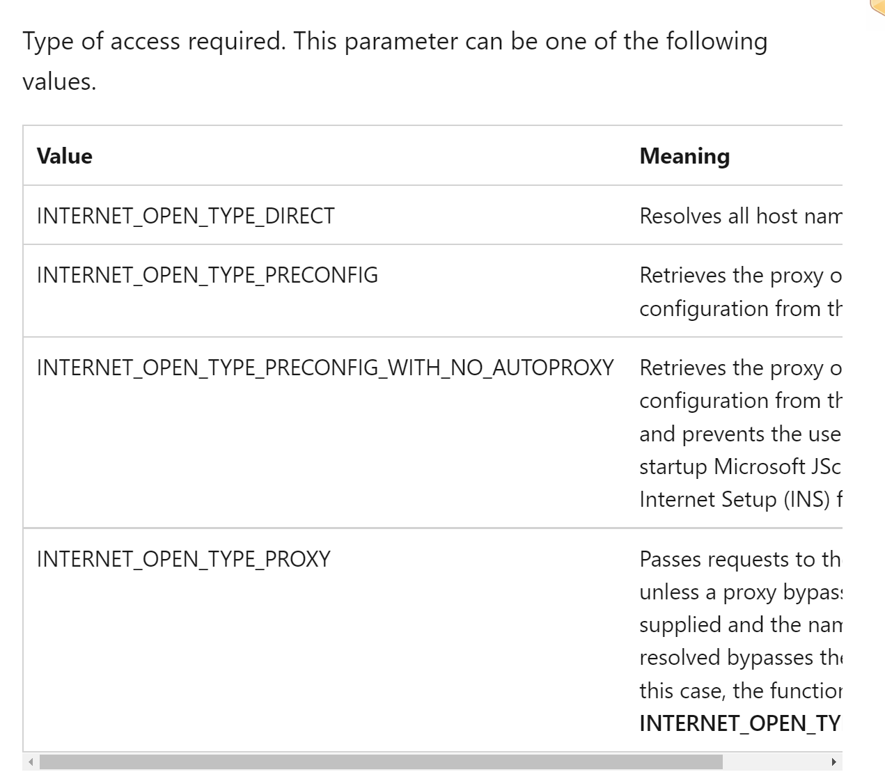

可以使用常量替换参数值，理解起来更方便一些。

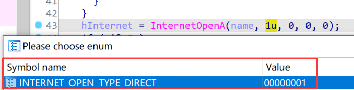


`User-Agent`的逻辑如下图所示，就是把`hostname`中的每个字母和数字加1，（Z对应A，z对应a，9对应0）

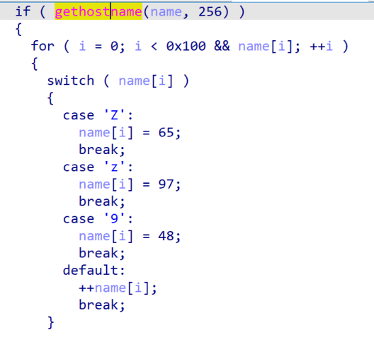

3和4解答：

在内存页中查找的是`Bamboo::`

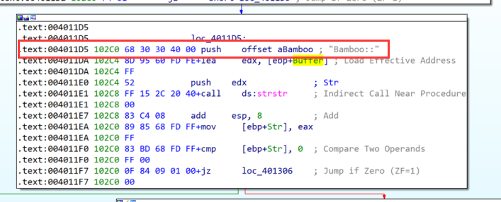

处理页面信息时，先把得到的页面信息和`Bamboo::`当作参数传入函数`strstr`，得到以`Bamboo::`开头的字串。然后对得到的子串b和`::`又进行查找子串的操作，

函数结束后`401209`处平衡栈，下一步将第一个:的位置填充一个byte的0，也就是常用的截断`\0`，这样原来的字符串b变成了以`Boomboo::`开头，`::`前面的部分。

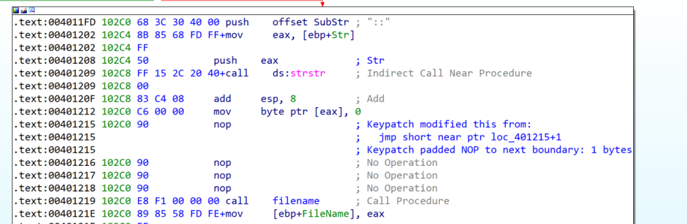


然后在`40123E`位置通过`add ecx, 8`得到`Boomboo::`后面的部分，然后当作url访问，所以综上所述，这个url应该是`Boomboo::`和后面的`::`中间的内容

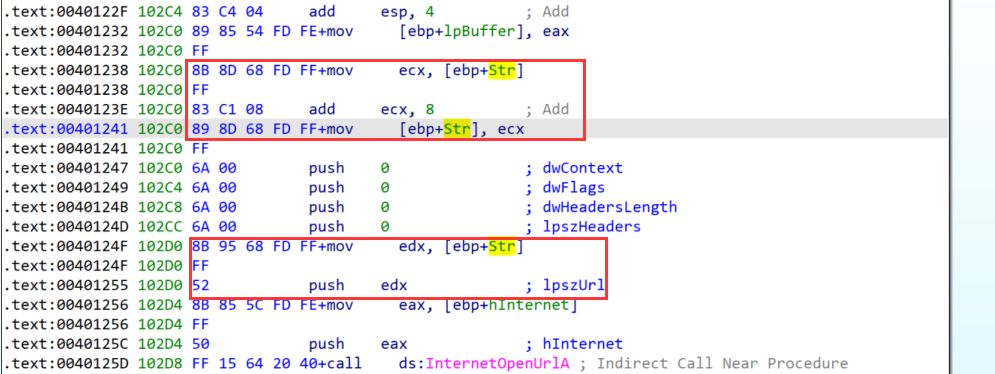

将传回的数据写入文件之后，会调用执行恶意文件，但是在之前还加入了一段花指令，这部分就是书上介绍的**多层内部调转序列**

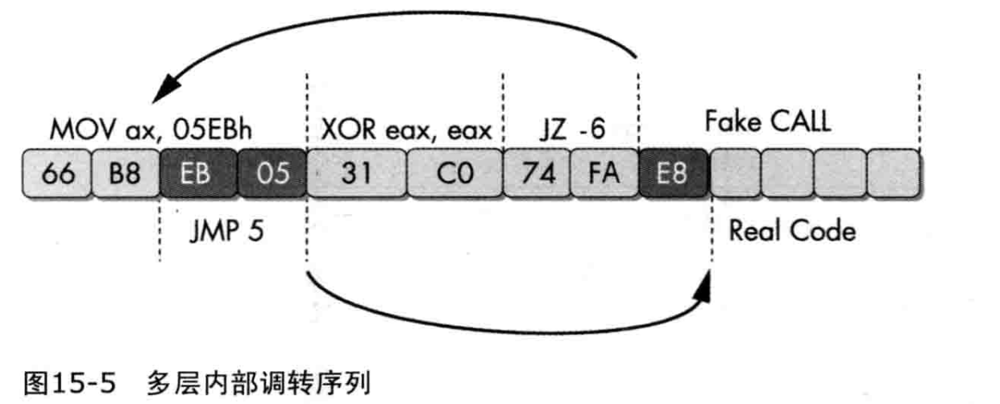

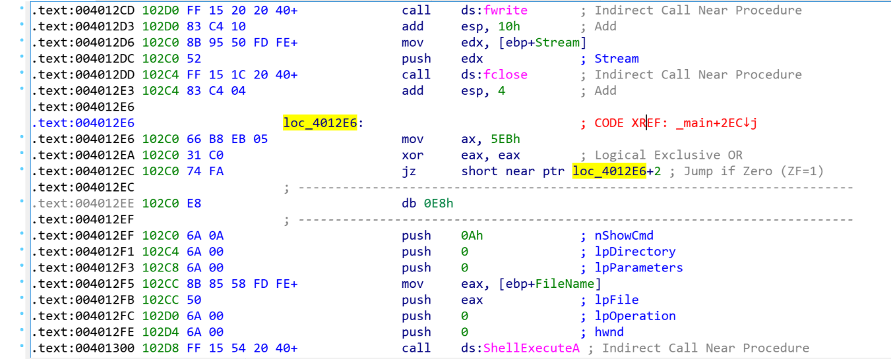

使用脚本patch掉无关字节，只保留`xor eax, eax`即可

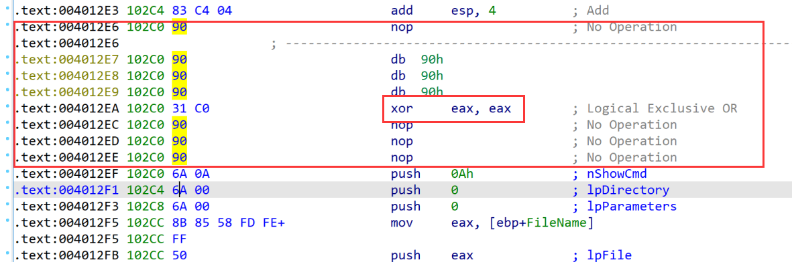

### Lab 15-3

**分析恶意代码文件`Lab15-3.exe`。乍一看，这个二进制程序似乎是一个合法工具，但实际上它的功能远远超过所告知的功能。**

* 1、恶意代码怎样被初始化调用?

* 2、恶意代码都做了什么?

* 3、恶意代码使用了什么URL?

* 4、恶意代码使用了什么文件名?

答案：

1、通过覆盖main函数的返回地址，初始化调用恶意代码。

2、恶意代码从一个URL下载文件，并且用`winExec`启动它

3、恶意代码使用的URL是 `http://www.practicalmalwareanalysis.com/tt.htmlo`

4、恶意代码使用的文件名是`spoolsrv.exe`。

可以看到在main函数开头地方就修改了函数返回地址，修改后为`0x40148C`。

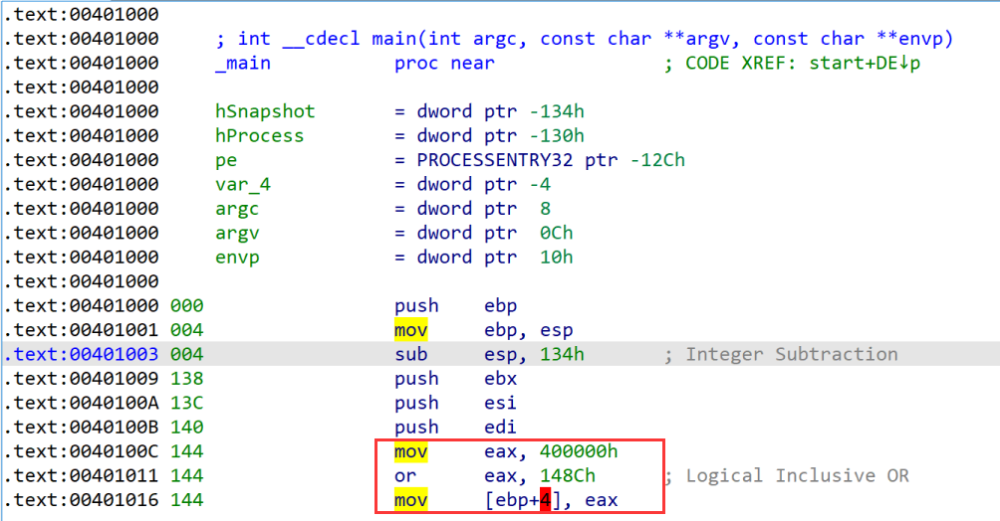

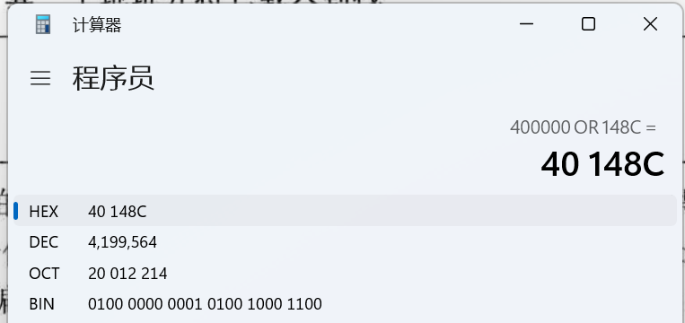

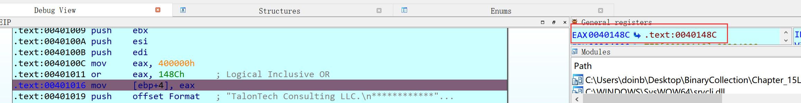

解决掉`0x401496`处的花指令后发现除零异常。`0x401497`处的是异常处理`handler`

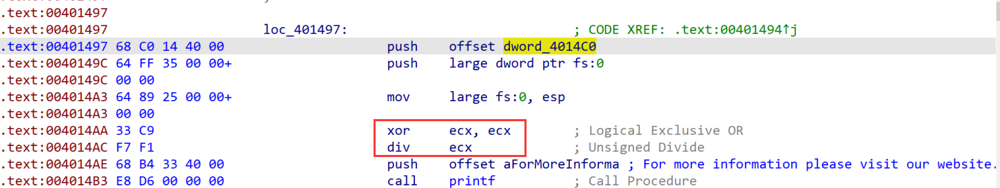


`asc_403010`的数据目前是不可读的，在`sub_401534`处理以后就会得到`url`，可以看到`url`已经被解密出来了。`http://www.practicalmalwareanalysis.com/tt.html`

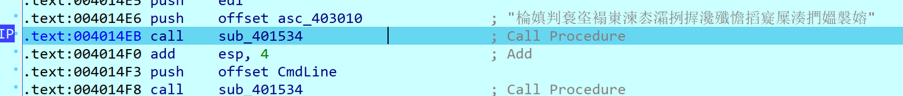

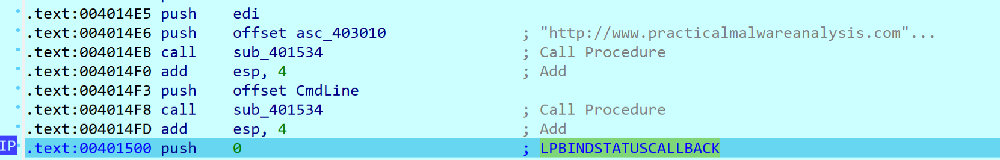

**重点：正常运行到div后就会跑飞，可以在异常回调的部分下断点就可以跑到异常处理位置**

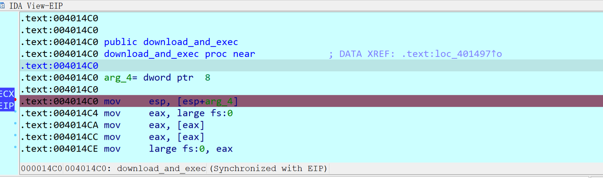

调试到`0x401510`位置

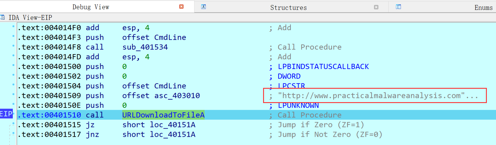