# 第十八章 加壳与脱壳
打包程序，也称为加壳器，他们能够对反病毒软件，复杂的恶意代码分析过程隐藏恶意代码的存在，另外能缩小恶意代码可执行文件的大小。        
对应的ATT&CK矩阵为：**[Software Packing]** https://attack.mitre.org/techniques/T1027/002/     
加壳可执行文件的俩个主要目的是

* 缩减程序的大小
* 阻碍对加壳程序的探测和分析。

## 剖析加壳
恶意代码加壳后，分析人员通常只能获得加壳文件，而不能检测原始程序及加壳器。
要脱壳一个可执行文件，我们必须解开加壳所执行的操作，首先，我们需要理解加壳器的工作原理。
	
所有加壳器都是将一个可执行文件作为输入，输出一个新的可执行文件。被加壳的可
执行文件经过压缩，加密或者其他转换，目的是使它们难以被识别，难以被逆向工程分析。
	
多数加壳器用压缩算法压缩原始文件。设计加壳器的目的是让程序难以分析，加壳器通过加
密原始可执行文件并且实施一些反逆向技术实现，如对抗反汇编，反汇编和反虚拟机等等。
	
要保持原程序功能，加壳程序需要存储程序中的导入函数表信息。这些信息可以用任何格式存储，它们之间有几个共同的策略，重构程序的导入函数表是以恶具有挑战性且费时的操作，但这对分析程序功能十分必要。
### 脱壳存根
加壳后的可执行程序的入口点指向脱壳存根，再由脱壳存根加载原始程序。脱壳存根执行了以下三个步骤：
* 将原始程序脱壳到内存中
* 解析原始可执行文件的所有导入函数。
* 将可执行程序转移到原始的程序入口点(OEP)Original Entry Point

### 加载可执行文件
当加载一个标准的可执行文件时，加载器会首先读取硬盘上可执行文件的PE头部信息，然后根据PE头部信息为可执行文件的各个节分配内存。然后，加载器将这些节复制到分配的内存空间中。        

加壳后的可执行文件会组成PE头部，让加载器为它的节分配空间，它的节要么来自源程序，要么是脱壳存根创建的节，脱壳存根会复制每个节的代码，并将他们复制到分配的内存空间中。

### 解析导入函数表
味加壳的PE文件中有一个节段告诉加载器需要导入哪些函数，同时还有一个节存储了需要导入的函数名称和地址。Windows加载器读取导入信息，确定需要导入哪些函数，然后填入导入函数的地址。

Windows加载器不能读取被加壳的可执行文件的导入函数表。对于加壳的可执行文件，脱壳存根负责解析导入函数表，最常用的方法是仅导入LoadLibrary和GetProcessAddress两个函数。脱壳存根在脱壳出可执行文件后，使用LoadLibrary函数导入每个库，使用GetProcessAddress获取每个函数的内存地址。

### 尾部跳转
一旦脱壳存根完成脱壳，他就必须转到OEP运行。转到OEP的指令通常被叫做尾部跳转指令。jump指令是最简单且最流行的转移指令。多数恶意的加壳程序试图使用ret或者call指令来隐藏这种行为。有时，恶意代码会使用操作系统转移控制的函数来掩盖尾部跳转。比如使用函数NtContinue或ZwContinue。

### 图示脱壳过程
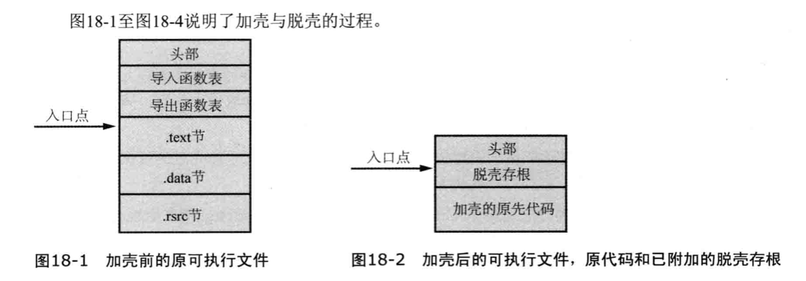

脱壳后的程序与原始程序不同，依旧包含脱壳存根，以及加壳程序添加的一些其他代码。脱壳后的程序包含一个被脱壳器重构的PE头部，并且与原始PE文件不完全相同。

## 识别加壳程序
### 加壳程序的标志
下面是恶意代码是否加壳的标志：
* 导入函数很少，导入函数仅有loadlibrary和getProcAddress。
* 当使用IDA Pro打开程序时，通过分析，只有少量代码被识别
* 当使用Ollydbg打开程序时，会有程序可能被加壳的警告。
* 程序的节名包含某款加壳器的标识(UPX0)
* 程序拥有不正常的节大小。
* 可以使用加壳探测工具，比如PEiD也可以探测可执行文件是否被加壳。
### 熵计算
加壳程序可以通过熵值计算的技术探测，压缩和加密数据更接近随机数据，拥有一个较高的熵值。混乱程序比较高。
Red Curtain(https://mandiant-red-curtain.apponic.com/)可以扫描文件系统发现可疑的加壳二进制文件，运用的就是熵值检测原理。

### 脱壳选项
* 自动静态脱壳
* 自动动态脱壳
* 手动动态脱壳

### 自动脱壳
自动的静态脱壳程序可以在没有运行可执行文件的情况下进行脱壳，一旦原始的可执行文件被脱壳，它将被写入硬盘，然后脱壳程序重构原始的导入表。
相关工具：PE Explorer

自动的脱壳程序必须确定脱壳存根的结束位置，原始可执行文件的开始位置，但这非常困难。当脱壳程序不能正确识别脱壳存根的结束位置时，脱壳就会失败。

### 手动脱壳
**有两种手动脱壳程序的办法**
* 1、找到加壳的算法，然后完全逆向运行，此种方式比较困难。
* 2、运行脱壳程序，让脱壳存根帮你工作。让它从内存中转储出进程，然后你再手动修正PE头部，这是一种有效的办法。
* 相关工具：OllyDump（是OllyDbg的一个插件，有两个重要功能，转储当前进程的内存，搜索加壳可执行程序的OEP）
手动脱壳过程可以抽象为以下两步。
第一步查找OEP。第二步重构导入表。
#### 查找OEP
1、使用自动工具查找OEP（OllyDump）
2、手动查找OEP（平衡堆栈法，又称ESP定律）
#### 手动修复导入表
OllyDump和ImpRec通过搜索内存中的导入函数来重构导入表。
导入表在内存中存在两个表，一个是函数名称或者序号列表，其中包含加载器或脱壳存根所需要的函数名称或者序号。第二个表是所有导入函数的地址列表。当代码运行时，只需要第二个表，所以加壳程序可以通过移除名字列表组织分析。如果名字列表被移除，你可能需要手动重构这个表。

### 常见壳的技巧和窍门
介绍了几种常见壳。

### 不完全脱壳情况下的分析
一些程序脱壳非常困难，有时，花费一天时间也没有任何进展。这可能是因为壳使用了一种你无法解决的新技术。分析某一块的恶意代码，并不总是需要创建一个完全脱壳后可运行的可执行文件。
最常发生的情况是由于不能完全修复导入表和PE头部，从而导致一个脱壳应用程序无法正确运行。这种情况下，即使程序没有完全脱壳，仍然可以使用IDA Pro分析它。一些脱壳器在原始程序运行之前，并不真正完全脱壳原始程序。相反，它们会脱壳原始程序的一部分，并且运行这部分，当需要运行下一部分代码时，再将这部分代码脱壳到内存。这需要相当大的开销，但也让分析人员难以脱壳。

### 加壳DLL

加壳DLL会有一些额外的问题需要解决，所以并不是所有的壳都支持这种功能。处理DLL导出表就是 其中的一个。那么导出函数也会被加壳。加壳程序必须考虑到这一点，确保DLL正常运行。

相关工具：LoadDll（OllyDbg工具）利用这个工具可以加载或调用Dll

问题：如何区别dll和可执行文件？

打开PE文件，定位到IMAGE_FILE_HEADER节的特征标志域，如果IMAGE_FILE_HEADER节0x2000处的标志位为1，则表示这个文件是DLL，如果这个标志位是0，这个文件被解释为可执行文件。

## 实验部分

分析样本文件Lab18-01.exe到Lab18-05.exe，进行脱壳。

### Lab18-01

使用EXEinfo查壳，发现加了UPX壳。

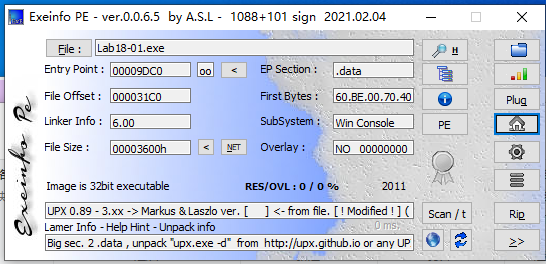

使用IDA Pro打开文件，提示可能被加壳

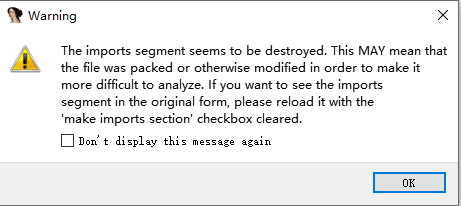

发现只能识别导入表的必须函数，分析`start`函数。

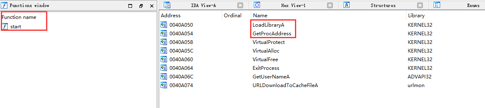

发现可疑尾部跳转，位于`0x409F43`。

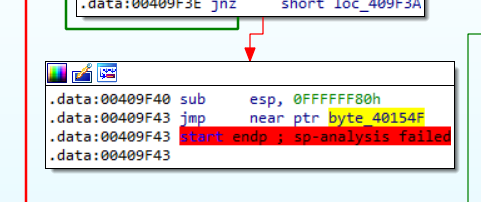

使用OD打开程序。跳转到`0x409F43`，jmp后是无意义的0，导致IDA Pro分析失败。

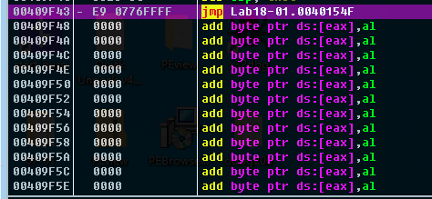

在`0x409F43`处下断点，`F9`执行到此处

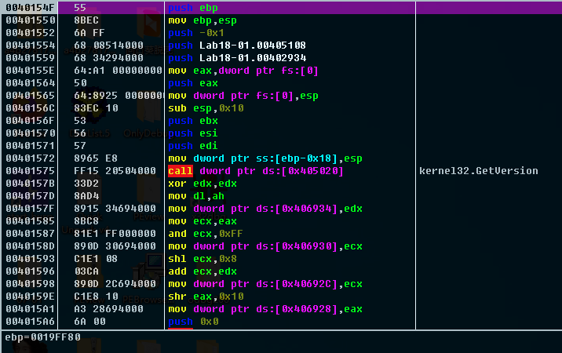

开始脱壳

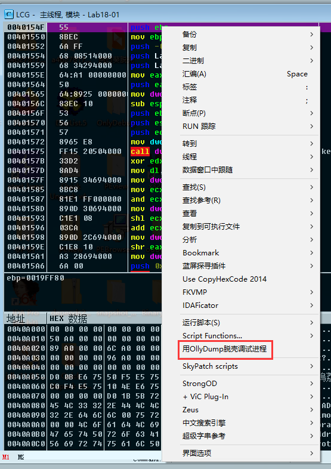

去掉`重建输入表选项`

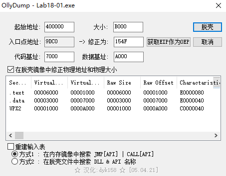

使用`ImportREC`重建导入表

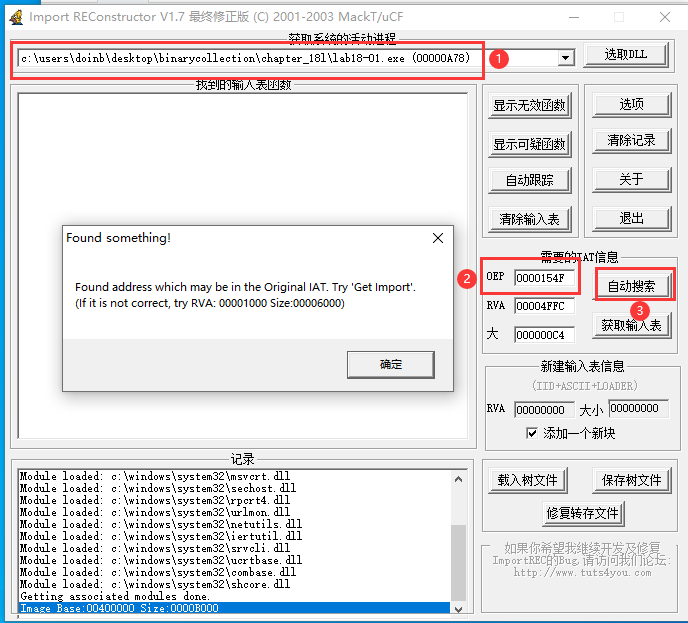

获取导入表

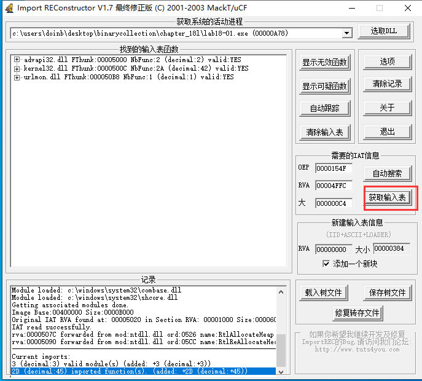

得到修复完成的文件会自动在原文件名后面加下划线。

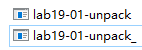

再次使用IDA Pro打开文件，发现可以识别函数和导入表了，脱壳完成。

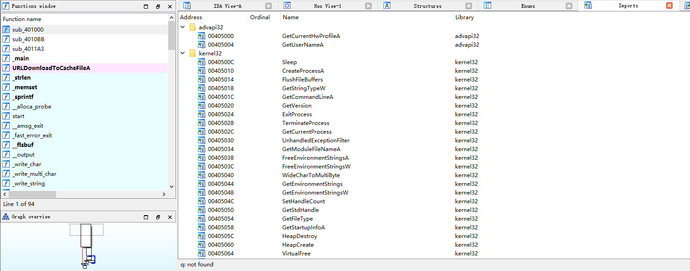

### Lab18-02

Exeinfo查看信息，没有识别出什么壳。

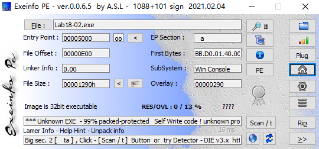

尝试使用插件脱壳。

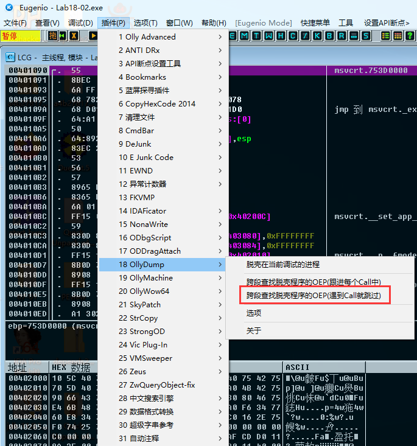

自动找到了OEP

直接使用Ollydump脱壳即可。

### Lab18-03

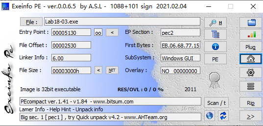

这两条指令保存寄存器和标志位信息，在到达OEP之前会使用push恢复寄存器和标志位，使用硬件断点比较方便。

运行完`pushfd`和`pushad`指令后，在栈顶位置右键，选择数据窗口中跟随。

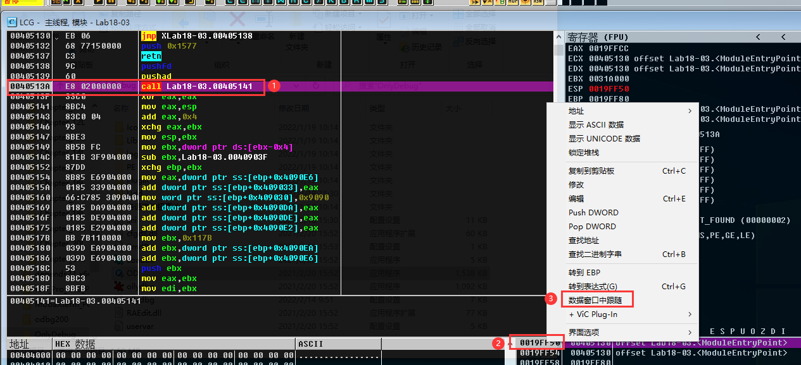

打上断点，在数据窗口中选中四个字节，打上右键断点。

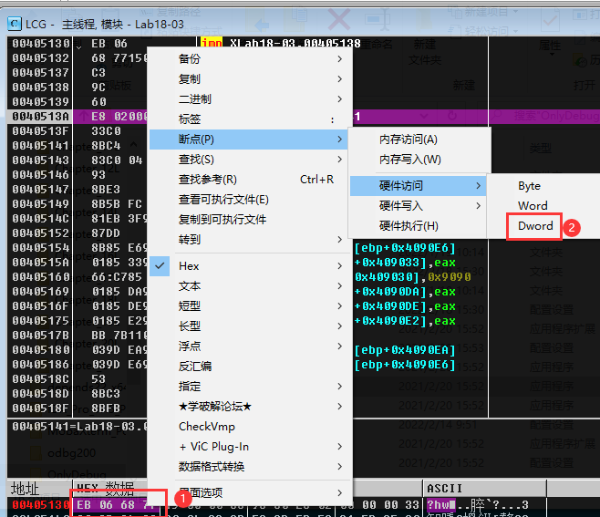

F9运行到断点，找到了`popfd`指令 下面有一个return，可能是OEP，单步过去，发现是OEP。

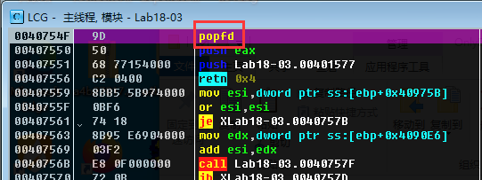

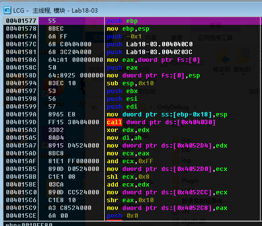

老办法解决

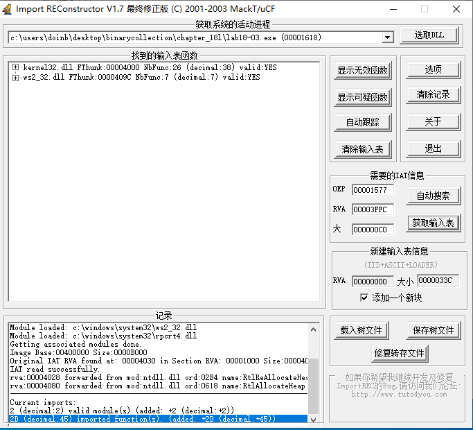

exeinfo查壳

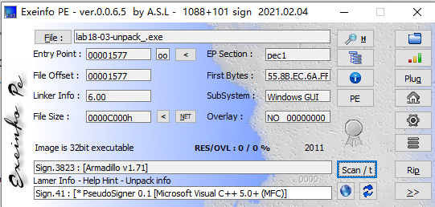

### Lab18-04

exeinfo查壳

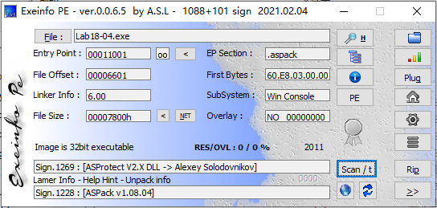

和实验三大同小异

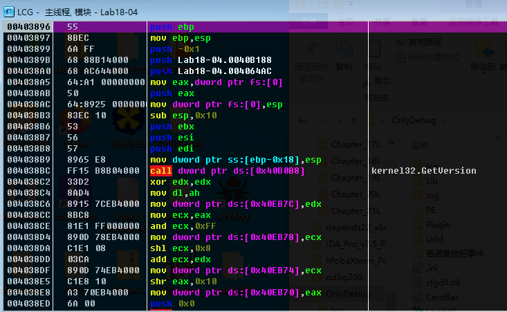

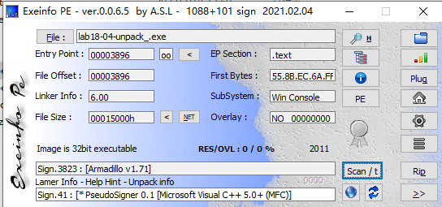

### Lab18-05

exeinfo查壳

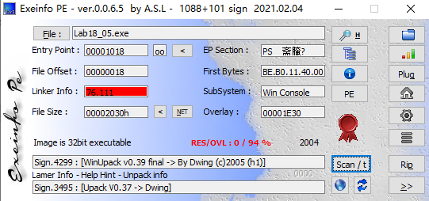

同上，找到oep

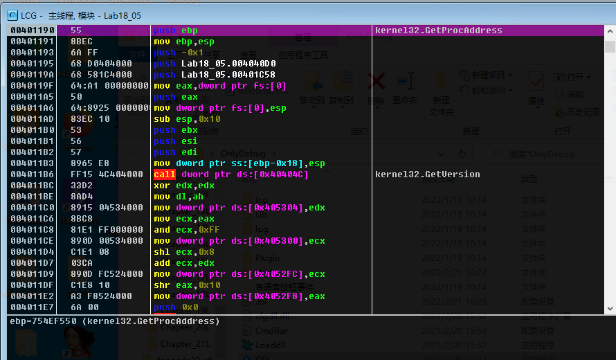

脱壳完毕，查壳

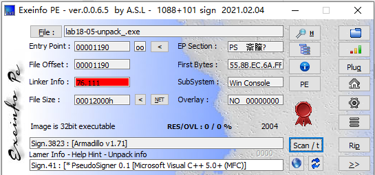