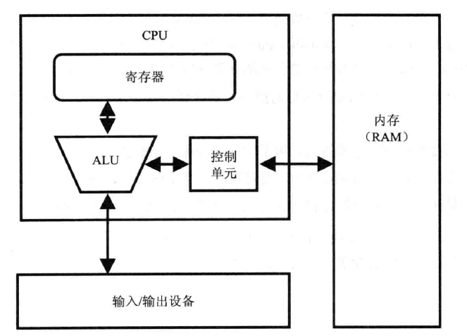
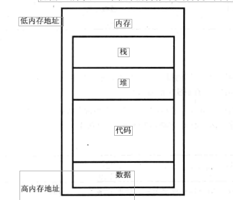
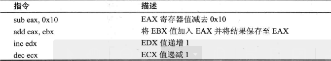
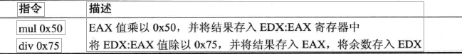
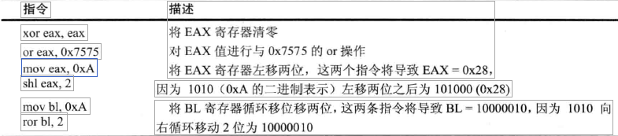
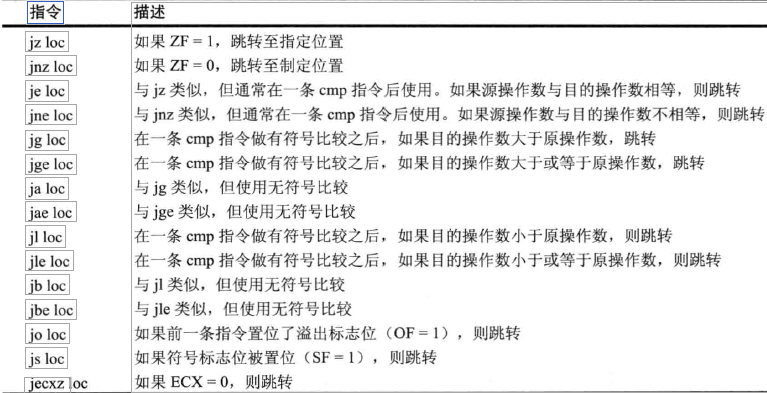
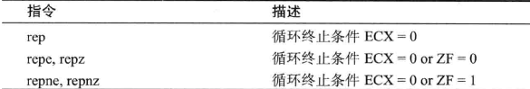
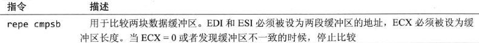
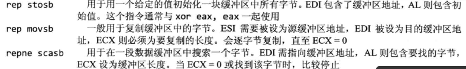
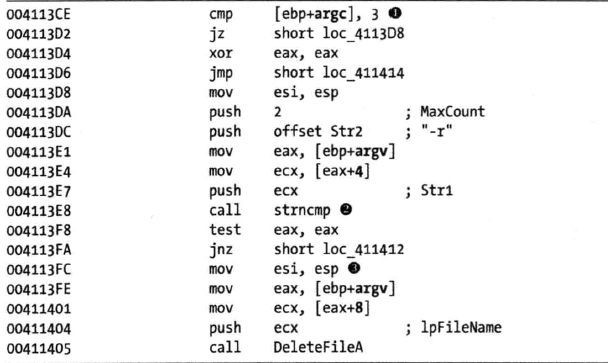

# 第四章 X86反汇编速成班

## X86体系结构
* 中央处理单元（CPU）
* 内存（RAM）
* 输入输出设备（IO）



## 内存
内存部分和PE文件结构一起理解
一个程序的内存可分为如下四个主要的节
* 数据节 这个词指的是内存中一 个特定的节，名为数据节 （data section），其中包含了一 些值。这些值在程序初始加载时被放到这里，称为静态值（static value），因为程序运行时它们可能并不发生变化，还可以称为全局值（global value），因为程序的任何部分都可以使用它们。
* 代码节 代码节包含了在执行程序任务时CPU所取得的指令。这些代码决定了程序是做什么的，以及程序中的任务如何协调工作。
* 堆节 堆是为程序执行期间需要的动态内存准备的，用于创建（分配）新的值，以及消除（释放）不再需要的值。将其称为动态内存（dynamic memory），是因为其内容在程序运行期间经常被改变。
* 栈节 栈用于函数的局部变量和参数，以及控制程序执行流。



## 指令，操作码和操作数
* 指令：指令是汇编程序的构成块。在x86、汇编语言中，一条指令由一个助记符，以及零个或多个操作数组成。

* 操作码：操作码告诉CPU程序要执行的操作

* 操作数：操作数说明指令要使用的数据。有以下三种类型：
    * 立即数（immediate）操作数是一个固定的值
    * 寄存器（register）操作数指向寄存器
    * 内存地址（memory address）操作数指向感兴趣的值所在的内存地址，一般由方括号内包含值、寄存器或方程式组成，如［eax］。


## 字节序
大端模式和小端模式的起源
* 关于大端小端名词的由来，有一个有趣的故事，来自于Jonathan Swift的《格利佛游记》：Lilliput和Blefuscu这两个强国在过去的36个月中一直在苦战。战争的原因：大家都知道，吃鸡蛋的时候，原始的方法是打破鸡蛋较大的一端，可以那时的皇帝的祖父由于小时侯吃鸡蛋，按这种方法把手指弄破了，因此他的父亲，就下令，命令所有的子民吃鸡蛋的时候，必须先打破鸡蛋较小的一端，违令者重罚。然后老百姓对此法令极为反感，期间发生了多次叛乱，其中一个皇帝因此送命，另一个丢了王位，产生叛乱的原因就是另一个国家Blefuscu的国王大臣煽动起来的，叛乱平息后，就逃到这个帝国避难。据估计，先后几次有11000余人情愿死也不肯去打破鸡蛋较小的端吃鸡蛋。这个其实讽刺当时英国和法国之间持续的冲突。Danny Cohen一位网络协议的开创者，第一次使用这两个术语指代字节顺序，后来就被大家广泛接受。


* 字节序：数据的字节序（enclianness）是指在一个大数据项中，最高位（大端，big-endian）还是最低位（小端，little-enclian）被排在第一位 （即排在最低的地址上）。

小端模式：低在低，高在高；不同类型的系统编码方式不一样，X86为小端模式（PowerPC（苹果电脑在使用Intel的芯片之前使用的就是Power PC，那时候的Macbook Pro也叫PowerBook，power即表示苹果电脑性能强劲，也表示内部的处理器是POWER PC）、IBM、Sun等为大端模式；ARM既可以工作在大端模式，也可以工作在小端模式。）

大端模式：高在低，低在高；网络传输中的网络字节顺序使用大端模式进行编码。

## 寄存器
寄存器是可以被CPU使用的少量数据存储器，访问其中内容的速度会比访问其他存储器要快。x86处理器中有一组寄存器，可以用于临时存储或者作为工作区。最常用的x86寄存器，可以将它们归为以下四类：
* 通用寄存器，CPU在执行期间使用。
* 段寄存器，用于定位内存节。
* 标志寄存器，用于做出决定。
* 指令指针，用于定位要执行的下一条指令。

X86寄存器

```
通用寄存器
EAX
EBX
ECX
EDX
EBP
ESP
ESI
```

```
段寄存器
CS
SS
DS
ES
FS
GS
```

```
标志寄存器
EFLAGS
```

```
指令指针
EIP
```

所有通用寄存器的大小都是32位，可以在汇编代码中以32位或16位引用。

有4个寄存器（EAX、EBX、ECX、EDX）还可以8位值的方式引用，从而使用其最低的8位，或次低的8位。即使用AX来获取EAX的最低16位，AL获取AX的低8位，AH获取AX的高8位。

**通用寄存器** 

通用寄存器一般用于存储数据或内存地址，而且经常交换着使用以完成程序。不过，虽然它们被称为通用寄存器，但它们并不完全通用。

一些x86指令只能使用特定的寄存器。例如，乘法和除法指令就只能使用EAX和EDX。

EAX通常存储了一个函数调用的返回值，如果一个函数调用以后马上使用EAX寄存器，可能就是在操作返回值。

**标志寄存器** 

EFLAGS寄存器是一个标志寄存器。在x86架构中，它是32位的，每一位是一个标志。在执行期间，每一位表示要么是置位（值为1），要么是清除（值为0），并由这些值来控制CPU 的运算，或者给出某些CPU运算的值。对恶意代码分析来说，最重要的一些标志介绍如下：

```
ZF 当一个运算的结果等于0时，ZF被置位，否则被清除。
CF 当一个运算的结果相对于目标操作数太大或太小时，CF被置位，否则被清除。
SF 当一 个运算的结果为负数，SF被置位；若结果为正数，SF被清除。对算术运算，当运算结果的最高位值为l时，SF也会被置位。
TF TF用于调试。当它被置位时，x86处理器每次只执行一条指令。
```

**EIP，指令指针**

在x86架构中，EIP寄存器，又称为指令指针或程序计数器，保存了程序将要执行的下一条指令在内存中的地址。EIP的唯一作用就是告诉处理器接下来要做什么。

```
注意：当EIP被破坏（即指向了一个不包含合法程序代码的内存地址 ）时，CPU 无法取得一条合法指令来执行，此时正在运行的程序就可能崩溃。当你控制了EIP，也就控制了CPU将要执行什么，这也就是为什么攻击者试图通过漏洞利用获得对EIP的控制。通常，攻击者先妥使攻击代码进入内存，然后改变EIP使其指向那段代码，从而攻击系统。
```

## 简单指令

**mov**

用于将数据从一个位置移动到另一个位置

mov指令可以将数据移动到寄存器或内存，其格式是：mov destination, source

由方括号括起来的操作数是对内存中数据的引用。例如，［ebx]指向内存中地址为EBX处的数据。

#### **lea**

lea指令用来将一个内存地址赋给目的操作数。

“load effective address“（加载有效地址）的缩写。它的格式是lea destination, source。

lea指令可以实现add指令做不到的事情

```
1. 2-3个操作数的加法
2. 可以在任意寄存器存储结果，不仅仅是在源操作数上
```

同时，lea指令不会修改flags。

eg:

- 计算（EAX + EBX + 1234567）的值，注意这里有3个操作数，是add指令无法做到的：

  - ```
    LEA EAX, [ EAX + EBX + 1234567 ]
    ```

- 不覆盖目的寄存器值的情况下，计算（EBX + ECX）的结果，这也是add指令无法做到的：

  - ```
    LEA EAX, [ EBX + ECX ]
    ```

- 常数乘法:

  - ```
    LEA EAX, [ EBX + N * EBX ]
    ```

#### 算术运算

加法和减法是从目标操作数中加上或减去一个值。

加法指令的格式是add destination, value。

减法的指令是sub destination, value。
sub指令会修改两个重要的标志：ZF和CF。
如果结果为零，ZF被置位；如果目标操作数比要减去的值小，则CF被置位。

inc和dec指令将一个寄存器加一和减一 。即为自增和自减。




乘法和除法都使用了一个预先规定的寄存器，因此其指令很简单，就是指令码加上寄存器要去乘或除的值。

mul指令的格式是mul value;
div指令的格式是div value。

mul或div指令要操作的寄存器一般会在之前许多条指令的地方被赋值，因此你可能需要在程序的上下文中来寻找。

mul的返回值为EDX:EAX 乘法的结果以64位的形式分开存储在两个寄存器中，EDX存储高32位，EAX存储低32位。

div返回值为 EDX:EAX -> 余数:商 需要注意一下。



**模（mod）**运算会被编译为在div指令后取EDX寄存器的值（因为除法保留了余数）

#### 逻辑运算

x86架构还使用逻辑运算符，例如OR、AND和XOR。其相应指令的用法与add和sub类似，对源操作数和目的操作数做相应的操作，并将结果保存在目的操作数中。

*xor eax, eax就一种将EAX寄存器快速置0的方法。这么做是为了优化，因为这条指令只需要2个字节，而mov eax, 0需要5个字节。*

shr和shl指令用于对寄存器做移位操作。

shr指令的格式是 “shr destination, count”
shl指令的格式是 “shl destination, count”

shr和shl指令对目的操作数右移或左移，由count决定移多少位。移出目的操作数边界的位则会先移动到CF标志位中。在移位时，使用0填充新的位。移位运算全部完成后，CF标志位中就包含了最后移出目的操作数的那一位。

循环移位指令ror和rol与移位指令类似，但移出的那一位会被填到另一端空出来的位上，即右循环移位（ror）会将最低位循环移到最高位；左循环移位Crol)则相反。

移位经常被用于对乘法运算的优化。由于不需要像乘法那样设置寄存器、移动数据，移位会更简单、更快。

在分析恶意代码时，如果遇到一个函数中只有xor、or、and、shl、ror、shr、rol这样的指令，并且它们反复出现，看起来随机排列的样子，就可能是遇到了一个加密或者压缩函数。最好是将其标记为一个加密函数，然后继续后面的分析。

常见的逻辑与位移算数运算指令



#### **NOP指令**

当它出现时，直接执行下一条指令。

这条指令的opcode是0x90。在缓冲区溢出攻击中，当攻击者无法完美地控制利用代码，就经常使用NOP滑板。它起到了填充代码的作用，以降低shellcode可能在中间部分开始执行所造成的风险。

## 栈

用于函数的内存、局部变量、流控制结构等被存储在栈中。

栈是一种用压和弹操作来刻画的数据结构，向战中压入一些东西，然后再把它们弹出来。

它是一种后入先出（LIFO）的结构。

与栈有关的指令包括push、pop、call、leave、enter、和ret。在内存中，栈被分配成自顶向下的，最高的地址最先被使用。当一个值被压入战时，使用低一点的地址。

栈只能用于短期存储。它经常用于保存局部变量、参数和返回地址。其主要用途是管理函数调用之间的数据交换。而不同的编译器对这种管理方法的具体实现有所不同，但大部分常见约定都使用相对EBP的地址来引用局部变量与参数。

## 函数调用

许多函数包含一 段 “序言” （prologue），它是在函数开始处的少数几行代码，用于保存函数中要用到的栈和寄存器。相应的，在函数结尾的 “结语” （epilogue）则将技和这些寄存器恢复至函数被调用前的状态。

下面列举了函数调用最常见的实现流程

```
1、使用push指令将参数压入栈中。
2、使用call memory_location来调用函数。此时，当前指令地址（指EIP寄存器中的内容）被压入栈中。这个地址会在函数结束后，被用于返回到主代码。当函数开始执行时，EIP的值被设为memory_location （即函数的起始地址）。
3、通过函数的序言部分，分配栈中用于局部变量的空间，EBP （基址指针）也被压入栈中。这样就达到了为调用函数保存EBP的目的。
4、函数开始做它的工作。
5、通过函数的结语部分，恢复。调整E回来释放局部变量，恢复EBP，以使得调用函数可以准确地定位它的变量。leave指令可以用作结语，因为它的功能是使ESP等于EBP，然后从栈中弹出EBP。
6、函数通过调用ret指令返回。这个指令会从栈中弹出返回地址给EIP，因此程序会从原来调用的地方继续执行。
调整栈，以移除此前压入的参数，除非它们在后面还要被使用。
```

x86架构还提供了其他弹出和压入的指令，其中最常用的是pusha和pushad。它们将所有的寄存器都压入栈中，并且常与popa和popad结合使用，后者从栈中弹出所有的寄存器。

在执行`push`指令时ESP会减小，执行`pop`指令时ESP会增加；执行pop时实际上是吧寄存器的值赋值给 ESP-4。

pusha和pushad的具体功能如下。

```
• pusha以下面的顺序将所有16位寄存器压入栈中：AX、EX、DX 、BX 、SP、BP、SI、DI
• pushad以下面的顺序将所有32位寄存器压入栈中：EAX、ECX 、EDX 、EBX 、ESP、EBP、ESI、 EDI
```

*在shellcode中，如果要将寄存器的当前状态全部保存在栈上，以便稍后恢复，就常使用这些指令。编译器很少使用它们，因此，看到它们，通常说明是某人手工写的汇编代码或者shellcode。*

关于函数调用栈参考一下两篇文章

https://zhuanlan.zhihu.com/p/59479513

https://www.jianshu.com/p/ea9fc7d2393d

## 条件指令

最常见的两个条件指令是test和cmp。

test指令与and指令的功能一样，但它并不会修改其使用的操作数。test指令只设置标志位。

对某个东西与它自身的test经常被用于检查它是否是一个NULL值。

cmp指令与sub指令的功能一样，但它不影响其操作数。cmp指令也是只用于设置标志位，其执行结果是，ZF和CF标志位可能发生变化。

## 分支指令

最常见的分支指令是跳转指令。程序中使用了大量的跳转指令，其中最简单的是jmp指令，它使得下一条要被执行的指令是其格式jmp location中指定位置的指令，又被称为无条件跳转，因为总会跳到目的位置去执行。这个简单的跳转无法满足所有的跳转需求。



## 重复指令

重复指令是一组操作数据缓冲区的指令。数据缓冲区通常是一个字节数组的形式，也可以是单字或者双字。

常见的数据缓冲区操作指令是movsx, cmpsx、stosx和scasx，其中x可以是b、w或者d，分别表示字节、字和双字。这些指令对任何形式的数据都有效。

在这些操作中，使用ESI和EDI寄存器。ESI是源索引寄存器，EDI是目的索引寄存器。还有ECX用作计数的变量。

这些指令还需要一 个前缀，用于对长度超过1的数据做操作。movsb指令本身只会移动一 个字节，而不使用ECX 寄存器。



在x86下，使用重复前缀来做多字节操作。rep指令会增加ESI和EDI这两个偏移，减少ECX寄存器。rep前缀会不断重复，直至ECX=O。repe／repz和repne/repnz前缀则不断重复，直至ECX=O或直至ZF= 1或0。

movsb指令用于将一串字节从一个位置移动到另一 个位置。rep前缀经常与movsb一起使用，从而复制一串长度由ECX 决定的字节。从逻辑上说，rep movsb指令等价于C语言的memcpy函数。movsb指令从ESI指向地址取出一 个字节，将其存入ED I指向地址，然后根据方向标志（DF）的设置，将ESI和EDI的值加1或者减1。如果DF=O，则加，否则减。

在由C代码编译后的结果中，很少能看到DF标志。但是在shellcode里，人们有时候会调换方向标志，这样就可以反方向存储数据。如果有rep前缀，就会检查ECX是否为0，如果不等于0，则指令继续从ESI移动一个字节到EDI并将ECX 寄存器减1。这个过程会不断重复，直至ECX=0。

cmpsb指令用于比较两串字节，以确定其是否是相同的数据。cmpsb指令用ESI指向地址的字节减去EDI指向地址的字节，并更新相关的标志位。它经常与repe前缀一起使用。此时，cmpsb指令逐一比较两串字节，直至发现一处不同，或比较到头。cmpsb指令从地址ESI获得一 个字节，将其与ED I指向位置的字节进行比较，并设置标志位，然后对ESI和EDI分别加1。如果有「epe前缀，就检查ECX的值和标志位，如果ECX=O或者ZF=O，就停止重复。这相当于C语言中的memcmp函数。

scasb指令用于从一串字节中搜索一 个值。这个值由AL寄存器给出。它的工作方式与cmpsb一样，但是它是将ESI指向地址的字节与AL进行比较，而不是与EDI指向地址的字节比较。repe操作会使得这个比较不断继续，直到找到该字节，或者ECX=O。如果在这串字节中找到了那个值，则其位置会被存储在ESI中。

stosb指令用于将值存储到EDI指向的地址。它与scasb一样，但不是去搜索，而是将指定的字节存入EDI指向的地址。rep前缀与scasb一起使用后，就初始化了一段内存缓冲区，其中的每个字节都是相同的值。这等价于C语言的memset函数。





## C语言主函数和偏移

一个标准C程序的主函数有两个参数，形式如下：
`int main(int argc, char** argv)`
参数argc和argv在运行时决定。其中，参数argc是一个整数，说明了命令行中参数的个数，包括程序名字本身：参数argv是一个字符串数据指针，指向了所有的命令行参数。

C语言代码

```
int main(int argc, char* argv[])
{
	if (argc != 3){return 0;}
	if (strncmp(argv[1], "-r", 2) == 0){
		DeleteFileA(argv[2]);
	}
	return 0;
}
```




这里首先使用`mov eax, [ebp+argv]`将第一个参数的地址给了eax，然后使用[EAX+4]相对位置表示第二个参数