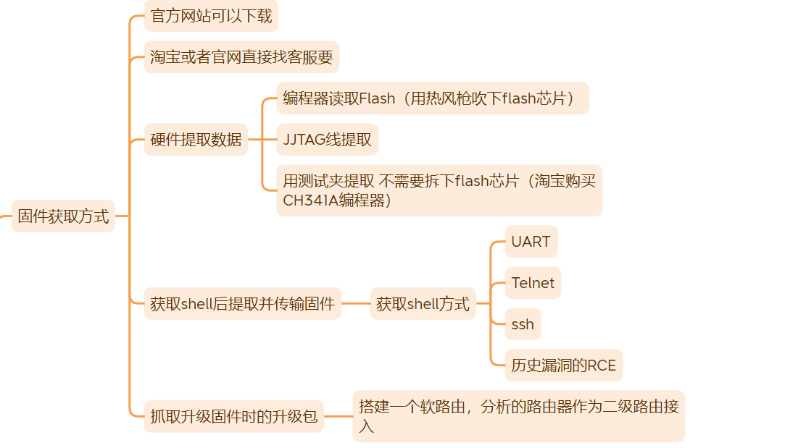
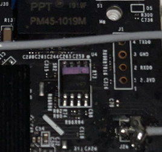
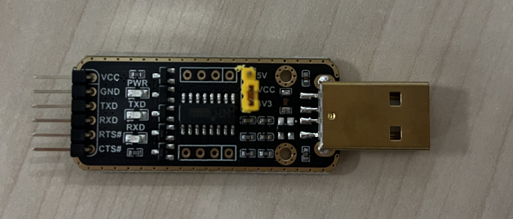
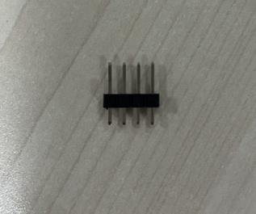
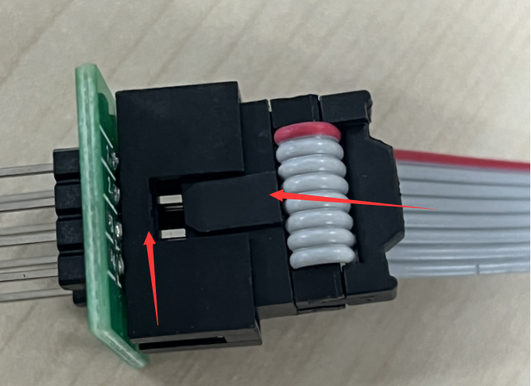
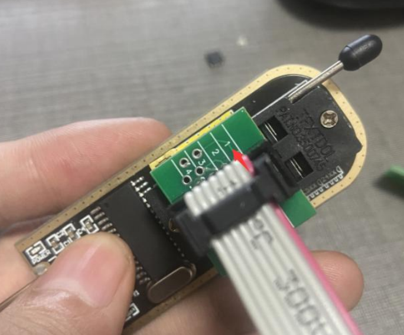
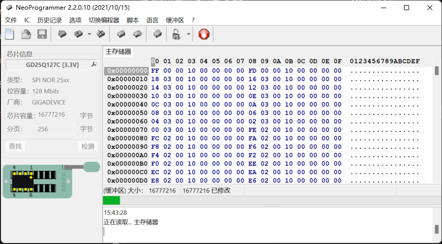
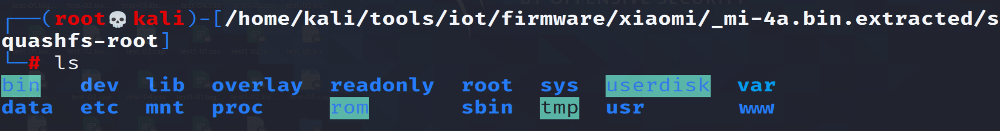

# 使用编程器提取路由器固件-以xiaomi-4a路由器为例

## 前言

进行IOT漏洞挖掘必不可少的一步就是获取并分析固件，获取固件的方式有很多，可以参考下图

因为近些年`IOT`漏洞越来越多，很多厂商都被整怕了，逐渐不在官网提供固件下载了，从硬件提取固件也是必不可少的基本技能，本次以**小米路由器4A**为例展示下如何使用编程器从Flash芯片中提取固件并分析。

## 实操

首先拆卸后盖，一般螺丝都是隐藏在贴片或者脚垫后面，注意仔细寻找，不要暴力拆卸

找到Flash芯片

找到Flash芯片，右边的就是UART口，而且也标记出了四个接口分别是什么，我们可以用电烙铁焊接接口上去，用杜邦线链接到UART转USB接口分析。

UART转USB转换器如图所示

焊接上的接口如图

之后组装PCB版和烧录夹，烧录夹得红线对应PCB的一号引脚，但是我的这个PCB和烧录夹是带有防呆插口的

连接编程器与芯片夹

连接芯片夹与Flash芯片，原则是红线对准Flash芯片的一号引脚，一号引脚位置会有小圆点，

芯片夹红色线对准Flash芯片一号引脚即可

插入电脑USB口中，编程器的power和run灯都会亮

最后一步就是使用对应的软件读取并保存固件，然后就可以将固件拖进分析机器，`binwalk`进行解包分析了

展示一波解包之后的成果

